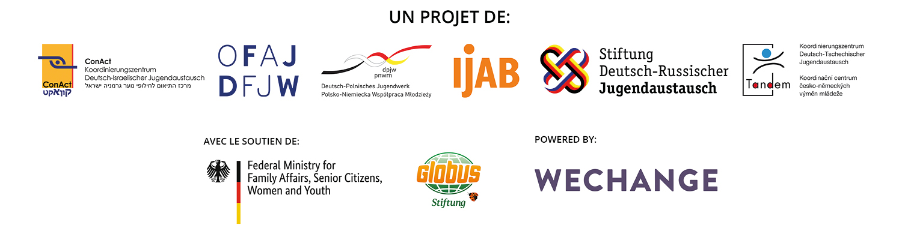

# À propos de DINA

La nouvelle plateforme en ligne [**DINA.international**](https://dina.international/) est le fruit d’une initiative commune des agences spécialisées et des organismes de subvention du travail international de jeunesse. L’idée est simple : en mai 2020, les deux offices de jeunesse existants, trois bureaux de coordination et l’agence spécialisée IJAB ont créé un groupe de travail afin de mieux coordonner leurs activités en matière de numérisation et de développer des activités communes.

Leur premier projet commun consiste à proposer une plateforme de vidéo et de planification de projet, qui s’appuie sur l’expérience des plateformes Projektwelt \([Stiftung DRJA\)](https://projektwelt.drja.de/), [TRIYOU](https://triyou.dpjw.org/) \(DPJW\) ainsi que [Tele-Tandem](https://www.tele-tandem.net/) \(OFAJ\) et les perfectionne à la lumière de l’expérience acquise au cours de la pandémie. Cette plateforme met à disposition des salles numériques gratuitement, sans publicité et dans le respect de la protection des données personnelles. [DINA.international](https://dina.international/) entend ainsi soutenir efficacement les activités numériques des agences spécialisées et des organismes de subvention, ainsi que les porteurs de projets et les écoles participant à des échanges. Pour ce faire, la plateforme met toute une palette d’outils à disposition. Grâce à cette plateforme et à l’utilisation de ces différents outils, les acteurs des échanges peuvent développer davantage leur réseau et obtenir de nouvelles possibilités de coopération, à la fois entre eux et avec leur partenaire étranger \(par exemple, pour analyser des méthodes et des expériences et traiter collectivement certains sujets ou rechercher des participants ou des intervenants, etc.\). [DINA.international](https://dina.international/) est consultable depuis les pages d’accueil de diverses agences spécialisées et de financement et sera progressivement mise à la disposition de tous les acteurs des échanges.

Sur quelle technologie [DINA.international](https://dina.international/) se base-t-elle ? Que se cache-t-il derrière cette plateforme ? [DINA.international](https://dina.international/) fonctionne grâce à la boîte à outils en ligne de la coopérative berlinoise « Wechange », le logiciel Open Source « BigBlueButton » ainsi que le système de messagerie « ROCKET-CHAT ». Wechange et [DINA.international](https://dina.international/) proposent des espaces dédiés au travail collaboratif. 

« Wechange » est un acteur du mouvement de changement écosocial qui propose ses logiciels sur des « serveurs verts », respectueux de la confidentialité des données et financés de manière transparente, c’est-à-dire sans exploitation des données. Fridays for Future et d’autres plateformes de participation citoyenne, entre autres, utilisent cette technologie pour travailler ensemble et partager leurs idées.

Nous souhaitons remercier « [betterplace lab](https://www.betterplace-lab.org/) » d’avoir réalisé la première version de ce guide ! 

Bonne découverte et bon travail sur DINA.international ! 

Votre équipe DINA

