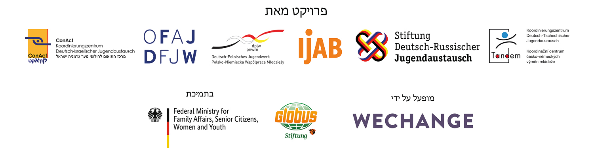

# DINA אודות

  
  
--&gt;  
 פלטפורמת [DINA.international](https://dina.international/cms/uber-uns/?lang=he) החלה ביוזמה משותפת של הגופים המתמחים והמקדמים עבודת נוער אירופית ובין-לאומית. שני מפעלי הנוער הקיימים, שלושה משרדי תיאום דו-צדדיים והמרכז לעבודת נוער בין-לאומית של הרפובליקה הפדרלית של גרמניה \(IJAB\) הקימו במאי 2020 קבוצת עבודה שנועדה לשיפור התיאום בין הגופים בתחום הדיגיטציה ולפיתוח פעילות משותפת. [DINA.international](https://dina.international/cms/uber-uns/?lang=he) היא למעשה הפרויקט המשותף הראשון – פלטפורמה שפותחה במשותף לווידיאו ולתכנון פרויקטים על בסיס הניסיון שנצבר בפלטפורמות "פרויקטוולט" \(קרן [DRJA](https://projektwelt.drja.de/cms/?lang=en)\), [TRIYOU](https://triyou.dpjw.org/cms/) \(DPJW\) ו"[טלה-טנדם](https://www.tele-tandem.net/de/was-ist-tele-tandem/)" \(DFJW\) – ועל כל זה נוסף הניסיון שנצבר בתקופת המגפה העולמית. [DINA.international](https://dina.international/cms/uber-uns/?lang=he) מאפשרת שימוש בחדרים דיגיטליים בלי עלות, בלי פרסומות ותוך שמירה על פרטיות המשתמשים. בדרך זו תומכת הפלטפורמה בפעילותם הדיגיטלית הן של הגופים המתמחים בעבודת נוער והן של המארגנים ושל בתי הספר בחילופים. לשם כך מעמידה הפלטפורמה לרשות המשתמשים שלל כלים. השימוש המשותף בכלים אלה מניח את התשתית הטכנית לערוץ תקשורת נוסף בין שחקני החילופין, ובתוך כך מייעל את האפשרויות לשיתוף פעולה ביניהם וכן בינם לבין שותפיהם שמנגד – לדוגמה, בעת ניתוח שיטות והתנסויות, בעיבוד משותף של נושאים ובחיפוש משתתפים ומרצים. [DINA.international](https://dina.international/cms/uber-uns/?lang=he) נגישה דרך מבחר דפי הנחיתה של הגופים המתמחים בעבודת נוער, ותועמד בהדרגה לרשות כל המעורבים בחילופין.

**הטכנולוגיה של** [**DINA.international**](https://dina.international/cms/uber-uns/?lang=he)**:** פלטפורמה זו מבוססת על ארגז כלי רשת של האגודה השיתופית הברלינאית **Wechange** ועל תוכנת הקוד הפתוח **BigBlueButton**, וכן על יישומון המסרים **Rocket.Chat**. Wechange, ובאמצעותה גם [DINA.international](https://dina.international/cms/uber-uns/?lang=he), מעמידות לרשות המשתמשים חדרים לעבודה משותפת. Wechange היא שחקן בתנועה למען שינוי סוציאלי-אקולוגי ומנגישה את התוכנה שלה למשתמשים על גבי "שרתים ירוקים" העומדים בדרישות שמירת הפרטיות וממומנים בשקיפוּת, כלומר בלי שייעשה בהם ניתוח נתונים של המשתמשים. בין שאר, משתמשות בטכנולוגיה זו תנועת **Fridays for Future** וכן פלטפורמות של שיתוף אזרחי שנועדו לשיתופי פעולה ולשיתוף מידע.

  
 תודתנו נתונה למיזם הדיגיטלי-חברתי [**betterplace lab**](https://www.betterplace-lab.org/en/?lang=en) על כתיבת המהדורה הראשונה של מדריך זה

מאחלים לכם חוויית משתמש מהנה ב-DINA.international.

שלכם, 

צוות DINA 

