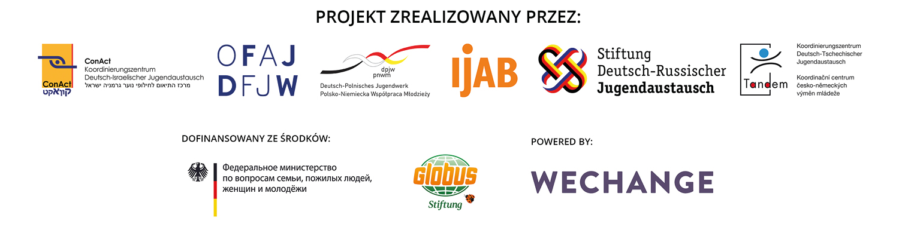

# Über DINA

Die neue Internet-Plattform [**DINA.international**](https://dina.international) ****geht auf eine Gemeinschaftsinitiative der Fach- und Förderstellen der Europäischen und Internationalen Jugendarbeit zurück. Die Idee ist einfach und schnell erklärt: Die zwei bestehenden Jugendwerke, drei bilaterale Koordinierungsbüros und die Fachstelle IJAB haben im Mai 2020 eine Arbeitsgruppe gegründet, um Ihre Aktivitäten im Bereich Digitalisierung besser abzustimmen und gemeinsame Aktivitäten zu entwickeln.   
Das erste gemeinsame Projekt ist die Bereitstellung einer Video- und Projektplanungsplattform, die auf den Erfahrungen der Plattformen Projektwelt  \([Stiftung DRJA](https://projektwelt.drja.de)\), [TRIYOU](https://triyou.dpjw.org/) \(DPJW\) sowie [Tele-Tandem](https://www.tele-tandem.net/) \(DFJW\) aufbaut und diese – mit den Erfahrungen der Pandemie – weiterentwickelt. Die Plattform stellt digitale Räume kostenfrei, werbefrei und unter Beachtung des Datenschutzes zur Verfügung. Damit soll [DINA.international](https://dina.international) dazu beitragen, die digitalen Aktivitäten der Fach- und Förderstellen, aber auch der Träger und Schulen im Austausch, wirksam zu unterstützen. Hierzu stellt die Plattform eine ganze Palette Instrumenten zur Verfügung. Durch die Plattform ergibt sich die Chance, dass durch die gemeinsame Nutzung der unterschiedlichen Instrumente die technische Voraussetzung gegeben ist, dass die Akteure des Austausches sich zusätzlich vernetzen und die Möglichkeiten der Kooperation untereinander und mit dem ausländischen Partner sich verbessern. Beispielsweise bei der Analyse von Methoden und Erfahrungen, bei der gemeinsamen Bearbeitung von Themen oder der Suche nach Teilnehmenden oder Referenten usw. [DINA.international](https://dina.international)  ist über verschiedene Landingpages der Fach- und Förderstellen erreichbar und wird schrittweise allen Akteuren des Austausches zur Verfügung gestellt.

Auf welcher Technik basiert [DINA.international](https://dina.international)? Was steckt dahinter? [DINA.international](https://dina.international) basiert auf einer Web-Toolbox der Berliner Genossenschaft "Wechange" und der Open-Source Software "BigBlueButton" sowie die Messenger-Chat "ROCKET-CHAT. Wechange und damit auch [DINA.international](https://dina.international)  stellt Räume zum kollaborativen Arbeiten zur Verfügung. "Wechange" ist ein Akteur der öko-sozialen Wandelbewegung und stellt seine Software auf "grünen Servern", datenschutzgeprüft und transparent finanziert, d.h. ohne Auswertung von Daten, zur Verfügung. Unter anderem nutzen Fridays for Future oder Plattformen der Bürgerbeteiligung die Technik, um zusammenzuarbeiten und ihre Erkenntnisse zu teilen.

Wir danken an dieser Stelle[ betterplace lab ](https://www.betterplace-lab.org/)für die Erstellung der ersten Handbuchversion!

Wir wünschen allen viel Freude an und mit DINA.international!  
  
Euer Team DINA 

