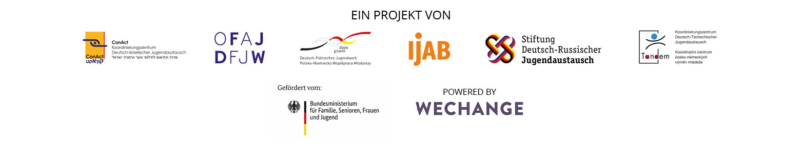

# O platformě DINA

Nová internetová platforma [**DINA.international**](https://dina.international/cms/?lang=cs) ****vznikla na základě společné iniciativy odborných organizací a finančních podporovatelů v oblasti evropské a mezinárodní práce s mládeží. Její myšlenku lze vysvětlit velice snadno. Dvě agentury mládeže, tři bilaterální koordinační centra a Mezinárodní služba pro mládež Spolkové republiky Německo \(IJAB\) v květnu 2020 založily pracovní skupinu, která měla lépe koordinovat jejich činnost v oblasti digitalizace a rozvíjet společné aktivity. Prvním společným projektem je platforma pro videokonference a projektové plánování, která vychází ze zkušeností s platformami Projektwelt \(Nadace pro německo-ruskou výměnu mládeže – [Stiftung DRJA](https://projektwelt.drja.de)\), [TRIYOU](https://triyou.dpjw.org/) \(Německo-polská agentura pro mládež – DPJW\) a [Tele-Tandem](https://www.tele-tandem.net/) \(Německo-francouzská agentura pro mládež – DFJW\) a která tyto poznatky rozšířila o zkušenosti získané v průběhu pandemie koronaviru. DINA.international nabízí své virtuální prostory zdarma, bez reklam a v souladu s pravidly ochrany osobních údajů. Tím chce přispět k podpoře digitálních aktivit jak ze strany odborných organizací a finančních podporovatelů působících v oblasti práce s mládeží, tak ze strany zřizovatelů a škol. Pro tyto účely nabízí širokou paletu nástrojů, které vytváří technické předpoklady pro to, aby se jednotliví aktéři mohli snadněji propojovat a aby se zlepšily možnosti vzájemné spolupráce, a to i na mezinárodní úrovni – ať už jde o sdílení pracovních metod a zkušeností, spolupráci na různých tématech, hledání účastníků a referentů pro různé akce či cokoliv dalšího. Na platformu [DINA.international](https://dina.international/cms/?lang=cs) odkazují stránky různých odborných organizací a finančních podporovatelů a je postupně zpřístupňována všem aktérům v oblasti výměn mládeže.

Jak [DINA.international](https://dina.international/cms/?lang=cs) funguje? Jaké technologie využívá? [DINA.international](https://dina.international) je založená na sadě webových nástrojů vytvořených berlínským družstvem Wechange a na open-source softwaru BigBlueButton. Využívá také chatovací platformu ROCKET.CHAT. Wechange – a tím pádem i [DINA.international](https://dina.international) – poskytují prostor pro online spolupráci v reálném čase. Wechange je součástí hnutí za ekologické a sociální změny a svůj software provozuje na „zelených serverech“, ověřených z pohledu ochrany osobních údajů a transparentně financovaných \(neprobíhá na nich tedy vyhodnocování dat\). Ke spolupráci a sdílení poznatků využívají technologii Wechange mimo jiné hnutí Fridays for Future nebo různé platformy působící v oblasti občanské participace.

Rádi bychom na tomto místě poděkovali organizaci[ betterplace lab ](https://www.betterplace-lab.org/)za vytvoření první verze tohoto manuálu!

Přejeme vám všem při používání platformy DINA.international hodně zábavy!  
  
Váš tým DINA 

