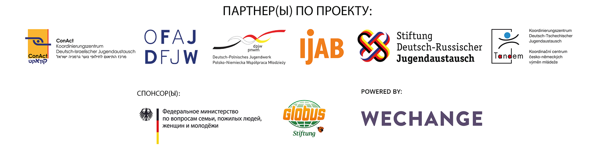

# О платформе DINA

Новая интернет-платформа [**DINA.international**](https://dina.international) ****
является результатом совместной инициативы профильных и финансирующих организаций в области европейской и международной молодежной работы. Основная идея объясняется просто и быстро: в мае 2020 года две молодёжные организации, три двухсторонних координационных бюро и организация «Центр по международной работе с молодежью Федеративной Республики Германия» сформировали рабочую группу для более качественного согласования своей деятельности в области цифровизации и развития новых форм совместной работы.  
Первым совместным проектом является создание платформы для проведения видеоконференций и проектного планирования, которая опирается на опыт платформ Projektwelt \([Stiftung DRJA](https://projektwelt.drja.de)\), [TRIYOU](https://triyou.dpjw.org/) \(Германо-Польское координационное бюро по молодежным обменам\), [Tele-Tandem](https://www.tele-tandem.net/) \(Германо-Французское координационное бюро по молодежным обменам\) и обеспечивает ее дальнейшее развитие, в том числе с учетом опыта пандемии. Платформа предлагает бесплатно, без рекламы и в соответствии с требованиями о защите персональных данных цифровые помещения. Таким образом, платформа [DINA.international](https://dina.international) должна способствовать эффективной поддержке цифровой деятельности  профильных и финансирующих организаций, а также молодежных организаций и школ, участвующих в обмене. Для решения данных целей платформа предлагает целый ряд инструментов. В результате совместного использования этих различных инструментов формируется техническая предпосылка для более плотных контактов между участниками обмена, для совершенствования сотрудничества между ними или с зарубежными партнерами, например, в связи с анализом методов и опыта, совместной обработкой тем или поиском участников или докладчиков и т. д. Доступ к платформе [DINA.international](https://dina.international) можно получить через различные целевые веб-сайты профильных и финансирующих организаций; он будет поэтапно предоставляться всем участникам обмена.

На какой технологии базируется платформа [DINA.international](https://dina.international)? Что за ней скрывается? [DINA.international](https://dina.international) базируется на веб-инструментах берлинской компании «Wechange», на программном обеспечении с открытым исходным кодом «BigBlueButton» и на мессенджерском чате «ROCKET-CHAT». «Wechange» и, таким образом, [DINA.international](https://dina.international)  обеспечивает помещения для совместной работы.

Берлинская компания «Wechange» является участником движения за экологическую и социальную трансформацию; он выкладывает свой софт на так называемых «зеленых серверах», с соблюдением требований о защите персональных данных, с прозрачным финансированием, то есть без анализа данных. В число пользователей этой технологии входят движение «Fridays for Future» и платформы гражданского участия, которые используют ее в целях совместной работы или обмена результатами такой работы.

Пользуясь случаем, мы хотели бы поблагодарить[ betterplace lab ](https://www.betterplace-lab.org/)за разработку первой версии руководства!

Желаем всем вам хорошо поработать с помощью и на платформы DINA.international!

Ваша команда платформы DINA

