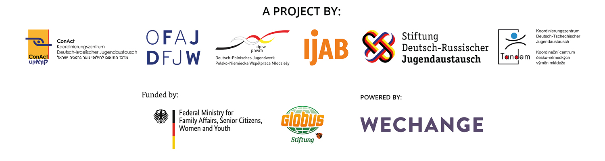

# About DINA

The new internet platform DINA.international is the result of a joint initiative of the specialised and funding agencies of European and international youth work. Its concept is simple and easily explained: two existing youth organisations, three bilateral coordination offices and the IJAB office founded a working group in May 2020 to better coordinate their digitalisation measures and to develop joint activities. The first joint project is a video and project planning platform that builds on the experience of the platforms Projektwelt \(DRJA Foundation\), TRIYOU \(DPJW\) as well as TRIYOU \(DPJW\) and Tele-Tandem \(DFJW\) while further developing them based on the experience during the pandemic. This platform offers digital spaces free of charge, free of advertising and in compliance with data protection laws. DINA.international is thus intended to contribute to effectively supporting the digital activities of the specialised and funding agencies as well as the activities of the providers and schools in their exchange. To this end, the platform provides a whole range of tools. By using the different tools together, the platform provides the technical prerequisite for the exchange actors to improve their networking and the potential for cooperation with each other and with their foreign partners. Amongst other things, they include the analysis of methods and experiences, joint work on topics or the search for participants or speakers, etc. DINA.international may be accessed via various landing pages of the specialised and funding agencies and will gradually be made available to all exchange partners.

What is the technology DINA.international is based on? Where does it come from? DINA.international is based on a web toolbox by Berlin cooperative "Wechange" and the open source software "BigBlueButton" as well as the messenger chat "ROCKET-CHAT”. Wechange and thus DINA.international provide spaces for collaborative work. "Wechange" is an active player in the eco-social change movement and provides its software on "green servers", privacy-checked and transparently funded, i.e. without analysing data. Fridays for Future or citizen participation platforms, among others, use this technology to collaborate and share their findings.

We would like to take this opportunity to thank betterplace lab for producing the first version of this manual! We wish you all lots of fun with DINA.international!

Your DINA team

