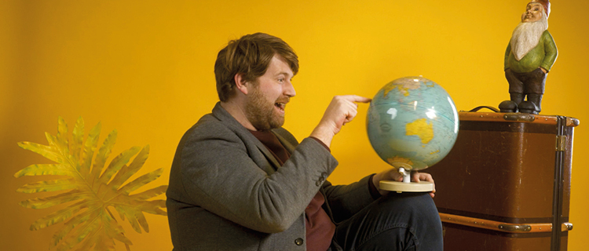

# FAQs

### Wie kann eine digitale Tagung bei DINA aussehen?

Hast Du noch nie an einer digitalen Tagung auf der DINA Plattform teilgenommen? Dann verschaffen wir Dir in diesem Kapitel einen kleinen Überblick:



### Wie beginne ich ein digitales Event mit DINA?

Eine digitale Tagung auf DINA anzulegen ist ganz einfach! Das Grundgerüst hast du in wenigen Minuten fertiggestellt. Wenn Du alles von Grund auf lernen möchtest, dann beginne doch [hier](funktionalitaeten/uebersicht/). Falls Du direkt loslegen willst:



### Was ist ein \(digitaler\) Veranstaltungsraum?

Einen digitalen Raum kannst Du dir fast wie einen analogen vorstellen: In ihm passiert etwas und er kann unterschiedlich ausgestattet sein \(Raumtyp\). Im Kontext von DINA sind das digitale Veranstaltungen, die je nach Raumtyp unterschiedlich sein können. Jeder Raum hat seine eigene \(Web-\)Seite innerhalb Deiner Tagung. Wie Du Räume anlegst, erklären wir hier:



### Was versteht ihr unter Veranstaltungen?

Veranstaltungen sind für uns immer das, was in einem Raum passiert. In einem Workshopraum kann das eine Videokonferenz sein, in einem Caféraum ein digitaler Cafétisch und in einem Bühnenraum ein Youtube-Stream. Der Lobbyraum wiederum listet einfach nur die Veranstaltungen aus allen anderen Räumen und macht daraus eine Agenda. Wie Du Veranstaltungen anlegen kannst, findest Du unter diesem Link:



### Ich habe noch nie ein größeres Event veranstaltet, wie kann ich Teilnehmende aktivieren und begeistern?

Dafür haben wir Dir extra ein ganzes Kapitel mit vielen verschiedenen Formaten und Inspirationen gewidmet - schau doch mal rein:



### Wie funktionieren Videokonferenzen im digitalen Tagungshaus?

Das digitale Tagungshaus von DINA nutzt die Videotechnologie von BigBlueButton. Ein paar der wichtigsten Funktionen haben wir Dir in diesem Kapitel zusammengestellt:



### Wie präsentiere ich mein Event nach außen?

Jede digitale Tagung auf DINA besitzt eine sogenannte Microsite. Auf ihr hast du die Möglichkeit Dich kreativ auszutoben und alle Informationen zu deinem Event bereitzustellen. Außerdem können sich Interessierte über die Microsite für das Event anmelden.



### Müssen Teilnehmende einer digitalen Tagung einen Account bei DINA haben?

Aktuell brauchen Teilnehmende einer digitalen Tagung auf der DINA Plattform noch einen Nutzer\*innen Account. Wir arbeiten allerdings daran, den Zugang zu digitalen Events bald auch ohne Account zu ermöglichen. Dann kann ein externer User mit einem Login und Passwort temporären Zugang zu einer Tagung erhalten. Sobald die Funktion zur Verfügung steht, wird der Admin der Tagung diese Funktion eingeblendet bekommen.

