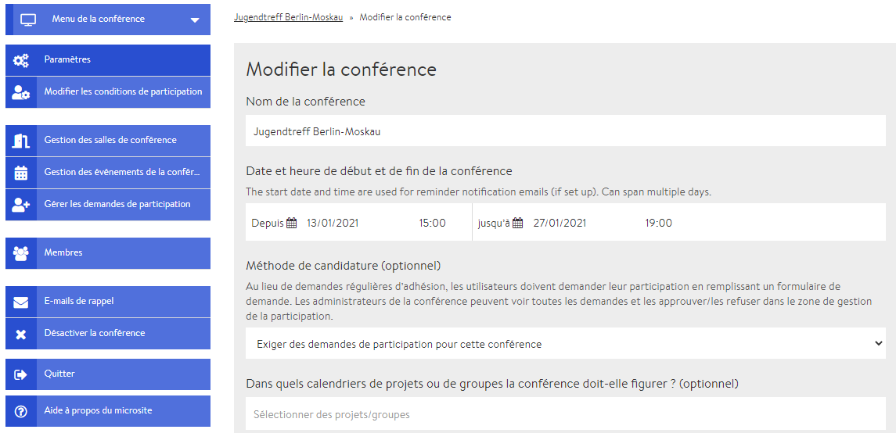
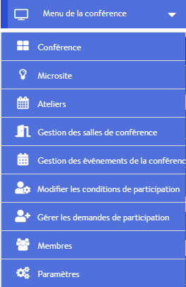

# Page d’administration/ back-end

La page d’administration est uniquement accessible par l’administratrice ou administrateur d’une conférence et comprend toutes les options de réglage \(techniques\). Au départ, seule la personne qui crée une conférence a le statut d’administrateur, mais des administratrices et administrateurs supplémentaires peuvent être nommés via la [**gestion des membres**](gestion-des-membres/). Vous pouvez accéder à la page d’administration en cliquant sur « modifier la conférence » depuis la « [vue conférence](fonctionnalites-vue-d-ensemble/conference.md) ». Vous trouverez ci-dessous un petit aperçu des différents champs \(onglets\) de la page d’administration avec des liens vers des informations complémentaires.

## Menu de la conférence

Dans le menu, vous trouverez des liens utiles, dont certains se trouvent également en dessous du menu de la conférence \(voir ci-dessous\). Les liens les plus importants sont ceux renvoyant au microsite et à la « vue conférence » \(conférence\).

## Paramètres

Vous pouvez modifier les options principales de la conférence dans l’onglet [Paramètres](start/#parametres-generaux). Il peut s’agir, par exemple, du nom, de la description et de l’image ou du logo de l’événement. C’est également à partir de là que vous pouvez concevoir le [microsite](start/microsite.md), qui s’adresse aux personnes extérieures et à partir duquel les personnes intéressées peuvent s’inscrire via un formulaire. La couleur de fond de l’environnement de conférence peut également être personnalisée.

## Modifier les conditions de participation


L’onglet **modifier les conditions de participation** ne s’affiche que si vous avez activé le [formulaire d’inscription](gestion-des-membres/formulaire-d-inscription.md) \(choisir l’option « exiger des demandes de participation pour cette conférence »\). Le formulaire d’inscription peut être activé ou désactivé dans les paramètres.


Les conditions de participation correspondent à toutes les informations supplémentaires qui sont demandées aux personnes intéressées lorsqu’elles remplissent le formulaire d’inscription. C’est ici que vous pouvez choisir quelles informations demander.

## Gestion des salles de conférence

L’onglet gestion des salles de conférence vous permet de [créer de nouvelles salles](salles/), de [modifier ou de supprimer des salles](salles/#modifier-les-salles) déjà existantes, et de créer de [nouveaux événements](evenements.md) dans des salles spécifiques.

## Gestion des événements de la conférence

En cliquant sur cet onglet, vous pouvez consulter la liste des événements déjà planifiés. Vous pouvez [modifier un événement](evenements.md#modifier-un-evenement) en cliquant dessus. Si vous ouvrez le menu déroulant en cliquant sur la flèche vers le bas, vous pouvez également supprimer un événement. Vous pouvez ajouter de [nouveaux événements](evenements.md#ajouter-de-nouveaux-evenements) via l’onglet « gérer les salles de conférence » ou directement à partir de la « [vue conférence](fonctionnalites-vue-d-ensemble/conference.md) ».

## Traiter les demandes d’inscription


L’onglet **modifier les formulaires d’inscription** ne s’affiche que si vous avez activé le [formulaire d’inscription](gestion-des-membres/formulaire-d-inscription.md) \(choisir l’option « exiger des demandes de participation pour cette conférence »\). Le formulaire d’inscription peut être activé ou désactivé dans les paramètres.


Vous trouverez ici toutes les demandes d’inscription déjà reçues et pourrez les accepter, les refuser ou les placer sur une liste d’attente.

## Membres

Ici, vous pouvez [inviter des personnes](gestion-des-membres/#inviter-des-participantes-et-des-participants), accepter ou rejeter des demandes d’inscription et nommer d’autres administratrices et administrateurs.

## E-mails de rappel

Ici, vous pouvez mettre en place des [e-mails de rappel](gestion-des-membres/emails-de-rappel.md) pour les participantes et participants, qui seront envoyés automatiquement à des moments précis avant le début de votre événement.

## Désactiver la conférence

Une fois la conférence désactivée, plus personne ne peut la trouver sur la plateforme DINA, ni la modifier. Vous pouvez toutefois la réactiver depuis les paramètres de votre profil \(Mon profil --&gt; Votre contenu désactivé\). [Suivez ce lien](https://dina.international/account/deactivated/) pour accéder directement à la page de réactivation.

## Ajouter d’autres langues

Dans la version actuelle de DINA.international, vous pouvez rendre votre contenu \(par exemple, les noms des salles, les descriptions des ateliers\) visible dans plusieurs langues en saisissant le contenu dans plusieurs langues dans le même champ.  
Une mise à jour est prévue prochainement pour permettre de définir quel contenu \(titres, descriptions\) est affiché dans quelle langue. Dès que cette mise à jour sera disponible, nous l’annoncerons sur la plateforme et la décrirons ici.

## Quitter


Si vous cliquez sur ce bouton et répondez à la question de sécurité, vous quittez la conférence et perdez votre statut de membre.


