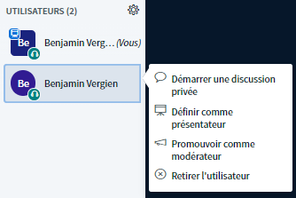

# Droits de modération

Les modératrices et modérateurs ont des droits spéciaux au sein de BigBlueButton qui les distinguent des autres personnes. Avec ces options, vous avez la possibilité de gérer la visioconférence ainsi que les personnes participantes.

Il existe trois manières d’obtenir des droits de modération sur BBB :

* Tous les admins d’une conférence sont automatiquement modérateurs et modératrices de toutes les visioconférences.
* Les admins peuvent, lorsqu’ils [créent un événement](../evenements.md#ajouter-de-nouveaux-evenements), donner le statut de modérateur à certaines personnes pour cet événement en particulier.
* Au cours d’une visioconférence, les modératrices et modérateurs peuvent attribuer des droits de modération à d’autres personnes \(qui ne sont valables que pour la visioconférence en cours\).

Dans ce qui suit, nous vous expliquons de quelles options disposent les modératrices et modérateurs d’une visioconférence.

### Gestion des participantes et participants

Il existe principalement deux options pour gérer les participantes et participants. La première concerne une personne en particulier, tandis que la deuxième agit sur l’ensemble des participantes et participants à la conférence.

**Première possibilité :** Cliquez sur une personne de la liste de participantes et participants.

Un menu s’ouvre, vous permettant les actions suivantes :

1. **Ouvrir** une conversation privée,
2. **Donner des droits de présentation** à la personne \(celle-ci peut partager son écran\),
3. **Donner des droits de modération** à la personne \(celle-ci obtient les mêmes droits que les modératrices et modérateurs\),
4. **Retirer** la personne de la visioconférence.

**Deuxième possibilité :** Ouvrir le menu en forme d’engrenage à côté de la liste des participantes et participants.

Ici, vous pouvez :

1. Réinitialiser les icônes de statut de toutes les participantes et participants et modératrices et modérateurs,
2. Couper le micro de toutes les participantes et participants,
3. Couper le micro de toutes les participantes et participants sauf celui de la présentatrice ou du présentateur,
4. Télécharger tous les noms dans un fichier texte \(.txt\) \(triés par nom et prénom\),
5. Restreindre les droits des participantes et participants \(voir ci-dessous, ne s’applique pas aux modératrices et modérateurs\).

### Gestion de la visioconférence

Le menu à 3 points en haut à droite vous permet d’effectuer des réglages généraux et de mettre fin à la conférence \(ceci ne dure pas sur DINA, car elle est relancée dès que quelqu’un veut se joindre à la conférence\).

Les paramètres généraux d’une conférence BigBlueButton vous permettent de faciliter la modération et l’interaction. Pour les groupes plus conséquents ou les sessions de questions-réponses, nous recommandons d’activer les notifications pop-up pour les nouveaux messages dans la conversation et lorsque de nouvelles personnes se joignent au groupe. Ainsi, vous gardez une trace de ce qui se passe et pouvez gérer le groupe plus facilement.

Dans l’onglet **Économies de données**, il est également possible de désactiver les webcams et le partage d’écran pour toute la conférence. En temps normal, ces paramètres ne devraient pas être modifiés, mais ils peuvent être utiles en cas de difficultés de connexion.


Il est également possible de **désactiver les webcams et le partage d’écran uniquement pour les participantes et participants**, et non pour les modératrices et modérateurs via le menu restreindre les droits des participants \(voir ci-dessus\).


### Présentatrice ou présentateur : droits de partage d’écran

BigBlueButton distingue les participantes et participants normaux des modératrices et modérateurs, ainsi que de la présentatrice ou du présentateur. Une seule personne peut faire une présentation à la fois. La personne disposant actuellement du droit est indiquée par une petite icône de projecteur bleu dans la liste des participantes et participants. Les modératrices et modérateurs peuvent s’attribuer le droit de présentation en cliquant sur le symbole « + » en bas à gauche de la fenêtre vidéo. Ils peuvent également accorder ce droit aux participantes et participants en cliquant sur le nom de la personne correspondante dans la liste.

La présentatrice ou le présentateur peut partager son écran, mais aussi créer et analyser des [sondages](interaction.md#sondages).

