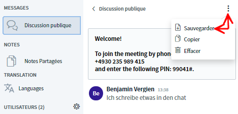
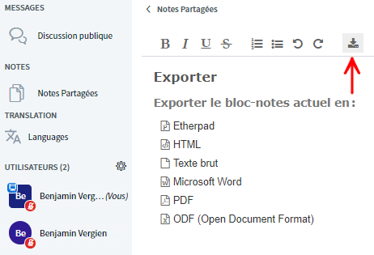
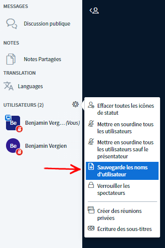

# Enregistrement et sauvegarde des résultats

## Enregistrer la vidéo

_La fonction d’enregistrement n’est pas encore disponible._

## Sauvegarder le chat et les notes

BigBlueButton propose de sauvegarder à la fois la discussion publique et les notes partagées. Pour sauvegarder la discussion publique, cliquez sur le menu à 3 points en haut à droite de la fenêtre de la discussion.

Les notes partagées, quant à elles, peuvent être téléchargées sous différents formats \(par exemple PDF, Word, ODF, HTML\) via l’icône de téléchargement.

## Sauvegarder la liste de participantes et participants

Les noms des personnes actuellement présentes peuvent également être téléchargés sous forme de fichier texte. Pour ce faire, il suffit de cliquer sur le menu en forme d’engrenage situé à côté de la liste des participants.

