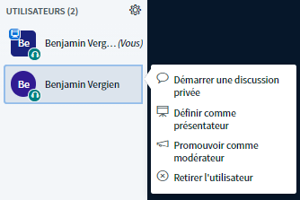
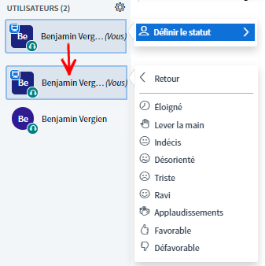
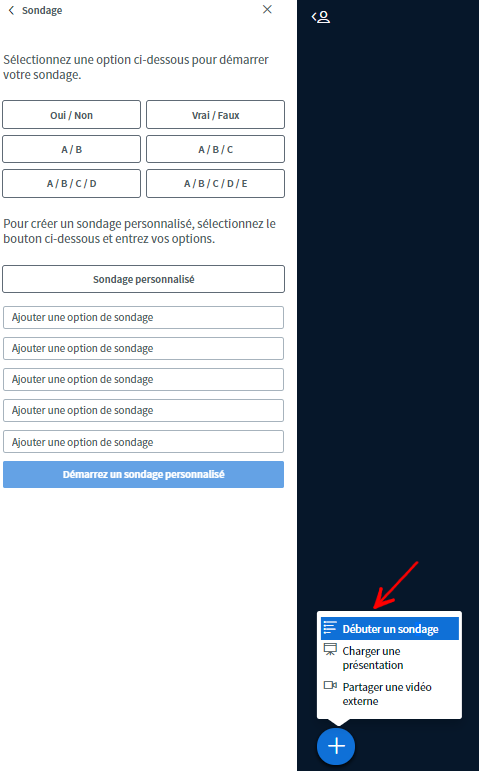
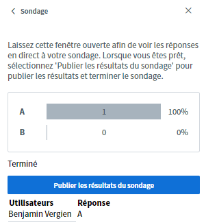

# Interaction

Une visioconférence dépend des interactions de tous les participants et participantes. C’est pourquoi il est important, tout comme pour les rencontres en présentiel, que des possibilités d’expression et de communication soient proposées. Pour ce faire, BigBlueButton propose quelques outils qui, si utilisés correctement, contribuent à rendre vos échanges interactifs.

## Chat

BigBlueButton propose deux types de chats : une discussion publique et une discussion privée.

La discussion publique est à disposition dès le début de la visioconférence et peut être utilisée par toutes les personnes présentes. Elle sert avant tout à poser des questions d’ordre général ou à envoyer des informations aux participantes et participants.

La discussion privée ne s’ouvre qu’après avoir cliqué sur un participant dans la liste des participants et choisi l’option **démarrer une discussion privée**. Les discussions privées peuvent être lues par les deux personnes concernées et s’utilisent surtout pour de rapides concertations, par exemple entre personnes chargées de la modération.


La discussion publique peut être téléchargée sous forme de fichier texte via le menu à 3 points en haut à droite de la fenêtre.


## Icônes

Les icônes peuvent être utilisées pour exprimer diverses émotions de manière non verbale ou pour communiquer avec les autres personnes participant à la conférence. Chacun peut changer son statut en cliquant sur son nom dans l’onglet des participantes et participants, puis sur « définir le statut ». Tout le monde pourra ensuite voir le statut changer et la petite image s’afficher.


Les autres personnes participant à la conférence ne sont pas alertées du changement de statut par un signal sonore. Par exemple, si quelqu’un lève la main, il faudra qu’une modératrice ou un modérateur s’en aperçoive.


## Notes partagées

Les notes partagées sont visibles et peuvent être modifiées par tous les participants dans la discussion publique. La différence est que les contributions ne peuvent pas être attribuées à des personnes spécifiques et qu’un éditeur HTML est proposé. Cela permet de mieux organiser les notes et d’en modifier la mise en page. Les notes partagées sont idéales pour un compte-rendu commun ou pour conserver des pensées et des idées.


Comme la discussion publique, les notes partagées peuvent être téléchargées dans différents formats \(HTML, texte, PDF, Word, ODF\) via l’icône de téléchargement.


## Sondages

Pour les votes ou les quiz simples, BigBlueButton propose une fonction de sondage. Cependant, une seule question \(single-choice\) peut être posée à la fois. Il existe déjà des sondages prédéfinis entre lesquels choisir, mais vous pouvez également créer un sondage personnalisé comportant jusqu’à 5 réponses choisies par l’utilisateur. Après sa publication, le sondage se termine et tous les participants peuvent consulter les résultats.


Seul le présentateur actuel peut créer des sondages. Les modératrices et modérateurs qui ne sont pas présentateurs peuvent le devenir facilement en cliquant sur le symbole plus. Toutefois, cela met fin à la présentation de la personne qui était présentatrice.


