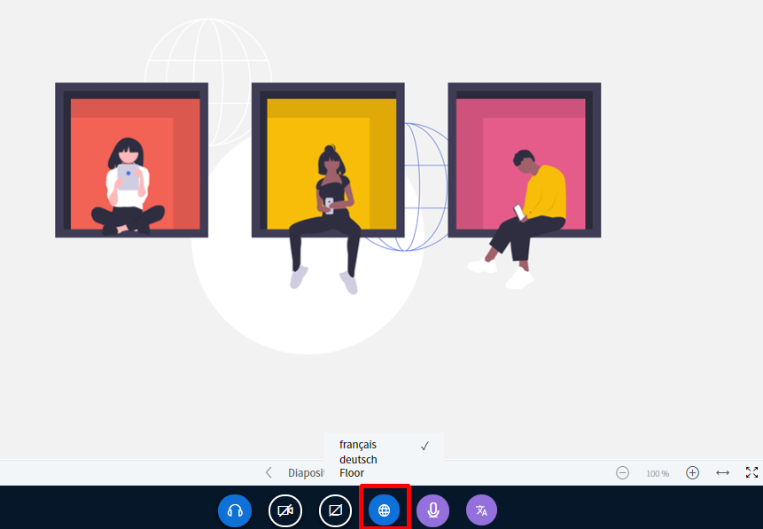

# Interprétation/traduction

Le but de DINA est de promouvoir les échanges de jeunes au niveau international. La plateforme est donc conçue pour être utilisée en plusieurs langues. En plus de la plateforme elle-même, la solution de visioconférence intégrée BigBlueButton \(BBB\) prend également en charge plusieurs langues. Bien que la technologie ne soit pas encore assez avancée pour permettre l’interprétation automatique du discours, vous pouvez facilement travailler avec vos propres interprètes. Nous vous expliquons dans ce qui suit comment cette option fonctionne et comment l’activer.

**Important :**  
Il nous semble important de rappeler les préparatifs nécessaires à l’interprétation d’une conférence sur DINA.international \(et dans la vie réelle\) : Nous recommandons particulièrement aux interprètes d’effectuer un test préalable et de se familiariser avec les fonctions et l’interface du logiciel afin d’éviter tout problème. Nous pouvons imaginer le niveau de frustration des participants si, par exemple, ils n’entendent pas le son et si quelque chose ne fonctionne pas à cause de l’utilisation du mauvais navigateur, ou parce que la fonction n’a pas été testée...

* Il est vivement conseillé aux interprètes de porter un casque pour éviter les problèmes d’écho \(en pratique, il n’est pas possible de se passer de casque\).
* Il est fortement recommandé que la connexion Internet \(de préférence par câble et non Wi-Fi\) soit puissante \(au moins 10 Mbit, au mieux 20 Mbit, ceci doit être testé au préalable\). L’accès en Wi-Fi peut fonctionner, mais est sensible aux interférences, par exemple des voisins qui regardent un film.
* Il est conseillé d’utiliser un ordinateur puissant avec au moins 4 Go, voire 8 Go de mémoire vive.
* Les interprètes doivent avoir pris connaissance de la configuration de la conférence sur DINA et testé les fonctions.
* Les interprètes souhaitent souvent avoir un contact visuel avec leurs collègues, ce qui est possible grâce à une salle vidéo \(cachée, séparée\), dont le son est coupé des deux côtés. Bien sûr, les interprètes peuvent rester en contact grâce à d’autres services de messagerie ou de vidéo.

## Fonctionnement de l’option d’interprétation

L’interprétation sur BBB fonctionne comme suit :

* Une modératrice ou un modérateur \(ou encore l’interprète\) renseigne la langue parlée \(c’est-à-dire celle qui est interprétée\).
* Chaque modératrice ou modérateur peut théoriquement interpréter sur DINA. Pour ce faire, il suffit de choisir la langue cible dans laquelle doit se faire l’interprétation.
* Les participantes peuvent choisir quelle langue ils souhaitent entendre. Ils peuvent également choisir le son original sans interprétation \(lorsqu’une personne sélectionne une langue, elle entend l’interprétation ou le son original dans la langue choisie\).
* Lorsqu’un interprète parle, le volume du son original est réduit.

## Activer l’option d’interprétation

Les modératrices et modérateurs peuvent ajouter toutes les langues de la visioconférence dans l’onglet « langues ». Si une seule langue doit être traduite \(par exemple, parce que la moitié du groupe parle les deux langues\), celle-ci suffit. Il ne reste plus qu’à cliquer sur le bouton « commencer la traduction » et tout est prêt.


Plus vous ajoutez de langues, plus le réseau d’interprètes se complique. Avec trois langues, vous avez théoriquement besoin de 6 interprètes :  
\(a➡b, b➡a, a➡c, c ➡ a, b ➡ c, c ➡ b\).


## Pour les interprètes : quelle langue est parlée ?

Pour agir en tant qu’interprète, la personne concernée a besoin de droits de modération dans les visioconférences BBB. Ces droits peuvent être accordés [dès la création](../evenements.md#presentateurs-orateurs-moderateurs-optionnel) d’un événement, mais également au cours de celui-ci.

Dans la liste d’options en dessous des vidéos, toutes les personnes présentes voient le bouton « langues disponibles ». C’est ici que vous choisissez quelle langue vous souhaitez entendre. Si vous choisissez la langue originale, le son original est diffusé dans toutes les langues. _Le choix des langues n’est disponible que si l’interprétation a été activée, mais les boutons sont visibles même lorsqu’elle n’a pas été activée._


Si la visioconférence ne comprend que quelques langues, rien n’empêche les interprètes d’entendre le son original. En revanche, s’ils ont besoin de l’interprétation, ils doivent choisir la langue.


## Pour les interprètes : dans quelle langue faut-il interpréter ?

Les interprètes doivent désormais choisir la langue dans laquelle ils veulent interpréter, c’est-à-dire la langue dans laquelle ils vont s’exprimer. Cela se fait via le bouton « traduire une langue », tout à droite. Si la langue entendue a déjà été renseignée, elle n’est pas disponible dans ce menu, et inversement.

## Interprètes : parler

Les interprètes ont leur propre bouton de micro, qu’ils utilisent uniquement lorsqu’ils interprètent. Ce bouton est de couleur violette, tout comme le bouton « traduire une langue ». Lorsque ce microphone est activé, seuls les participants ayant sélectionné la langue correspondante entendront la voix de l’interprète. Le microphone normal peut être utilisé pour être entendu par tous les participants et doit sinon toujours être coupé \(coupé = barré\). Le micro de l’interprète doit lui aussi être coupé lorsqu’il n’est pas utilisé.

## Auditrices et auditeurs

Pour les auditrices et auditeurs, rien de plus simple : il leur suffit de choisir la langue qu’ils veulent entendre. Pour ce faire, ils doivent cliquer sur le bouton bleu en forme de globe, comme les modératrices et modérateurs.


Les auditrices et auditeurs qui comprennent toutes les langues disponibles peuvent simplement sélectionner le son original. Le son original est prédéfini en l’absence de choix.


