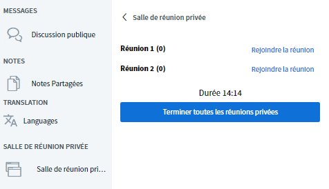

# Salles de groupes

Il est parfois intéressant de répartir les participants dans des visioconférences distinctes pour qu’ils y travaillent en plus petits groupes, fassent connaissance ou pour des formats interactifs. Dans un grand nombre de solutions de conférence actuelles, ces salles vidéo séparées sont appelées « breakout rooms ». Une autre solution serait d’aménager une [salle de café](../salles/#type-de-salle) avec plusieurs tables virtuelles et de demander aux participants de se répartir sur ces tables. L’inconvénient est que les participants doivent quitter la visioconférence en cours et se répartir sur les tables par eux-mêmes \(cela peut constituer une excellente option pour la pause\). BigBlueButton propose une fonction spécifique, **les salles de groupes**. Cette fonction permet de répartir les participants de manière aléatoire, d’après des groupes préétablis ou en donnant le choix du groupe à chacun. Les admins et les présentateurs peuvent configurer ces salles de réunion privée au cours d’une visioconférence en quelques clics seulement.

## Créer des salles de réunion privée

Pour créer des salles de réunion privée, vous devez tout d’abord agrandir la visioconférence via la croix fléchée en haut à droite, afin d’afficher toutes les options. Ouvrez le menu en forme d’engrenage à côté de l’aperçu des participants, et cliquez sur « créer des réunions privées ».

Dans la fenêtre suivante, vous pouvez choisir le nombre de salles \(jusqu’à 8\), le délai de fermeture automatique des salles, répartir les participants dans les salles de manière aléatoire ou leur permettre de choisir une salle par la suite. Vous avez également la possibilité de glisser et déposer \(cliquer, maintenir et déplacer\) les participants dans les salles. Cliquez sur « créer » pour ouvrir les salles, et sur « fermer » pour annuler.


La répartition aléatoire répartit tous les participants de manière égale dans les salles disponibles. Par défaut, les modérateurs ne sont pas répartis automatiquement. Ils doivent être déplacés manuellement si nécessaire.


## Rejoindre une salle de réunion privée

Une fois que les salles sont créées, tous les participants reçoivent une notification leur indiquant qu’ils peuvent rejoindre une salle. Selon les réglages choisis, ils peuvent ou non avoir le choix. Cependant, personne n’est forcé à rejoindre une salle, la notification pouvant être ignorée via le bouton « fermer ».

Même après avoir fermé la première notification, les participants peuvent rejoindre une salle par la suite grâce au menu latéral. Les admins et les présentateurs peuvent rejoindre toutes les salles à tout moment, même si une certaine salle leur a été attribuée.

Dès qu’une personne clique sur « rejoindre la salle », une nouvelle fenêtre s’ouvre dans le navigateur avec une visioconférence BigBlueButton. La conférence principale reste ouverte dans la fenêtre précédente, mais le son est désactivé.


La fenêtre de la visioconférence principale ne doit pas être fermée, car elle contient également les salles de conférence de DINA. Si vous la fermez, vous devez rouvrir DINA. En revanche, les salles de groupe peuvent être fermées à tout moment \(voir ci-dessous\).


## Travailler dans une salle de groupe

La plupart des fonctions habituelles de BigBlueButton peuvent être utilisées dans les salles de réunion privée. La plus grande différence est que toutes les personnes présentes peuvent s’attribuer des droits de présentation et partager leur écran. Cela s’avère très pratique, car il n’est pas nécessaire qu’un admin soit présent dans chaque salle.

## Quitter une salle de réunion privée

Les participants peuvent décider à tout moment de quitter une salle de réunion privée. Pour ce faire, il suffit de fermer la fenêtre de navigateur correspondante.


De même, les participants peuvent rejoindre leur salle après avoir fermé la fenêtre du navigateur via l’onglet salles de réunion privée.


## Fermer une salle de réunion privée

En principe, les salles de réunion privée prennent fin automatiquement à la fin du temps imparti. Les modérateurs peuvent toutefois forcer la fermeture de toutes les salles en cliquant sur le bouton « fermer toutes les salles de réunion privée » dans l’onglet des salles de réunion privée.

## Indications


* La durée des salles ne peut pas être modifiée ultérieurement.
* Le chat et les notes des salles de réunion privée ne sont pas automatiquement transférés dans la salle principale, ni l’inverse.
* Les salles de réunion privée ne peuvent pas être enregistrées.
* Tous les participants d’une salle de réunion privée sont automatiquement modérateurs, la première personne à rejoindre la salle devenant présentatrice \(c’est-à-dire qu’elle peut partager son écran\). Si nécessaire, les participants doivent se transférer le rôle de présentateur entre eux.
* Il n’est pas possible de préparer les salles de réunion privée dès le début d’une visioconférence, car celles-ci s’ouvrent dès qu’elles sont créées. Toutefois, le processus de création est simple et facile et peut être effectué par une personne chargée de la technique.


