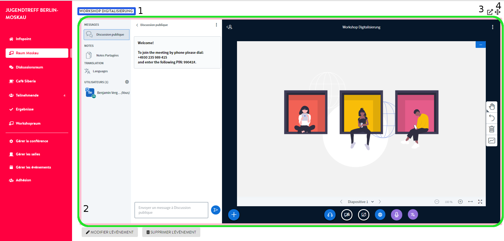
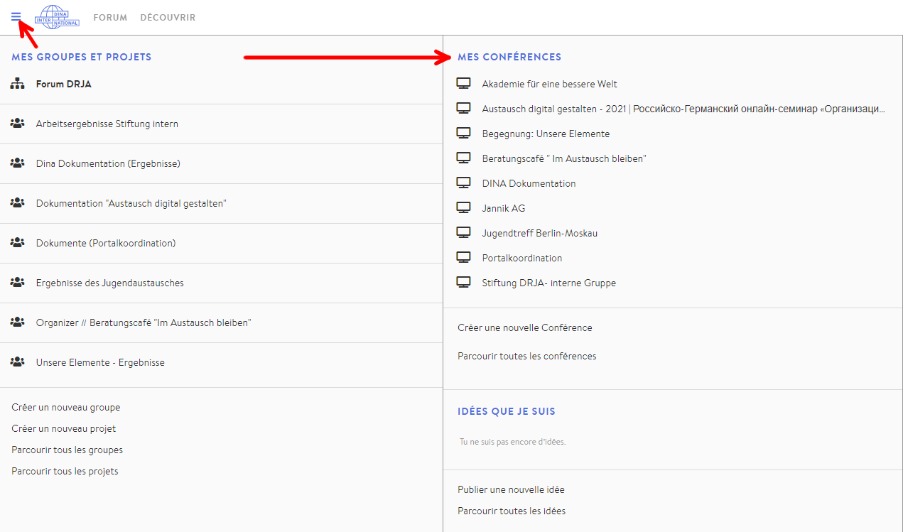

# Vue conférence

### Structure de base

Vous pouvez personnaliser vous-même l’apparence de votre conférence numérique, mais nous vous donnons ici un exemple pour que vous vous fassiez une idée de la configuration du centre de conférences numérique. Vous êtes libre de choisir les couleurs ainsi que les textes descriptifs, les noms des salles et des événements. Seuls les administratrices et administrateurs de la conférence peuvent accéder aux boutons de réglage présentés dans cet exemple.

1. Titre et description de la conférence
2. Salles

   2.1  Salle active

3. Aller aux paramètres/à la page d’administration
4. Description de la salle
5. Événements se déroulant dans la salle active et réglages
6. Fenêtre de messagerie \(reliée à RocketChat : tous les messages que vous échangez ici apparaîtront également dans vos conversations sur le chat DINA\).

### Salle avec événement vidéo

Si vous cliquez sur un événement dans une salle de type « [ateliers](../salles/#type-de-salle) », « [discussion](../salles/#type-de-salle) » ou « [table basse/café](../salles/#type-de-salle) », BigBlueButton s’ouvre dans cette salle. Si d’autres personnes dont la caméra est activée participent à cette visioconférence, vous pouvez communiquer avec le son et l’image. Pour plus d’informations sur l’utilisation de BigBlueButton, [cliquez ici](../bigbluebutton/).

1. Nom de l’événement
2. Visioconférence BigBlueButton
3. Ouvrir la visioconférence dans un nouvel onglet
4. Agrandir la vidéo \(les pièces situées à gauche sont cachées, vous pouvez annuler à l’aide du même bouton\)

Il existe d’autres [types de salles](../salles/#type-de-salle) en plus des salles vidéo, essayez-les !😉

### Afficher la « vue conférence »

Il existe deux façons d’y accéder :

* à partir de la page d’administration de la conférence ou à partir du menu à trois barres de DINA
* ou à partir du menu à trois barres de DINA

Vous pouvez facilement y accéder à partir de la page d’administration de la conférence via le menu de la conférence, puis l’onglet « Conférence ».

Vous pouvez également à tout moment utiliser le menu à trois barres de DINA pour y accéder:

