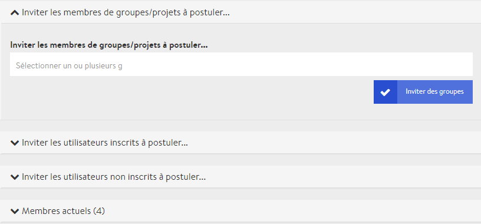

# Gestion des membres

Que serait un événement, une réunion, une rencontre ou une conférence sans une communauté engagée formée de personnes intéressées, de participantes et participants, d’élèves ou de membres ? La préparation d’une conférence virtuelle comprend également la gestion et l’ajout de participantes et participants, que nous appelons « membres » sur notre plateforme.

Pour une conférence virtuelle sur DINA, vous pouvez ajouter des personnes ayant déjà un compte sur la plateforme, mais aussi inviter des personnes extérieures à celle-ci grâce à leur adresse e-mail. Vous pouvez également activer un simple formulaire sur le microsite de votre conférence, qui permettra aux personnes intéressées de s’inscrire d’elles-mêmes.

Mais avant tout, nous aimerions vous donner un aperçu des différents rôles possibles lors d’une conférence virtuelle. Chaque rôle est associé à certains droits, qui confèrent différentes possibilités d’interaction avec la plateforme ou au sein des visioconférences.

### Rôles



Les administratrices et administrateurs \(ou admins\) ont accès à tous les [paramètres de la conférence](../admin-page.md#parametres). Ils peuvent modifier son aspect visuel, créer, modifier et supprimer des salles et des événements, gérer les participantes et participants et disposent de droits de modération pour toutes les visioconférences.


Le nombre d’admins devrait idéalement être limité à quelques personnes afin d’éviter des modifications non désirées.




Les présentatrices et présentateurs peuvent être nommés par les admins lors de la création ou de la modification d’un événement. Ils disposent alors de droits de modération supplémentaires lors de la visioconférence de l’événement concerné. Pour toutes les autres salles et les autres événements, ils ont les mêmes droits que les autres membres.


Si une personne doit avoir des droits de modération pour plusieurs événements, vous devez la nommer présentatrice pour chacun des événements.




Les participantes et participants n’ont aucun droit de modification. Ils peuvent entrer dans toutes les salles et participer aux événements qui s’y déroulent. Chaque personne ajoutée à une conférence commence avec de simples droits de participante ou participant. Les admins peuvent conférer des droits d’administrateur aux participantes et participants ou les nommer présentatrice ou présentateur pour certains événements.



Les interprètes soutiennent la conférence en assurant l’interprétation simultanée. Étant donné qu’ils doivent avoir accès à la technique, ils doivent être nommés admins de la conférence.



### Inviter des participantes et des participants

Pour ouvrir la page de gestion des participantes et participants, cliquez sur l’onglet **« membres »** depuis la page d’administration.

Il existe plusieurs façons d’inviter des personnes à une conférence. Nous distinguons avant tout les cas suivants : 

* une personne est déjà inscrite sur la plateforme ou
* souhaite participer à une conférence en tant que participante externe.

Dans le deuxième cas, il est possible de créer un compte DINA lors de l’inscription ou \(nous y travaillons encore\) d’obtenir un accès temporaire dans le cadre d’une conférence.


Selon votre choix entre l’activation et la désactivation du [formulaire d’inscription](formulaire-d-inscription.md) \(option intitulée « demande de participation » dans le menu\) pour les participantes et participants dans les paramètres de la conférence, les options décrites ci-dessous porteront des noms différents. Nous décrivons ici le cas où le formulaire d’inscription est désactivé.


#### Inviter des utilisatrices et utilisateurs de la plateforme

Il est très facile d’inviter des personnes déjà membres de DINA. Si vous vous trouvez déjà sur la page de gestion des participantes et participants, vous pouvez voir l’option « inviter des utilisateurs inscrits... » avec un nombre entre parenthèses. Ce nombre indique combien de membres de la plateforme ont déjà été invités et n’ont pas encore répondu à l’invitation. Vous pouvez tout simplement taper le début d’un nom dans le champ pour voir des propositions s’afficher. Vous pouvez ainsi ajouter des membres les uns après les autres. Pour finir, cliquez sur le bouton « inviter les membres » pour confirmer l’invitation.


Petit conseil : Dès que le nom souhaité s’affiche, appuyez sur entrée puis tapez directement le nom suivant. Vous pourrez ainsi saisir les noms de plusieurs personnes rapidement et les inviter en même temps.


#### Inviter des utilisateurs et utilisatrices externes \(avec inscription sur DINA\)

Avec l’option « inviter des utilisateurs non-inscrits », vous pouvez inviter des participantes et des participants externes, qui devront créer un compte DINA lorsqu’ils accepteront l’invitation. Le nombre entre parenthèses indique combien de personnes externes ont été invitées et ne se sont pas encore inscrites sur DINA. Cliquez maintenant sur le bouton « inviter des personnes ».

L’étape suivante vous permet d’ajouter une ou plusieurs adresses e-mail dans le champ correspondant. Vous pouvez en saisir plusieurs en les séparant d’une virgule ou en utilisant une ligne par adresse e-mail. Ajoutez au choix un message personnalisé au mail d’invitation. Quand vous cliquez sur le bouton « inviter », toutes les personnes invitées reçoivent un e-mail avec un lien pour s’inscrire sur DINA. Après leur inscription, elles seront ajoutées directement à la conférence en tant que participantes.

#### Inviter des utilisatrices et utilisateurs externes \(sans inscription sur DINA\)

_Cette option n’est pas encore disponible._

### Gérer les demandes d’adhésion

Si les personnes intéressées ont rempli une « demande d’adhésion » \(ou demande d’inscription\) sur le microsite de la conférence, celles-ci apparaissent dans l’onglet « Demandes d’adhésion ». C’est ici qu’elles peuvent être acceptées ou refusées par une personne responsable de la conférence. Une fois la décision prise, toutes les personnes reçoivent une notification via la cloche située en haut à droite de la plateforme DINA et par e-mail \(selon les réglages des notifications\). Les personnes acceptées peuvent désormais accéder à la conférence.

### Gérer les membres actuels

Tous les membres déjà acceptés dans la conférence sont visibles dans l’onglet **« membres actuels ».** À droite des noms sur le côté gauche de la page se trouve une icône d’e-mail, qui permet d’ouvrir un \(Rocket\)chat avec la personne concernée sur la plateforme DINA. À côté de cette icône se trouve le rôle, qui peut indiquer admin ou membre. 

Trois options s’offrent à vous lorsque vous déroulez le menu d’une personne :

* **Signaler un contenu offensant :** si le comportement d’une personne va à l’encontre des règles de DINA, vous pouvez nous le signaler. Nous prenons ensuite les mesures appropriées.
* **Modifier les rôles :** les options « en tant que membre » ou « en tant qu’admin » permettent de changer le rôle d’une personne pour qu’elle devienne membre \(= participant\) ou admin de la conférence.
* **Retirer :** retire la personne de la conférence. Elle ne peut plus participer, tant qu’elle ne renouvelle pas sa demande d’adhésion.

