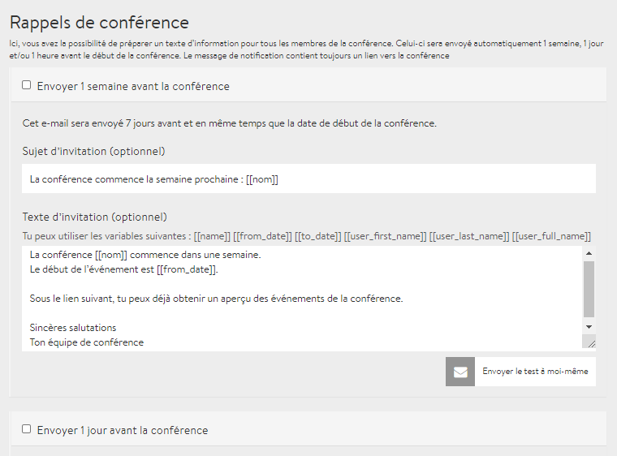

# E-mails de rappel

Vous connaissez probablement cette situation : vous vous êtes inscrit à un super événement il y a des semaines et vous vous rendez compte tout d’un coup que vous l’avez raté. Pour que cela n’arrive pas aux personnes inscrites à votre conférence, et pour augmenter le taux de participation, DINA offre la possibilité de rédiger des e-mails de rappel. Vous pouvez en préparer jusqu’à 3, et ils seront envoyés aux participantes et participants une semaine, un jour ou une heure avant le début de la conférence. Pour ce faire, vous trouverez les paramètres sous l’onglet **e-mails de rappel** sur la [page d’administration](../admin-page.md).


Sur la capture d’écran ci-dessus, vous pouvez voir ce que l’on appelle des shortcodes \(variables\). Par exemple, **\[\[nom\]\]** est automatiquement remplacé par le nom de la conférence dans l’e-mail. Vous pouvez aussi simplement écrire le nom. Toutefois, les shortcodes sont pratiques si, par exemple, vous deviez changer le nom ou l’heure de la conférence.


