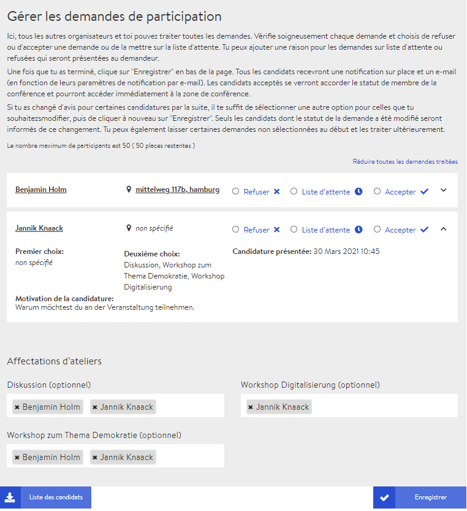

# Formulaire d’inscription

Pour les grands événements où vous ne connaissez pas tout le monde ou avez besoin d’informations précises sur les participantes et participants, nous vous recommandons d’activer le formulaire d’inscription dans les [paramètres de la conférence](../start/#parametres-generaux) en choisissant l’option « demande de participation » dans le menu déroulant « Méthode de candidature ». Celui-ci doit être rempli depuis le microsite par les personnes intéressées par la conférence dès qu’elles s’y inscrivent. Lorsque vous activez le formulaire d’inscription et enregistrez les paramètres, deux nouveaux onglets apparaissent sur la page d’administration :

* Modifier les conditions de participation 
* Gérer les demandes d’inscription

## Modifier les conditions de participation

Derrière l’onglet **modifier les conditions de participation** se cachent les paramètres concernant le formulaire que doivent remplir les personnes intéressées lors de l’inscription à la conférence.

### Délai d’inscription

Si vous renseignez une période ici, les personnes intéressées ne peuvent s’inscrire à la conférence que pendant cette période. Vous pouvez revenir aux paramètres à tout moment pour raccourcir ou rallonger cette période.

### Nombre maximum de participantes et participants \(optionnel\)

Vous pouvez renseigner un nombre maximum de participantes et participants. Celui-ci sera ensuite affiché sur le microsite, à côté du nombre de personnes déjà acceptées.


Si le nombre maximum est atteint, les inscriptions suivantes ne sont pas placées automatiquement sur liste d’attente. Vous pouvez le faire manuellement sous l’onglet **gérer les demandes de participation**.


### Texte de motivation pour les personnes intéressées \(optionnel\)

Vous avez la possibilité de demander un texte de motivation de la part des personnes demandant à s’inscrire. Vous pouvez par exemple utiliser le champ de texte pour poser des questions auxquelles elles devront répondre.

### Options de participation \(optionnel\)

Ici, vous pouvez proposer des options supplémentaires à sélectionner. Cette option est surtout utile pour les conférences ayant lieu en présentiel. Par exemple, on peut indiquer ici le souhait d’une alimentation végétarienne ou le besoin d’un hébergement pour la nuit.

### Choix de l’atelier \(optionnel\)

Si vous cochez la case permettant de choisir l’atelier, les participantes et participants verront une liste de tous les événements déjà créés dans les salles d’atelier. Ils pourront donc choisir tous ceux qui les intéressent. Cette option profite avant tout aux organisatrices et organisateurs, qui peuvent plus facilement gérer le nombre de personnes par atelier.

### Conditions de participation

Enfin, vous pouvez définir les conditions de participation que toutes les personnes intéressées doivent accepter avant de pouvoir soumettre leur demande.

## Gérer les demandes de participation

Sous l’onglet **gérer les demandes de participation**, vous trouverez toutes les demandes déjà envoyées par les personnes intéressées par la conférence. À cette étape, vous avez accès aux données individuelles des personnes intéressées. Vous pouvez accepter ou refuser les demandes ou les inscrire sur la liste d’attente. Ces décisions peuvent toutefois être annulées à tout moment, vous pouvez donc exclure quelqu’un sans risque.


La liste d’attente n’est pas une liste automatique et autonome, mais plutôt un statut. Si une personne annule, vous devez faire passer le statut d’une autre personne de « liste d’attente » à « accepter ».


### Répartition des ateliers

_À l’avenir, il devrait être possible de répartir les participantes et participants entre certains événements dans des salles d’atelier ou de discussion. Cependant, cette fonctionnalité n’est pas encore disponible et les affectations ne font \(encore\) aucun effet._

