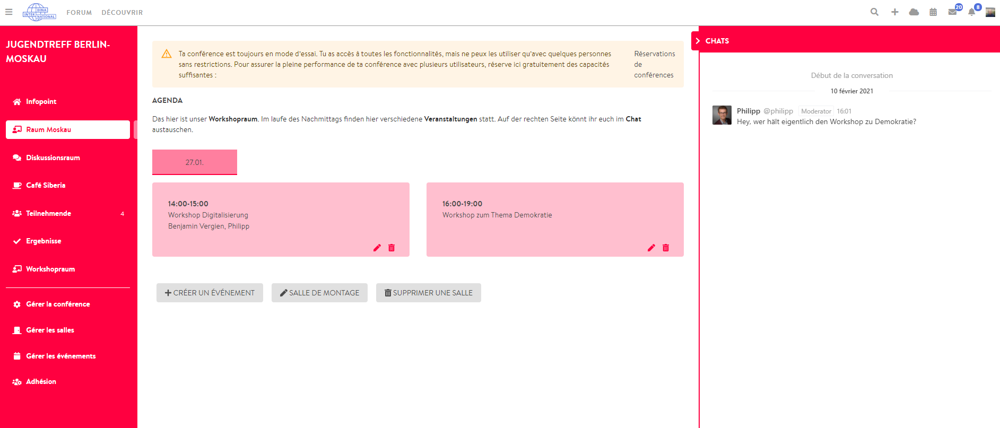

# Chat dans les salles

Lors de la [création](./#visibilite-de-la-salle-et-du-chat) d’une salle, vous pouvez choisir l’option **« montrer le chat »**. Si vous choisissez cette option, la salle sera connectée au logiciel de messagerie intégré de DINA, RocketChat, que vous pouvez également utiliser pour communiquer avec les membres de la plateforme DINA.international. La différence est que, utilisé dans le cadre d’une conférence, tous les membres \(si la fonction de chat est activée\) rejoignent automatiquement un chat de groupe spécifique à la salle. Ce chat de groupe s’affiche alors à droite dans la salle correspondante, mais peut également être affiché via le menu de la messagerie en dehors de la conférence \(symbole de l’enveloppe en haut à droite dans la barre de menu DINA\).


Le chat de groupe spécifique à une salle est particulièrement adapté pour clarifier des questions sur les événements qui s’y déroulent. Toutefois, pour que ces questions trouvent une réponse, au moins une personne responsable doit garder un œil sur les conversations.

CONSEIL : RocketChat est également disponible sous forme d’[application](https://rocket.chat/install) pour téléphone portable et ordinateur. Pour vous inscrire, vous aurez besoin de l’adresse du serveur DINA \(chat.dina.interational\) et de vos identifiants d’accès à DINA.


