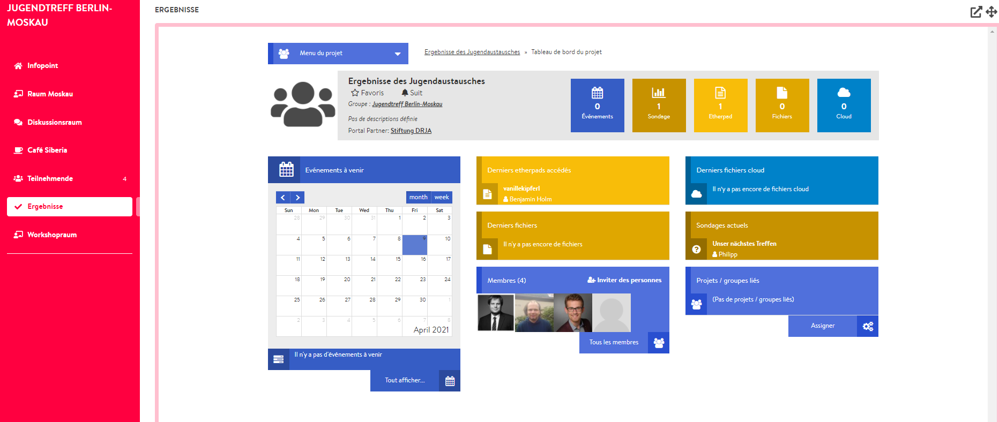

# Salle de résultats

Tout comme la salle de type « participants », la salle « résultats » n’est pas vraiment une salle. Vous ne pouvez donc pas y créer d’événements. Vous pouvez utiliser la salle des résultats pour intégrer un \(nouveau\) projet sur DINA lié à votre conférence afin que tout le monde y ait accès. Étant donné qu’il apparaît depuis la « [vue conférence](../fonctionnalites-vue-d-ensemble/conference.md) » comme les autres salles, les participantes et participants peuvent travailler en collaboration sur des documents, télécharger des fichiers dans le cloud, créer des sondages ou remplir le calendrier du projet directement depuis l’environnement de la conférence. Voici un petit exemple de ce à quoi peut ressembler un projet intégré dans l’environnement de la conférence :


Si vous souhaitez utiliser une salle de résultats pour votre conférence, vous devez la créer avant d’inviter d’autres participantes et participants. En effet, seuls les membres ajoutés après l’intégration du projet auront accès à celui-ci.


