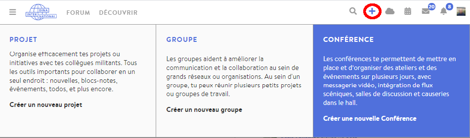
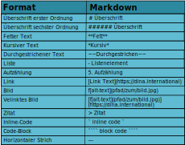

# Créer une conférence ou un événement

Vous souhaitez créer votre premier événement sur DINA ? Vous êtes au bon endroit ! Bien que nous parlions de conférence dans les prochaines pages, votre événement peut bien sûr être _un échange, une rencontre de groupe, une réunion, un cycle de conférences ou toute autre chose_.

Le processus est très similaire à la création d’un groupe sur DINA, donc si vous l’avez déjà fait, vous reconnaîtrez certaines étapes.

## Créer une nouvelle conférence

Pour créer une nouvelle conférence, cliquez en haut à droite sur le symbole « plus » dans la barre du menu, puis sur la case « conférence ». Vous arrivez directement sur la page de configuration, où vous pouvez décider des réglages de base de votre conférence. En plus des réglages de base, vous pouvez également remplir **\*\*\[**le microsite\*\* \]\(microsite.md\)de la conférence, mais vous pouvez aussi le faire plus tard \(ainsi que modifier les paramètres de la conférence\).

## Paramètres généraux

### Nom de la conférence

Le nom de la conférence est une information obligatoire qui sera visible pour tous les participants ainsi que le public grâce au microsite. Trouvez un titre court et concis qui décrit au mieux votre conférence.

### Heure de début et de fin de la conférence

L’heure de début et de fin sera affichée sur le microsite et sert de base aux [**e-mails de rappel**](../gestion-des-membres/emails-de-rappel.md), si vous en avez créé.

### Méthode de candidature

Ici, vous pouvez décider si les personnes intéressées par votre conférence doivent remplir un formulaire d’inscription, que vous pouvez créer par avance. Si vous ne voulez pas de formulaire d’inscription, ne choisissez pas cette option.  
Vous pouvez également créer votre conférence de façon à ce que toutes les personnes utilisant la plateforme puissent y accéder. _\(Cela pouvant mener à des groupes bien plus importants que prévu, qui pourront participer spontanément à votre conférence, nous ne le recommandons que dans certains cas.\)_


Dans les deux cas, vous devez activer les nouveaux membres. Cette option modifie surtout le processus de candidature pour les personnes intéressées.


### Annonce dans les calendriers de projet ou de groupe \(optionnel\)

Si la conférence fait partie d’un groupe sur DINA ou est pertinente pour certains groupes et projets, vous pouvez l’indiquer ici. La conférence apparaît ensuite dans les calendriers des groupes et des projets correspondants _\(par exemple, il serait concevable de diffuser une conférence pour laquelle vous attendez encore de nombreux participants sur un forum de DINA ou si le public cible de la conférence fait ou devrait faire partie d’un groupe spécifique\)._

### Description et informations

La description de la conférence est essentielle pour la présenter au public extérieur, car c’est le premier élément que voient les personnes intéressées sur le [microsite](microsite.md). C’est pourquoi vous devriez l’écrire avec soin et inclure toutes les informations importantes à propos de l’événement. L’éditeur de la description est basé sur le langage Markdown, qui s’utilise de manière très intuitive dès que l’on a compris comment il fonctionne. Vous trouverez plus d’informations sur le sujet [ici](https://docs.framasoft.org/fr/grav/markdown.html#styles-de-texte).


Quelques règles de base à propos de Markdown :


### Informations de contact \(optionnel\)

Comment peut-on joindre les responsables de la conférence ? Dans ce champ, vous pouvez ajouter des liens ainsi que des informations telles qu’une adresse, un numéro de téléphone, des réseaux sociaux, etc. Attention : ces informations seront visibles par les personnes extérieures à la conférence. Ici aussi, vous pouvez utiliser la syntaxe Markdown si vous souhaitez mettre quelque chose en évidence, par exemple.

### Couleur de la réunion \(optionnel\)

Vous pouvez choisir la couleur primaire de la conférence très facilement, au format Hex. Vous trouverez sur [Wikipédia](https://www.wikipedia.org/) quelques couleurs au format Hex, ou pouvez simplement chercher « color picker » sur Google et convertir la couleur de votre choix.


La couleur de la conférence détermine surtout l’aspect visuel de « [la vue conférence](../fonctionnalites-vue-d-ensemble/conference.md) », la page d’administration n’est pas modifiée.


### Icône \(optionnel\)

L’icône est pour ainsi dire le logo de la conférence et est visible sur le microsite et lors de la recherche.

### Bannière \(optionnel\)

La bannière apparaît sur le microsite, au-dessus du nom du groupe. Choisissez donc une image très large, pour qu’elle ne soit pas coupée \(1140 x 240 pixels\).

### Site Internet \(optionnel\)

Votre conférence dispose de son propre site Internet ou bien vous souhaitez faire référence au site Internet sur lequel votre événement est annoncé ? Dans ce cas, vous pouvez ajouter le lien ici. Il sera visible sur le microsite.

### Thèmes pertinents et mots-clés \(optionnel\)

Ici, vous indiquez quelles thématiques sociales seront abordées pendant votre événement, afin que les personnes intéressées par ce sujet trouvent votre conférence plus facilement et qu’elles aient une idée de son contenu. Les mots-clés peuvent affiner un peu plus le sujet. Tout cela est visible sur le microsite.

### Lieu ou adresse \(optionnel\)

Si vous souhaitez associer un lieu à la conférence \(par exemple, elle est diffusée depuis Berlin\), vous pouvez l’ajouter ici et il apparaîtra sur le microsite.

### Projets/groupes apparentés \(optionnel\)

Peut-être souhaitez-vous renvoyer à des projets ou des groupes qui proposent du contenu sur le même thème. Cela sera ensuite affiché sur le microsite.

### Partenaire du portail

Le partenaire est l’organisation sur DINA à laquelle votre conférence est rattachée, par exemple, si elle est soutenue par un certain bureau de coordination ou si elle s’inscrit dans un contexte bilatéral, vous indiquez le lien avec ce partenaire.

### Visibilité

Vous pouvez rendre votre conférence publique ou visible seulement pour certains groupes de personnes.

Cliquez sur « Enregistrer » pour créer votre conférence. Si vous le souhaitez, vous pouvez également concevoir le microsite de la conférence à l’avance en remontant au début du formulaire et en cliquant sur l’onglet [microsite](microsite.md). Vous pouvez aussi le faire plus tard ! Vous devez ensuite créer des [salles ](../salles/)pour votre conférence.

