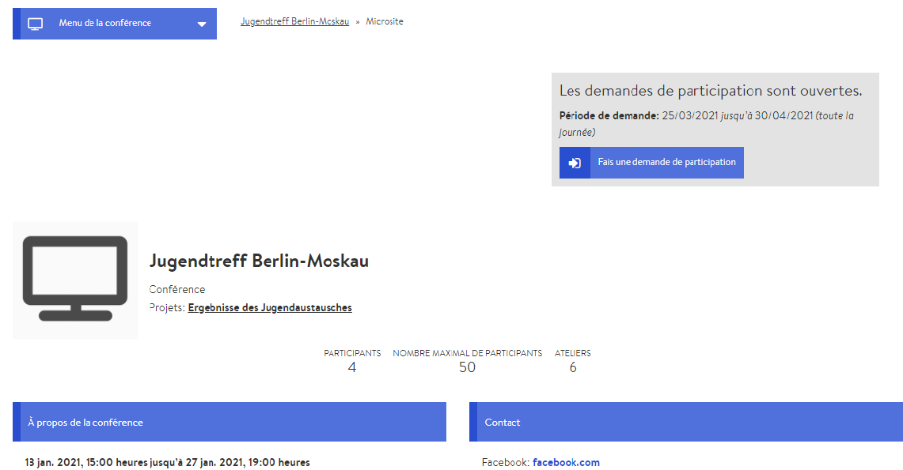

# Microsite

Le microsite est la représentation extérieure de votre conférence et peut être consulté par toute personne ayant l’URL de la conférence. Il s’agit en quelque sorte de votre vitrine numérique. Il doit donc être informatif et donner envie de participer à la conférence ou à l’événement. De plus, les personnes intéressées peuvent s’inscrire à la conférence via le microsite, ce qui en fait également un outil de [gestion des participantes et participants](../gestion-des-membres/).

### Édition du microsite 

Les paramètres du microsite font partie des paramètres généraux de la conférence. Ainsi, vous avez peut-être déjà paramétré le microsite lors de la [création de votre conférence,](./) mais il est possible de le modifier à tout moment. Pour modifier le microsite, rendez-vous sur la page d’administration puis cliquez sur l’onglet des paramètres.


Certains des paramètres sont de nature générale et n’ont aucune influence sur l’apparence du microsite. Les plus importants sont l’icône, la bannière, la description et les informations de contact.


