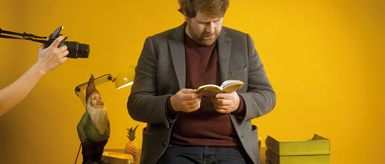

# !DINA מפגשים דיגיטליים מוצלחים – באמצעות

המפגש הדיגיטלי הוא כר נרחב להזדמנויות חדשות. מדובר במפגשים פורצי גבולות שאינם תלויים במיקום פיזי ומאפשרים צירוף משתתפים רבים בעת ובעונה אחת. זאת עשויה להיות חוויה מעשירה ומהנה, אם כי סוד ההצלחה – הן מבחינת תכניו של האירוע והן מבחינת איכות החוויה – תלוי בכמה גורמים. המפגש הדיגיטלי אמנם אינו שונה במהותו ממפגש אנלוגי, אך עם זאת הוא מתאפיין באיכויות המיוחדות לו ובתכונות הדורשות התייחסות ייחודית מאחר שהן פחות אינטואיטיביות.

### **אילו תכונות המאפיינות את המפגש הדיגיטלי מצריכות התייחסות מיוחדת?**

* •	האינטראקציה בין המשתתפים אינה מובנת מאליה, והתופעה מוכרת למנוסים במפגשים מהסוג הווירטואלי. נכנסים למפגש, ואז נתקלים בשני מצבים טיפוסיים: או שכל האחרים שותקים כמוכם או שכבר מתקיימת שיחה ערה בין הנוכחים במפגש, והמצטרפים הטריים לא כל כך יודעים איך להצטרף לשיחה – הרי כל דובר מקבל לרגע את הבמה הווירטואלית כולה, וזה יכול להיות מלחיץ למדי. המסקנה היא שגם בפורום הדיגיטלי רצוי וכדאי שיהיה מנחה, אפילו בשלב השיחות הבלתי פורמליות שמתנהלות עד לתחילתו הרשמית של המפגש.
* •	טווח הריכוז בפורום דיגיטלי קצר יותר מאשר במפגש בלתי אמצעי. גם יום אירועים שלם במציאות הוא מעייף, וכשהוא מתרחש במרחב הווירטואלי – זה כמעט בלתי אפשרי. מפגשים דיגיטליים מתישים מאוד, שכן המוח מחפש אינסטינקטיבית בלי הרף אחר אותות שאינם מועברים באמצעים דיגיטליים, ומנסה להשלים את הפערים. בלי רגעי התנועה שהאדם חווה אוטומטית, כגון שינויי מקום וכך גם שינויי זירה, התחושה המתישה המתקבלת היא שיום האירועים מתארך פי שלושה. לכן מומלץ שתוכנית מפגשים דיגיטלית תהיה במתכונת מצומצמת, לדוגמה על ידי השמטת חלקים שתוכננו מלכתחילה או על ידי ריווח התוכנית, למשל באמצעות פריסתה על פני כמה ימים. מכל מקום, רצוי לדאוג להפסקות בתדירות גבוהה יותר בהשוואה להפסקות במפגשים בלתי אמצעיים, ויתרה מכך רצוי לשלב מפעם לפעם "שוברי קרח" שתפקידם לגבש מעט בין המשתתפים, ולהזכיר לנו שלפני הכול – כולנו בני אדם, גם אם כל אחד מאתנו יושב במקום אחר ומביט באחרים דרך מסך.
* •	הנוכחים בחדר וירטואלי יתקשו לקלוט ולחוש את האווירה שמסביבם. במפגש בלתי אמצעי גוף האדם משדר אותות שמבהירים לו מה האווירה בחדר בכל רגע נתון – שקט או רועש, אנשים שמטים את ראשם הצידה או מהנהנים קלות – ניתוח אותות דקים כאלה ורבים אחרים הוא משימה קשה עד בלתי אפשרית בפורום דיגיטלי שנעדר מטיבו אפשרות לקליטה חושית. כדי לברר את מצב האווירה ברגע מסוים וכדי לייצר אווירה חיובית דרושים רגעים של ביטוי פעיל ליוזמות כאלה. אפשר להשתמש ב"שוברי הקרח" ובסימני יד שיוסכמו מלכתחילה בתחילת המפגש כדי לאותת על רצון לומר משהו בדיון או כדי לבקש הפסקה ספונטנית. 
* •	אם הצלחתם להניע את המפגש בהנחיה מוצלחת, כבר עשיתם חצי מהמלאכה, אך כמה כללי אצבע בכל זאת לא יזיקו: \(1\) רבע שעת האיחור "האקדמית" הקבילה ומוכרת מאירועים בלתי אמצעיים אינה חלק מ"כללי המשחק" במפגש דיגיטלי. פורומים דיגיטליים נוטים להתחיל בדיוק בזמן; \(2\) רצוי לסמן בתוכנית בצורה ברורה הזדמנויות לשיח בלתי פורמלי. לדוגמה, "ארוחת בוקר דיגיטלית" או "הפסקת קפה דיגיטלית", ואף להנחות אותן. בתחילת התוכנית הרשמית רצוי לסכם כיצד תתנהל התקשורת בין המשתתפים \(באמצעות צ'אט, בפניה ישירה...?\). כמו-כן, רצוי להכריז מראש באיזו מידה המפגש יהיה גם באחריותם של המשתתפים עצמם בכל הקשור למחויבותם לנוכחות בחדר המפגש. מעבר ל"היעדרויות טבעיות", לדוגמה כדי להביא עוד כוס תה, משמעותה של האחריות מתבטאת גם במחויבות הן של המשתתפים והן של המנחים להימצא בתוך המפגש בפועל. אם מארגני המפגש מעוניינים לפתוח את המפגש באופן שיעורר השתתפות פעילה של חברי הקבוצה, כדאי להתחיל את המפגש בסבב של אינטראקציה פעילה של המשתתפים, לדוגמה באמצעות [נטוורקינג מאולתר](verbindung-in-der-gruppe-schaffen/untitled-1.md).   

להלן נציג על סמך מבחר פורמטים כיצד אפשר לעצב מפגש דיגיטלי מהנה ואנרגטי, מתוך שיתוף פעיל ככל האפשר של המשתתפים. הפורמטים ממוינים לפי מטרתם של פריטי התוכנית למיניהם: החל מהקניית ידע \([שיתוף ידע](input/)\), עבור דרך עבודה משותפת לשם השגת תוצאות \([שיתוף פעולה](input/)\) וכלה בנטוורקינג \([רשתות](verbindung-in-der-gruppe-schaffen/untitled-1.md)\). הפורמטים יספקו לכם כלים והשראה לאירוע דיגיטלי מוצלח.

