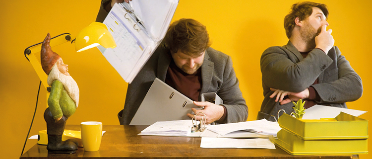

# Ergebnisse produzieren

An Tagungen können Themen unter verschiedenen Gesichtspunkten behandelt und konkrete Ergebnisse erarbeitet werden. Gerade, wenn die Ergebnisse später weiter verarbeitet werden sollen ist wichtig, eine **Ergebnisdokumentation** sicherzustellen \(z.B. über ein verknüpftes DINA Projekt in einem [Ergebnisraum](../../funktionalitaeten/rooms/#raumtyp)\). Wenn die Gruppe parallel zum Arbeitsprozess mitschreiben soll oder die Dokumentation zur visuellen Unterstützung im Prozess genutzt werden soll, kann man dies z.B. auf einem kollaborativen Tool wie einem DINA Projekt-Pad tun, auf das die Teilnehmenden live zugreifen können. Am besten legt man vor Beginn einer Arbeitssession fest, wer Ergebnisse protokolliert und bestimmt eine zuständige Person. Der Rest der Gruppe kann sich dann ganz aufs Arbeiten einlassen. Die Moderatorin hält den Raum für die Gruppe und sollte dafür sorgen, dass alle Menschen zu Wort kommen - je nach Setting kann man eher ruhige Teilnehmende auch bitten, sich im Chat zu beteiligen, wenn sie nicht vor der große Gruppe sprechen wollen. Macht stets deutlich, dass jede Perspektive wertvoll ist und gehört werden sollte!  

