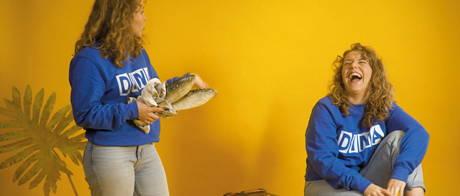

# Делиться знаниями

Конференции являются прекрасной возможностью, чтобы **собрать множество знаний**, которые обычно распределены по разным головам, и эту возможность необходимо использовать! Для свежих импульсов можно пригласить больше экспертов, которые могут расширить или освежить наши собственные знания. Вместе с тем, **интеллект участников мероприятия** представляет собой огромный ресурс, который осваивается с помощью различных форматов форматов. При обмене знаниями важно всегда учитывать контекст участников и постоянно призывать их к активному участию. Активное обучение доставляет больше удовольствия и обеспечивает более высокие результаты!

