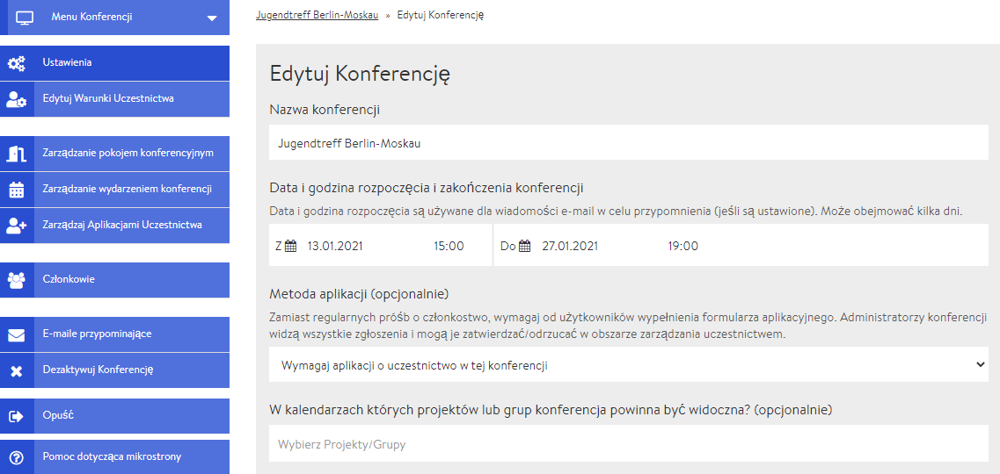
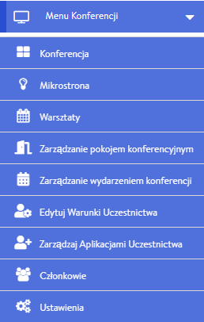

# Admin Seite / back-end

Die Admin Seite kannst nur Du als Administrator\*in einer Tagung aufrufen und enthält alle \(technischen\) Einstellungsmöglichkeiten. Anfänglich ist nur die/der Ersteller\*in Administrator\*in einer Tagung, es können aber weitere Administrator\*innen über die [Mitgliederverwaltung](teilnehmendenmanagement/) benannt werden. Zur Admin Seite gelangst Du, indem du in der [Tagungsansicht](uebersicht/tagungsansicht.md) auf Tagung bearbeiten klickst. Im Folgenden eine kleine Übersicht über die verschiedene Bereiche \(Reiter\) der Admin Seite mit Verlinkung zu weiteren Informationen.

### Tagungsmenü

Im Tagungsmenü findest du hilfreiche Links, die sich teilweise allerdings auch unterhalb des Tagungsmenüs befinden \(s.u.\). Am wichtigsten sind die Links zur Microsite und zur Tagungsansicht \(Tagung\).

### Einstellungen

Im Bereich [Einstellungen](start/) lassen sich grundlegende Optionen der Tagung verändern. Hierzu gehören beispielsweise der Name, die Beschreibung und das Bild/Logo der Veranstaltung. Aber auch die [Microsite](start/microsite.md), welche nicht-Mitgliedern bzw. nicht-Teilnehmenden angezeigt wird und von wo sich Interessierte über ein Formular anmelden können, kann von hier aus gestaltet werden. Die Hintergrundfarbe der Tagungsumgebung lässt sich ebenfalls individuell anpassen.

### Teilnahmebedingungen bearbeiten


Der Reiter **Teilnahmebedingungen bearbeiten** wird nur angezeigt, falls du das [Antragsformular](teilnehmendenmanagement/antragsformular.md) aktiviert hast. Das Antragsformular lässt sich in den Einstellungen an- und abschalten.


Die Teilnahmebedingungen sind alle zusätzlichen Informationen, die von Interessierten beim Ausfüllen des Antragsformulars abgefragt werden. An dieser Stelle kannst Du wählen, welche Informationen Du benötigst.

### Tagungsräume verwalten

Über den Reiter **Tagungsräume verwalten** lassen sich neue [Räume anlegen](rooms/), bereits erstellte [Räume bearbeiten](rooms/#raeume-bearbeiten) oder löschen und [neue Veranstaltungen](veranstaltungen-erstellen.md) in den spezifischen Räumen erstellen.

### Tagungsveranstaltungen verwalten

In diesem Bereich wird eine Liste der bereits geplanten Veranstaltungen angezeigt. Mit einem Klick auf eine gewünschte Veranstaltung kannst Du diese [bearbeiten](veranstaltungen-erstellen.md#veranstaltung-bearbeiten). Öffnet man das Aufklappmenü über den Pfeil nach unten, kann eine Veranstaltung hier auch gelöscht werden. [Neue Veranstaltungen](veranstaltungen-erstellen.md) lassen sich über den Reiter "Tagungsräume verwalten" oder direkt aus der [Tagungsansicht](uebersicht/tagungsansicht.md) heraus hinzufügen.

### Teilnahmeanträge bearbeiten


Der Reiter **Teilnahmeanträge bearbeiten** wird nur angezeigt, falls du das [Antragsformular](teilnehmendenmanagement/antragsformular.md) aktiviert hast. Das Antragsformular lässt sich in den Einstellungen an- und abschalten.


Hier findest du alle bereits eingegangenen Anträge von Tagungsinteressierten und kannst diese annehmen, ablehnen oder auf eine Warteliste setzen.

### Mitglieder

Von hier aus kannst Du [Teilnehmer\*innen einladen](teilnehmendenmanagement/), Anmeldungen annehmen oder ablehnen und weitere Administrator\*innen benennen.

### Erinnerungsmails

Hier kannst du [Erinnerungsmails](teilnehmendenmanagement/erinnerungsmails.md) für deine Teilnehmenden einrichten, die automatisch an bestimmten Zeitpunkten vor dem Event verschickt werden.

### Tagung deaktivieren

Nach dem Deaktivieren der Tagung kann sie von niemandem auf der DINA-Plattform mehr gefunden oder bearbeitet werden. Du kannst sie jedoch in Deinen Profileinstellungen reaktivieren \(Mein Profil --&gt; Deine deaktivierten Inhalte\). Über diesen [Link](https://dina.international/account/deactivated/) kommst du direkt zur Reaktivierungsseite.

### Mehrsprachigkeit umsetzen

In der aktuellen Version von DINA.international kannst du deine Inhalte \(also Raumnamen, Workshopbeschreibungen\) in der Form mehrsprachig sichtbar machen, das du den Inhalt in mehreren Sprachen hintereinander im gleichen Eingabefeld eingibst.  
In Kürze ist ein Update geplant, welches es zusätzlich möglich macht zu definieren, welche Inhalte \(Titel, Beschreibungen\) in welcher Sprachversion angezeigt werden.  
Sobald dieses Update verfügbar ist, werden wir das auf der Plattform bekannt geben und hier beschreiben.

### Verlassen


Wenn du auf diesen Button klickst und die Sicherheitsfrage bestätigst, verlässt Du die Tagung und verlierst Deinen Mitgliedsstatus.


