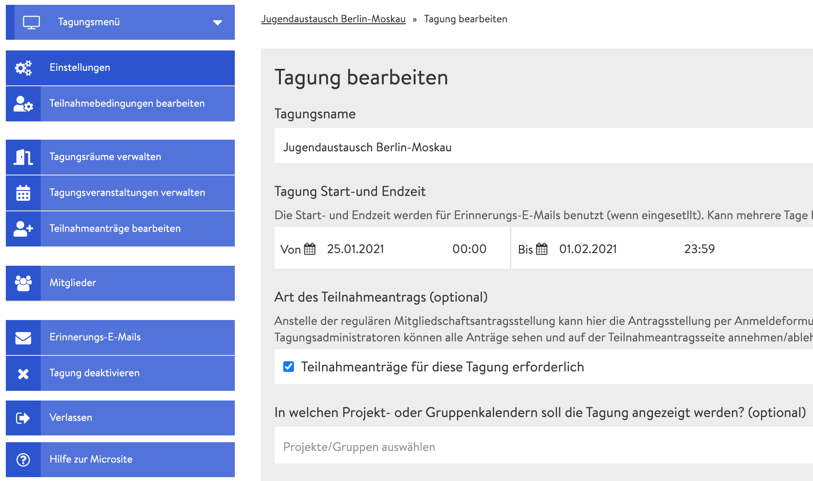
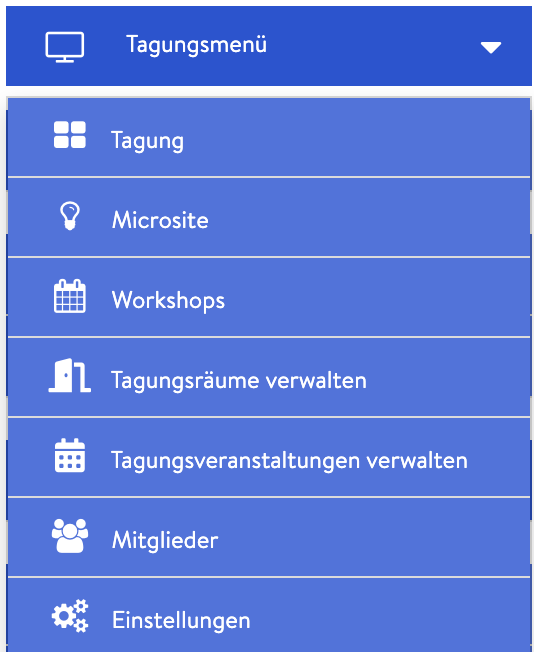

# Správcovská stránka / back-end

Správcovská stránka, na kterou se dostane pouze správce konference, obsahuje všechna \(technická\) nastavení. Po založení konference je jejím správcem jen ten, kdo ji založil. Následně lze ale prostřednictvím [správy členů](teilnehmendenmanagement/) určit další správce. Na správcovskou stránku se dostanete tak, že v [náhledu konference](uebersicht/tagungsansicht.md) kliknete na „upravit konferenci“. Níže naleznete přehled různých oblastí \(záložek\) správcovské stránky s odkazy na další informace.

### Menu konference

Rozkliknutím „Menu konference“ se zobrazí několik užitečných odkazů, další se nachází také pod tímto tlačítkem \(viz níže\). Nejdůležitější je odkaz na microsite a náhled konference \(„Konference“\).

### Nastavení

V části [nastavení](start/) můžete měnit základní parametry konference jako např. název, popis nebo obrázek/logo události. Upravovat zde můžete i [microsite](start/microsite.md), která se zobrazuje všem, kdo nejsou členy/účastníky, a na které se zájemci mohou na události přihlašovat prostřednictvím formuláře. Stejně tak si zde můžete nastavit individuální barevné pozadí konference.

### Nastavení podmínek účasti


Záložka **Nastavení podmínek účasti** se zobrazí pouze v případě, že jste nastavili použití [přihlašovacího formuláře](teilnehmendenmanagement/antragsformular.md). Ten lze aktivovat a deaktivovat v nastavení.


Podmínky účasti jsou všechny doplňující informace, které musí zájemci uvést v přihlašovacím formuláři. Zde si můžete nastavit, jaké informace budete požadovat.

### Správa místností

Na záložce **Správa místností** můžete [vytvořit novou místnost](rooms/), již vytvořenou [místnost upravit](rooms/#raeume-bearbeiten) nebo smazat a ve specifických místnostech [vytvářet události](veranstaltungen-erstellen.md).

### Správa událostí konference

V této části se zobrazuje seznam již naplánovaných událostí. Kliknutím na libovolnou událost ji můžete [upravit](veranstaltungen-erstellen.md#veranstaltung-bearbeiten). V rozbalovacím menu, které se zobrazí kliknutím na šipku, můžete událost také vymazat. [Nové události](veranstaltungen-erstellen.md) lze přidávat prostřednictvím záložky „Správa místností“ nebo přímo v [náhledu konference](uebersicht/tagungsansicht.md).

### Správa přihlášek


Záložka **Správa přihlášek** se zobrazí, pouze pokud jste nastavili použití [přihlašovacího formuláře](teilnehmendenmanagement/antragsformular.md). Ten lze aktivovat a deaktivovat v nastavení.


Zde naleznete všechny přihlášky zájemců o akci. Můžete je přijmout, odmítnout nebo přesunout na čekací listinu.

### Členové \(účastníci\)

Na tomto místě můžete [pozvat účastníky](teilnehmendenmanagement/), přijmout nebo odmítnout přihlášky a případně určit další správce.

### E-mailová upozornění

Zde můžete nastavit [e-mailová upozornění, ](teilnehmendenmanagement/erinnerungsmails.md)která budou účastníkům zasílána automaticky určitou dobu před akcí.

### Deaktivace konference

Když konferenci deaktivujete, nikdo ji na platformě nenajde ani ji nebude moci upravovat. V nastavení svého profilu ji ale můžete znovu aktivovat \(Můj profil --&gt; Váš deaktivovaný obsah\). Pomocí tohoto [odkazu](https://dina.international/account/deactivated/) přejdete přímo na stránku opětovné aktivace.

### Vícejazyčnost

V aktuální verzi platformy DINA.international můžete svůj obsah \(názvy místností, popisy událostí\) prezentovat ve více jazycích tak, že text do daného políčka zadáte za sebou v různých jazycích. V nejbližší budoucnosti ale plánujeme update, který umožní nadefinovat, které texty \(název, popisy\) se mají zobrazovat v jakém jazyce. Jakmile bude tato možnost dostupná, na platformě to oznámíme a v manuálu popíšeme, jak na to.

### Odejít


Když kliknete na tlačítko „Odejít“ a potvrdíte kontrolní otázku, opustíte konferenci a ztratíte status účastníka.


