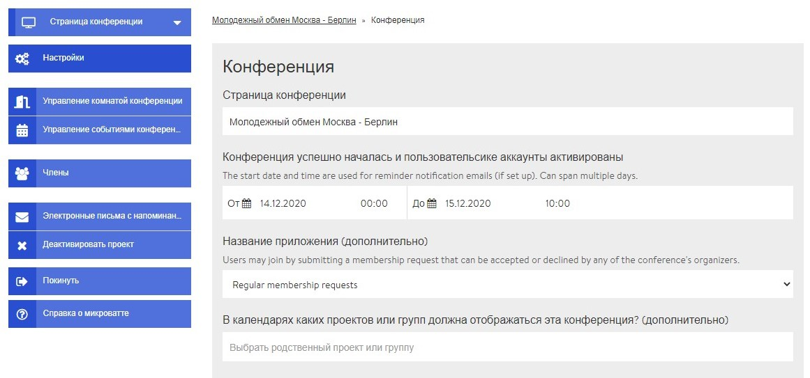

# Страница администратора / бэкенд

Страница администратора доступна только тебе как администратору конференции, она содержит все необходимые \(технические\) настройки. Изначально администратором является только создатель конференции, но через [настройки](https://app.gitbook.com/@dina-international/s/manual/~/drafts/-MY9DMMC5Y2UhbHjLBgJ/v/rus/funktionalitaeten/teilnehmendenmanagement) можно назначать дополнительных администраторов. На страницу администратора ты выходишь, кликнув на кнопку «Управлять конференцией» в окне просмотра конференции \(справа\). Ниже приведен краткий обзор различных секторов \(вкладок\) страницы администратора с ссылками на дополнительную информацию.

### Меню конференции

В меню конференции находятся полезные ссылки, но, некоторые из них расположены под стрелкой "Страница конференции" \(см. ниже\).

### Настройки

В разделе «Настройки» можно изменить основные настройки конференции. Например, название, описание и изображение/логотип мероприятия. Здесь также можно оформить микросайт, который отображается для лиц, не являющихся членами или участниками конференции, и которые, если они заинтересуются, могут зарегистрироваться с помощью соответствующей формы. Здесь также можно индивидуально настроить цвет фона  конференции.

### Редактирование условий участия


Вкладка **«Редактирование условий участия»** отображается только в том случае, если ты активировал форму заявки. Форма заявки включается и выключается в настройках.


Условия участия  - это вся дополнительная информация, которая запрашивается у участников в процессе заполнения заявки. Здесь ты определяешь, какая информация тебе необходима.

### Управление конференц-помещениями

С помощью вкладки **«Управление комнатой конференции»** создаются новые помещения, редактируются или удаляются ранее созданные помещения, а также создаются новые мероприятия в специфических помещениях.

### Управление мероприятиями конференции

В этом секторе отображается список уже запланированных мероприятий. Кликнув на желаемое мероприятие, ты можешь его редактировать. Если открыть выпадающее меню через стрелку вниз, здесь также можно удалить какое-либо мероприятие. Новые мероприятия можно добавлять через закладку «Управление комнатой конференции» или непосредственно из окна просмотра конференции.

### Редактирование заявок на участие


Вкладка **«Редактировать заявки на участие»** отображается только в том случае, если ты активировал форму заявки. Форма заявки включается и выключается в настройках.


Здесь находятся все заявки, уже поступившие от участников, которые ты можешь принимать, отклонять или помещать их в список ожидания.

### Члены

В этом разделе ты можешь приглашать участников, принимать или отклонять заявки и назначать новых администраторов.

### Электронные письма с напоминанием

Здесь ты можешь создавать для своих участников электронные письма-напоминания, которые будут им автоматически отправляться в определенное время перед мероприятием.

### Деактивация конференции

Деактивированная конференция исчезает с платформы DINA. Тем не менее, ты можешь в любое время реактивировать ее в настройках своего профиля \(Мой профиль --&gt; Защищенный контент\). Через эту ссылку ты выходишь прямо на страницу реактивации.

### Реализация многоязычия

В актуальной версии DINA.international ты можешь отображать соответствующий контент \(например, названия помещений, описания семинаров\) на нескольких языках путем его ввода на нескольких языках подряд в одно и то же поле ввода. В ближайшее время планируется апдейт, который позволит дополнительно определять языковую версию для отображения соответствующего контента \(названия, описания\). Как только этот апдейт будет доступен, мы объявим об этом на платформе и опишем его здесь.

### Выход


Кликом на эту кнопку и подтверждением вопроса безопасности ты покидаешь конференцию и лишаешься статуса участника.


