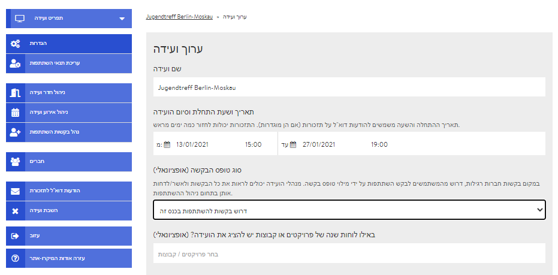
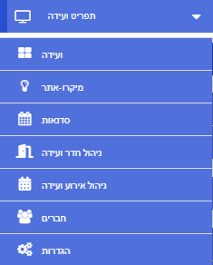

# דף האדמין / הקצה האחורי

דף האדמין זמין רק לכם כאדמין במפגש, והוא כולל את כל ההגדרות הטכניות. תחילה, רק יוצר המפגש ישמש גם כאדמין שלו. לאחר מכן הוא יוכל למנות אדמינים נוספים באמצעות ניהול ההשתתפות. כדי להגיע לדף האדמין, לחצו על "ערוך ועידה" בתצוגת המפגש. להלן סקירה קצרה של הלשוניות בדף האדמין, המייצגות תחומים, וכן קישורים למידע נוסף.

### תפריט המפגש – "תפריט ועידה"

בתפריט המפגש תמצאו קישורים מועילים שכמה מהם מוצגים גם מתחת לתפריט המפגש \(ראו להלן\). הקישורים החשובים ביותר הם אלה המפנים למיקרו-אתר ולתצוגת המפגש \(למפגש\).

### הגדרות

בתחום ההגדרות אפשר לשנות אופציות בסיסיות של המפגש. לדוגמה, שם המפגש, תיאורו ואת התמונה או הלוגו של המפגש. יש אפשרות לעצב משם גם את המיקרו-אתר שיוצג למי שאינו חבר או למי שאינו משתתף, ושם יוכלו מעוניינים להירשם באמצעות טופס. אפשר גם להתאים את צבע הרקע של סביבת המפגש.

### עריכת תנאי ההשתתפות


הלשונית "ערוך תנאי השתתפות" תוצג רק אם הפעלתם את טופס בקשת ההצטרפות. אפשר להפעיל או להשבית את טופס הבקשות ב"הגדרות".


כל המידע הנוסף שיידרש מהמעוניינים במפגש במילוי הטופס יהווה תנאי להשתתפות. באפשרותכם לבחור כאן איזה מידע דרוש לכם.

### ניהול חדרי מפגש

בלשונית "נהל/י חדרים" אפשר ליצור חדרים חדשים, לערוך ולמחוק חדרים קיימים וליצור אירועים חדשים בחדרים מסוימים.

### ניהול אירועי מפגש

באזור זה תוצג רשימה של האירועים המתוכננים. בלחיצה על האירוע המבוקש, תוכלו לערוך אותו. אם תפתחו את התפריט הנפתח באמצעות החץ הפונה מטה, תוכלו למחוק את האירוע גם כאן. אפשר להוסיף אירועים חדשים בלשונית "ניהול חדר ועידה" או ישירות מתוך תצוגת המפגש..

### טיפול בבקשות השתתפות


הלשונית "נהל בקשות השתתפות" תוצג רק לאחר שתפעילו את טופס הבקשה להצטרפות. אפשר להפעיל את טופס הבקשה ולהשביתו ב"הגדרות".


כאן תמצאו את כל בקשות ההצטרפות שכבר הוגשו למפגש שלכם. תוכלו לקבלן, לדחותן או להעבירן לרשימת המתנה.

### חברים

מכאן תוכלו להזמין משתתפים, לקבל הרשמות או לדחותן ולמנות אדמינים נוספים.

### הודעות תזכורת במייל

כאן תוכלו להכין הודעות תזכורת למשתתפים. ההודעות יישלחו אוטומטית במייל ובזמנים מוגדרים מראש לפני האירוע.

### נטרול מפגש

לאחר נטרול המפגש, לא תהיה אפשרות למוצאו או לערוך אותו בפלטפורמת DINA. עם זאת, תוכלו להפעיל אותו מחדש בהגדרות הפרופיל שלכם: "הפרופיל שלי" &gt;&gt; "התכנים המנוטרלים שלי". קישור זה יוביל אתכם ישירות לעמוד ההפעלה מחדש.

### מימוש הרב-לשוניות

בגרסה הנוכחית של DINA.international באפשרותכם להציג את התכנים שלכם, כלומר את שם החדר ואת תיאור הסדנאות, בכמה שפות על ידי הזנת התוכן בשפות הנבחרות בזו אחר זו באותה תיבה.
 בקרוב אמור לצאת עדכון שיאפשר להגדיר אילו תכנים \(כותרות, תיאורים\) יוצגו באיזו שפה.
 כשהעדכון יהיה זמין, נודיע על כך בפלטפורמה ונציג אותו כאן.

### עזיבה


אם תלחצו על כפתור זה ותענו על שאלת האבטחה, תוכלו לעזוב את המפגש ותאבדו את מעמד החברות שלכם.


