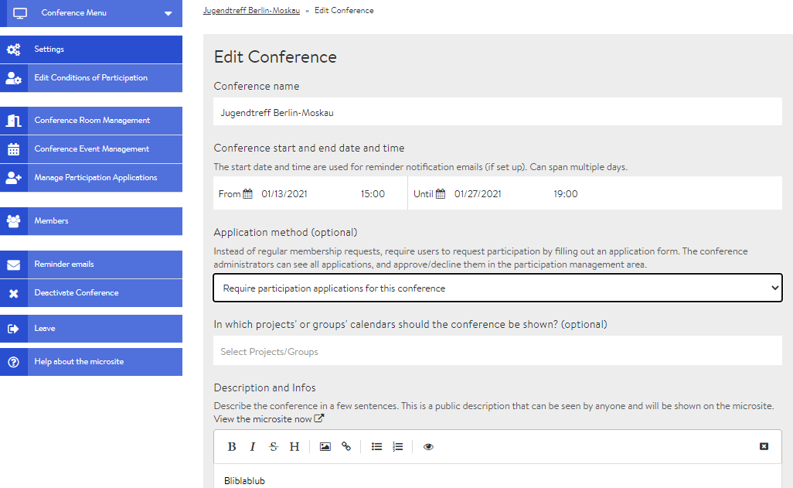
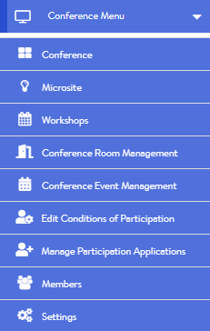

# Admin Page / Back-End

The admin page can only be accessed by you as the administrator of a conference and contains all \(technical\) setting options. Initially, only the creator of a conference is an administrator, though other administrators can be appointed via the member administration. You can access the admin page by clicking on Edit conference in the conference view. Below is a brief overview of the different areas \(tabs\) of the admin page with links to further information.

### Conference menu

In the conference menu you will find helpful links, some of which can also be found below the conference menu \(see below\). The most important links are those leading to the microsite and to the conference view \(conference\).

### Settings

In the settings section, you can change basic options for the conference. These include, e.g., the name, the description and the picture/logo of the event. The microsite which is displayed to non-members or non-participants and from which interested parties can register via a form can also be designed from here. The background colour of the conference venue can also be customised.

### Editing the participation conditions


The **Edit participation conditions** tab is only displayed if you have activated the application form. The application form can be enabled and disabled in the settings.


The participation conditions include all additional information that interested parties are asked to provide when filling out the application form. At this point you can choose which information you need.

### Managing conference rooms

The **Manage conference rooms** tab allows you to create new rooms, edit or delete rooms that have already been created and create new events in specific rooms.

### Managing conference events

This area displays a list of events that have already been scheduled. You can edit an event by clicking on it. If you open the drop-down menu via the downward arrow, an event can also be deleted here. New events can be added via the tab "Manage conference rooms" or directly from the conference view.

### Processing participation applications


The **Process participation applications** tab is only displayed if you have activated the application form. The application form can be enabled and disabled in the settings.


Here, you will find all applications received from interested parties and can accept, reject or put them on a waiting list.

### Members

From here you can invite participants, accept or reject registrations and appoint other administrators.

### Reminder emails

Here you can set up reminder emails for your participants that will be sent automatically at certain times prior the event.

### Conference deactivation

After deactivating the conference, it can no longer be found or edited by anyone on the DINA platform. However, you can reactivate it in your profile settings \(My Profile --&gt; Your deactivated content\). This link will take you directly to the reactivation page.

### Implementing multilingualism

In the current DINA.international version, you can make your content \(i.e., room names, workshop descriptions\) visible in several languages by entering the content in several languages consecutively in the same input field. An update is planned shortly which will also allow you to define which content \(titles, descriptions\) is displayed in which language version. As soon as this update is available, we will announce it on the platform and describe it here.

### Leave conference


If you click on this button and confirm the security question, you will leave the conference and lose your membership status.


