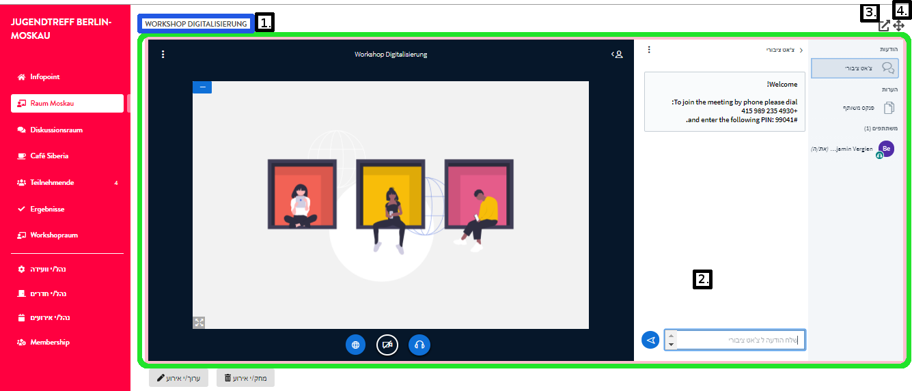

# תכונות וידיאו

בית המפגשים הדיגיטליים של DINA משתמש בתוכנת הקוד הפתוח BigBlueButton כפתרון משולב של ועידות וידיאו, פתרון שמרבים להשתמש בו גם בבתי ספר ובאוניברסיטאות. היתרון של קוד פתוח נעוץ בעיקר ברמה הגבוהה של אבטחת נתונים, מאחר שמומחי טכנולוגיות מידע מכל העולם יוכלו לגשת לקוד ולערוך בו שיפורים. אמנם ל-BigBlueButton כבר זמינים באינטרנט מדריכים רבים שמתארים בהרחבה את האפשרויות שמציעה התוכנה, אך בכל  זאת, בעמודים הבאים נתמקד בתכונות מסוימות הראויות לדגש מיוחד.


BigBlueButton תואמת באופן מיטבי את דפדפני האינטרנט כרום ופיירפוקס. לכן, אם נתקלתם בבעיות בשימוש בתוכנה עם דפדפנים אחרים, נסו בכרום או בפיירפוקס.



מאחר שטכנולוגיית האינטרנט מתפתחת בהתמדה, רצוי להשתמש בגרסה העדכנית של הדפדפנים. לכן, אם מתעוררות בעיות, ודאו שהגרסה של הדפדפן היא העדכנית ביותר.


1. 1.	שם האירוע
2. 2.	ועידת וידיאו BigBlueButton
3. 3.	פתח ועידת וידיאו בלשונית חדשה
4. 4.	הגדל את תצוגת הווידיאו – מעלים את שאר חלקי תצוגת המפגש ומגדילים את חלון הווידיאו. אפשר לבטל באותו כפתור

