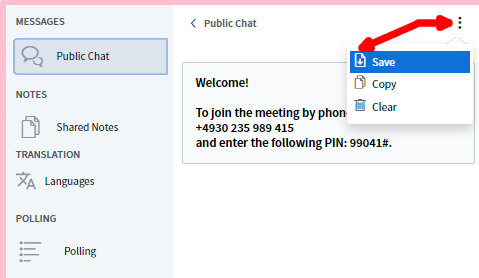
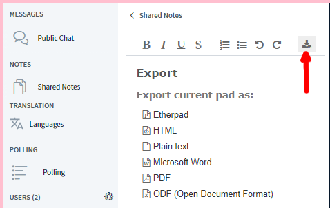
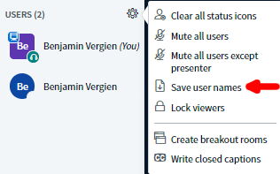

# Recording and Saving of Results

### Video recording

The recording function has not yet been implemented.

### Saving the chat and the notes

BigBlueButton allows you to save both the public chat and the shared notes. In the public chat, this is done via the 3-point menu in the upper right corner of the chat window.

The shared notes, on the other hand, can be downloaded in various formats \(e.g. PDF, Word, ODF, HTML\) via the download icon.

### Saving the list of participants

The \(present\) participants can also be downloaded in a text file. This is easily done via the cogwheel menu next to the list of participants.

