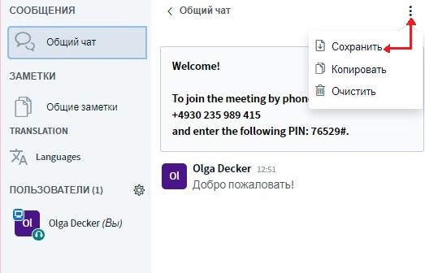
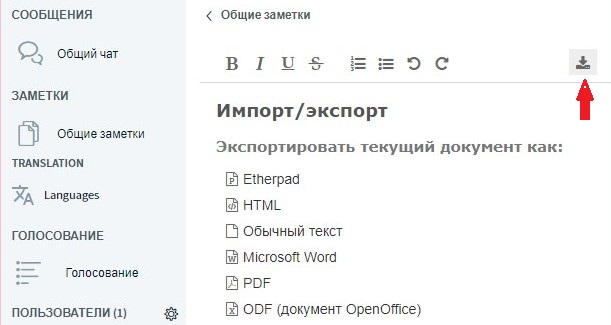
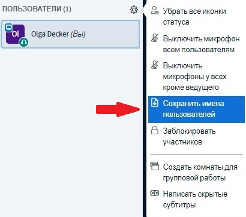

# Запись и сохранение результатов

### Видеозапись

В настоящее время функция видеозаписи еще не работает.

### Сохранить чат и заметки

BigBlueButton предлагает возможность сохранить как общий чат, так и общие заметки. В публичном чате это делается через трехстрочное меню в правом верхнем углу окна чата.

Общие заметки можно скачать в различных форматах \(например, PDF, Word, ODF, HTML\) с помощью функции «Download».

### Сохранить список участников

Список актуально присутствующих участников также можно скачать в текстовом файле. Это можно очень просто сделать через меню шестеренки рядом со списком участников.

