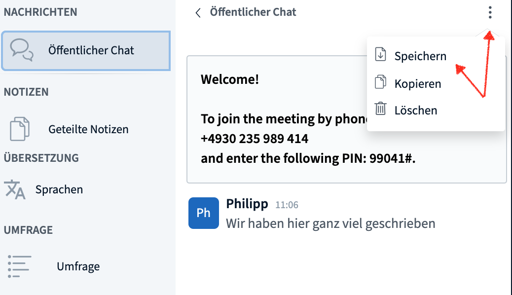

# Záznam a uložení výstupů

### Videozáznam

Funkce pro pořizování videozáznamu zatím není dostupná.

### Uložení chatu a poznámek

BigBlueButton nabízí možnost uložení skupinového chatu i sdílených poznámek. Pro uložení společného chatu klikněte na symbol tří teček v pravém horním rohu okna chatu.

Sdílené poznámky lze stáhnout v různých formátech \(např. PDF, Word, ODF či HTML\) – stačí kliknout na symbol stahování.

### Uložení seznamu účastníků

Jako textový soubor si můžete stáhnout také seznam aktuálně přítomných účastníků. Klikněte na ozubené kolečko vedle seznamu účastníků.

