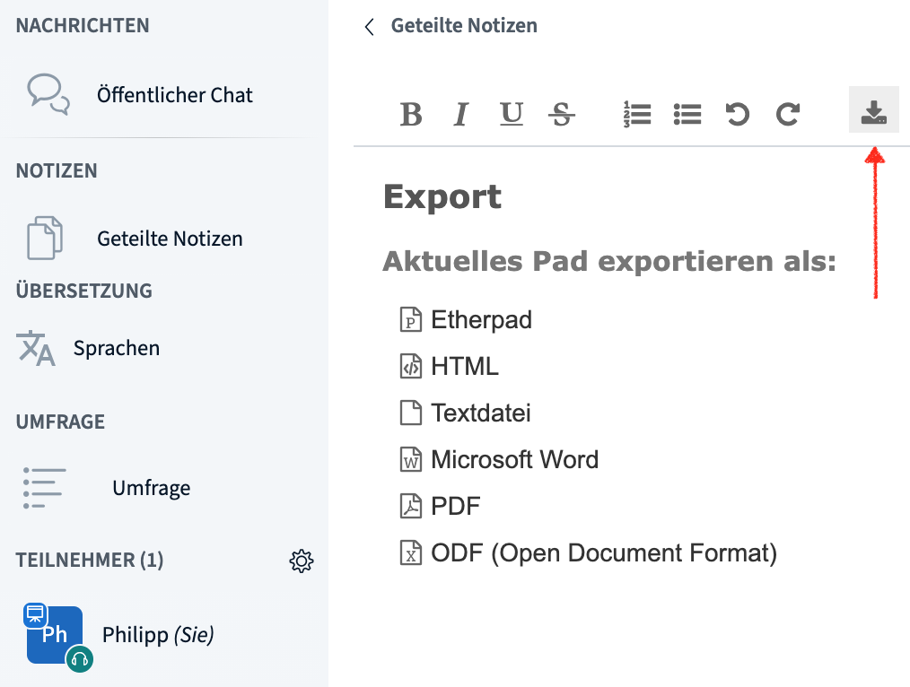
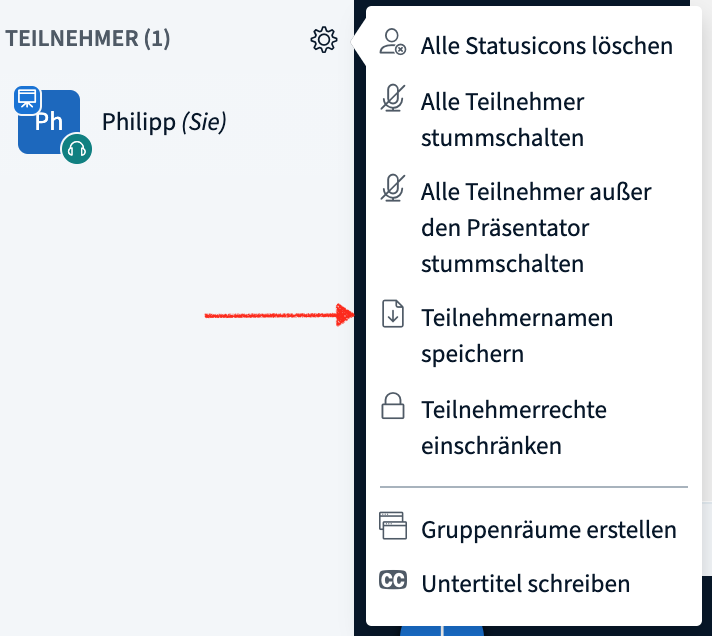

# Καταγραφή και αποθήκευση αποτελεσμάτων

### Βιντεοσκόπηση

Η λειτουργία βιντεοσκόπησης δεν είναι διαθέσιμη ακόμα.

### Αποθήκευση της ζωντανής συνομιλίας και των σημειώσεων

Το BigBlueButton παρέχει τη δυνατότητα αποθήκευσης της δημόσιας συνομιλίας καθώς και των κοινοποιημένων σημειώσεων. Στη δημόσια συνομιλία, αυτό πραγματοποιείται μέσω του μενού 3 σημείων στην πάνω δεξιά γωνία του παραθύρου συνομιλίας.

Από την άλλη, μπορείτε να κατεβάσετε τις κοινοποιημένες σημειώσεις σε διάφορες μορφές \(π.χ. PDF, Word, ODF, HTML\) μέσω του εικονιδίου μεταφόρτωσης.

**Αποθήκευση της λίστα συμμετεχόντων**

Μπορείτε να κατεβάσετε σε αρχείο κειμένου και τη λίστα των παρόντων συμμετεχόντων. Αυτό γίνεται εύκολα μέσω του μενού γρανάζι δίπλα στη λίστα συμμετεχόντων.

