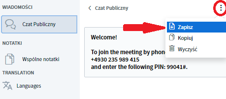
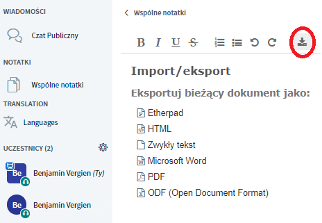
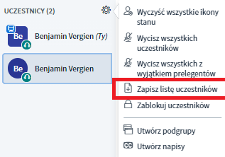

# Aufzeichnung und Ergebnissicherung

### Video aufzeichnen

Aktuell ist die Aufzeichnungsfunktion noch nicht implementiert.

### Chat und Notizen sichern

BigBlueButton bietet die Möglichkeit sowohl den öffentlichen Chat, als auch die geteilten Notizen zu sichern. Im öffentlichen Chat geht dies über das 3-Punkt-Menü in der rechten oberen Ecke des Chatfensters.

Die geteilten Notizen hingegen lassen sich über das Download-Symbol in verschiedenen Formaten \(z.B. PDF, Word, ODF, HTML\) herunterladen.

### Teilnehmendenliste sichern

Auch die \(aktuell anwesenden\) Teilnehmenden lassen sich in einer Text-Datei herunterladen. Dies ist einfach über das Zahnradmenü neben der Teilnehmerliste möglich.

