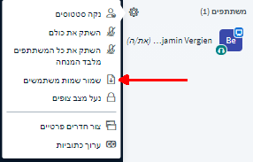

# הקלטה ושמירת תוצאות

### הקלטת וידיאו

פונקציה זו עדיין אינה זמינה.

### שמירת צ'אט והערות

BigBlueButton מאפשרת לשמור הן את הצ'אט הציבורי והן את ההערות ששותפו. בצ'אט הציבורי פונקציה זו זמינה דרך התפריט המשולש הממוקם בפינה השמאלית למעלה בחלון הצ'אט, ומכיל שלוש אופציות: שמור, העתק, נקה

אפשר להוריד את ההערות ששותפו בפורמטים שונים \(לדוגמה, PDF, וורד, ODF, HTML\) בלחיצה על סמל ההורדה.

### שמירה של רשימת המשתמשים

קיימת אפשרות גם להורדה לקובץ טקסט של רשימת המשתמשים בכל רגע נתון, בתפריט ההגדרות שליד רשימת המשתתפים.

