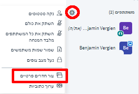
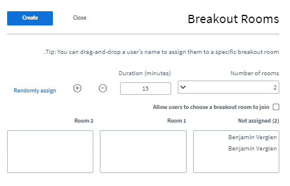
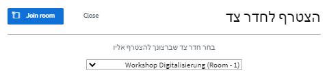
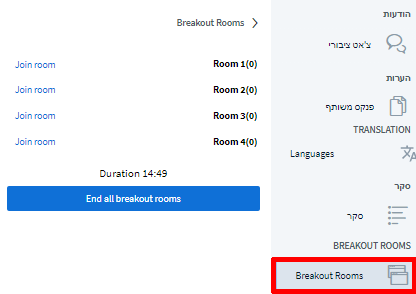

# חדרים פרטיים / קבוצתיים

לפעמים רצוי לשלוח משתתפים לוועידות וידיאו נפרדות לצורך משימות בצוותים קטנים, לסבבי היכרות או לפורמטים אינטראקטיביים. ברבים מפתרונות הוועידה מכונים חדרי הווידיאו הנפרדים האלה Breakout Rooms – חדרים נפרדים. אפשרות אחת היא ליצור חדר קפה ובו כמה שולחנות וירטואליים ולהנחות את המשתתפים להתפצל לשולחנות. אם כי החיסרון שבאפשרות זו הוא שהמשתתפים נאלצים לעזוב את ועידת הווידיאו הפעילה ולהתפצל עצמאית לשולחנות. לכן, זו אפשרות מעולה בהפסקות. עם זאת, BigBlueButton כוללת אפשרות פרישה מובנית שמוגדרת **"חדרים פרטיים"** לחלוקת המשתתפים אקראית או לפי בחירתם. אדמינים ומגישים יכולים ליצור חדרים קבוצתיים כאלה בעת ועידת וידיאו פעילה בכמה הקלקות קלות.

### יצירת חדרים קבוצתיים

ליצירת חדר נפרד, תחילה עליכם להגדיל את חלון ועידת הווידיאו לגודל המרבי בלחיצה על ה-X בפינה הימנית העליונה, כדי לראות את כל האפשרויות. לאחר מכן, לחצו על סמל ההגדרות ליד רשימת המשתתפים ובחרו "צור חדרים פרטיים".

בתצוגה שלהלן בחרו את מספר החדרים שאתם מבקשים ליצור \(עד 8\), וכן את טווח הזמן עד לסגירת החדרים אוטומטית. הקצו את המשתתפים לחדרים או אפשרו להם לבחור חדר בעצמם. כמו כן באפשרותכם להעביר משתתפים מחדר לחדר באמצעות "גרור ושחרר" \(לחצו וגררו בעת ובעונה אחת\). לחצו על "צור" כדי לפתוח חדר, לחצו על "סגור" כדי לבטל את הפעולה.


ההקצאה באקראי מפזרת את המשתתפים אקראית בין החדרים הזמינים. כברירת מחדל, מנחים לא יוקצו אוטומטית, כי אם בקביעה ידנית של ההגדרה בלבד, לפי הצורך.


### הצטרפות לחדרים קבוצתיים

לאחר יצירת החדרים, תישלח לכל משתתף הודעה כי באפשרותו להצטרף לחדר. לפי ההגדרה שנבחרה, יתאפשר לכל אחד מהמשתתפים לבחור את החדר, אם כי אף משתתף אינו מחויב להצטרף לחדר מסוים, וכל אחד מהם רשאי להתעלם מההודעה בלחיצה על כפתור "סגור".

עם זאת, גם לאחר שסגרו את ההודעה הראשונה, יוכלו המשתתפים להצטרף לחדרים באמצעות התפריט הצדדי. אדמינים ומגישים רשאים להצטרף לכל החדר בכל עת, גם אם הוקצו תחילה לחדר אחר.

משתתף שלחץ על "כניסה לחדר", יועבר לחלון חדש בדפדפן עם ועידת וידיאו BigBlueButton. הוועידה הראשית תישאר פתוחה בחלון המקורי, אך הקול בה יושתק.


רצוי שלא לסגור את החלון של ועידת הווידיאו הראשית, מאחר שהוא כולל גם את חדרי המפגש של DINA. אם החלון ייסגר, יהיה צורך לפתוח את DINA מחדש, אבל את חדרי הקבוצה אין מניעה לסגור בכל עת \(ראו להלן\).


### עבודה בחדר קבוצתי

בחדרים הקבוצתיים אפשר להשתמש במרבית הפונקציות הרגילות של BigBlueButton, אבל בהבדל אחד גדול: בחדר כזה כל אחד מהנוכחים יכול להפוך את עצמו למגיש ולפצל את המסך. זו אפשרות נוחה מאוד, מאחר שהיא מייתרת את הצורך באדמין בכל חדר.

### יציאה מחדר קבוצתי

בכל עת משתתף יכול להחליט לצאת מחדר קבוצתי. לשם כך, די בסגירת את החלון הרלוונטי.


לאחר שסגר את החלון, באפשרותו של המשתתף להצטרף שוב לחדר בלשונית "חדרים פרטיים" או "חדרים קבוצתיים".


### סגירת חדרים פרטיים / קבוצתיים

ככלל, תוקפם של חדרים צדדיים יפוג לאחר הזמן שנקבע, אם כי מנחים יוכלו לסגור את החדרים ביוזמתם בלחיצה על הכפתור "סגור את כל החדרים הקבוצתיים" בלשונית "חדרים קבוצתיים".

### הערות


* •	אין אפשרות לשנות את משך זמן פעולת החדר בדיעבד.
* •	הצ'אט ופנקס ההערות של החדרים הקבוצתיים לא יועברו אוטומטית לחדר הראשי, גם לא בכיוון ההפוך.
* •	אין אפשרות להקליט חדרים קבוצתיים.
* •	כל אחד משתתפי החדר הקבוצתי משמש אוטומטית כמנחה. המצטרף הראשון לחדר מתמנה למגיש, ובאפשרותו לפצל את המסך שלו. התפקיד יועבר בין המשתתפים ביוזמתם.
* •	אין אפשרות להכין חדרים קבוצתיים כבר בתחילת ועידת הווידיאו, מאחר שהם נפתחים מיד עם יצירתם. עם זאת, התהליך מהיר ופשוט מאוד ויוכל להיעשות על ידי התמיכה הטכנית.


