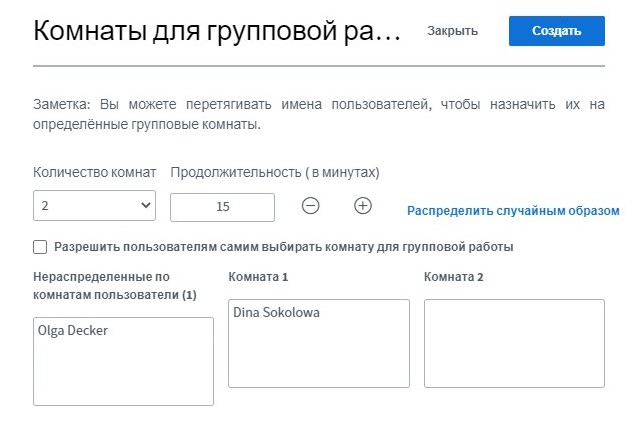

# Брейкаут-помещения/ групповые помещения

Иногда есть необходимость отправить участников на отдельные видеоконференции для выполнения небольших командных задач, для знакомства или работы в интерактивных форматах. В целом ряде современных решений для проведения конференций эти отдельные видеопомещения называются брейкаут-помещениями. В качестве варианта представляется возможным создать помещение-кафетерий с несколькими виртуальными столиками и попросить участников распределиться по этим столикам. Недостаток данного варианта, однако, заключается в том, что участникам в этих целях придется покинуть текущую видеоконференцию и самостоятельно распределиться по столикам \(вместе с тем, это отличный вариант для перерыва\). Однако BigBlueButton уже предлагает встроенную функцию брейкаута, которая называется **групповыми помещениями**. Она обеспечивает как  рандомное распределение, так и самостоятельное группирование участников. Администраторы и презентующие могут создавать такие групповые помещения в ходе текущей видеоконференции всего несколькими кликами мыши.

### Создать групповые помещения

Чтобы создать брейкаут-помещение, тебе, при необходимости, следует сначала максимизировать видеоконференцию с помощью крестика со стрелкой в правом верхнем углу, чтобы увидеть все опции. Рядом со списком участников ты открываешь меню шестеренки и выбираешь опцию «Создать групповые помещения».

В следующем окне просмотра ты выбираешь количество помещений \(до восьми\) и период времени, по истечении которого помещения будут автоматически закрыты. Ты можешь распределить участников по  помещениям рандомно или предоставить им возможность выбрать помещение самостоятельно. Кроме того, с помощью функции drag-and-drop \(кликнуть, держать и передвигать\) ты можешь перемещать участников между помещениями. Кликом на кнопку «Создать» помещения создаются, а с помощью кнопки «Закрыть» процесс прекращается.


Рандомизированное распределение равномерно распределяет всех участников по созданным помещениям. В стандартном режиме модераторы не распределяются по помещениям автоматически, их, при необходимости, надо перемещать вручную.


### Зайти в групповые помещения

После создания помещений все участники получают сообщение о том, что они могут зайти в помещение. В зависимости от настроек у них может быть или отсутствовать возможность выбора. Вместе с тем, никто не принуждается зайти в помещение, соответствующее сообщение можно проигнорировать через кнопку «Закрыть».

Но и после завершения первого призыва участники могут в последующем зайти в помещения через боковое меню. Администраторы или презентующие в любое время могут заходить во все помещения, даже если они были зачислены в определенное помещение.

Как только участник нажимает на кнопку «Присоединиться к комнате», открывается новое окно браузера с видеоконференцией BigBlueButton. Основная конференция остается открытой в первоначальном окне, но с выключенным звуком.


Окно с основной видеоконференцией не рекомендуется закрывать, так как оно содержит и конференц-помещения DINA. Если окно все же закрыли, то тогда DINA необходимо открыть повторно. В отличие от этого, групповые помещения могут закрываться в любое время \(см. ниже\).


### Работа в групповых помещениях

В групповых помещениях можно использовать большинство обычных функций BigBlueButton. Самое большое отличие, однако, состоит в том, что каждый присутствующий может присвоить себе статус презентующего и, таким образом, разделить экран. Это очень удобно, так как не в каждом групповом помещении требуется присутствие администратора.

### Выход из групповых помещений

Участники могут в любое время принять решение о выходе из группового помещения. Для этого всего лишь необходимо закрыть соответствующее окно браузера.


Аналогичным образом участники могут вновь зайти в свое помещение после закрытия окна браузера через вкладку «Комнаты для групповой работы».


### Закрыть брейкаут-помещения / групповые помещения

Как правило, брейкаут-помещения закрываются по истечении настроенного времени. Однако модераторы могут закрывать помещения в принудительном порядке, нажав на кнопку «Завершить групповую работу во всех комнатах» на закладке «Комнаты для групповой работы».

### Примечания


* Срок действия групповых помещений в последующем изменить невозможно.
* Чат и заметки групповых помещений не передаются автоматически в основное помещение, равно как и наоборот.
* Групповые помещения не могут записываться.
* Все участники группового помещения автоматически являются модераторами, причем первое лицо, заходящее в помещение, получает статус презентующего \(то есть может разделить свой экран\). Роль презентующего, при необходимости, участники должны передавать между собой самостоятельно.
* Групповые помещения нельзя подготовить в начале видеоконференции, так как они открываются непосредственно после их создания. Но этот процесс занимает очень мало времени и не является сложным, так что его может взять на себя технический администратор.


