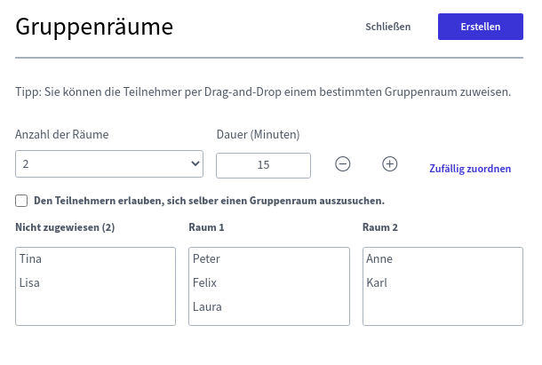
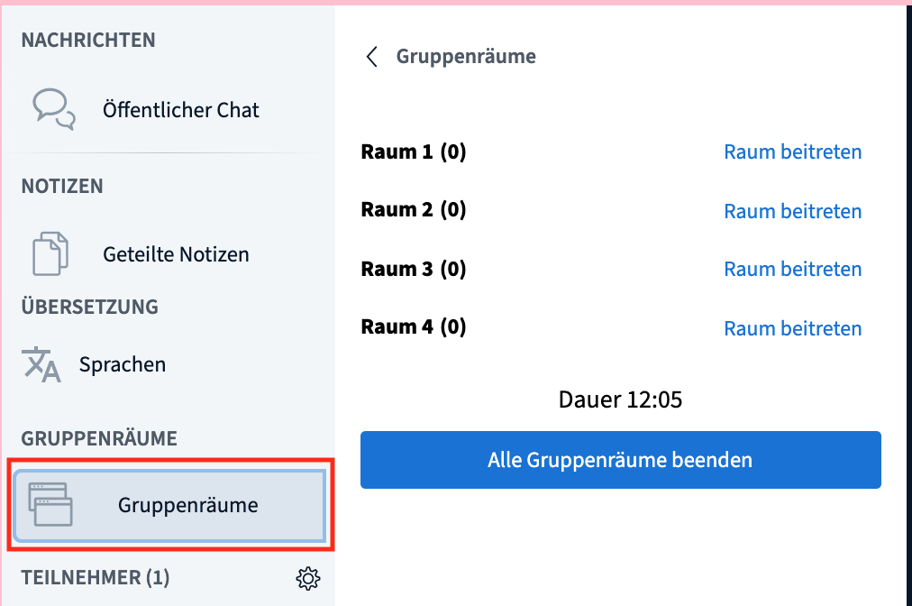

# Skupinové místnosti \(„breakout rooms“\)

Při plnění menších týmových úkolů, seznamování nebo interaktivních formátech je někdy praktické účastníky rozdělit na vícero samostatných videokonferencí. Na současných platformách se takovýmto odděleným místnostem často říká „breakout rooms“. BigBlueButton pro tyto účely nabízí zvláštní integrovanou funkci, která se označuje jako **skupinové místnosti**. Do nich lze účastníky rozdělit nahodile, nebo jejich rozdělení určit. Správci a přednášející mohou skupinové místnosti zřídit během videokonference pomocí několika málo kliknutí. Možným alternativním řešením by bylo založit místnost typu [kavárna](../rooms/#raumtyp) s několika virtuálními stolky a požádat účastníky, aby se k nim rozdělili. To by ale mělo tu nevýhodu, že by účastníci museli opustit probíhající videokonferenci a sami se rozdělit k jednotlivým stolkům \(což je mimochodem dobrá varianta během přestávky\). 

### Vytvoření skupinových místností

Abyste mohli skupinovou místnost vytvořit, maximalizujte si nejdříve okno videokonference \(kříž se šipkami vpravo nahoře\), aby se vám zobrazily všechny možnosti. Klikněte na ozubené kolečko vedle seznamu účastníků a dále na „Vytvořit skupinové místnosti“. 

V následujícím menu si nastavíte počet místností \(max. 8\), dobu, po které se místnosti automaticky zavřou, a také to, zda účastníky do místností přiřadíte sami, budou přiřazeni náhodně, nebo si místnost budou moci sami vybrat. Kromě toho máte možnost účastníky mezi místnostmi přesouvat jednoduše přetažením myší \(funkce „drag-and-drop“\). Kliknutím na „Vytvořit“ místnosti otevřete, kliknutím na „Zavřít“ celý proces ukončíte.


Nahodilé přiřazení účastníky rozdělí rovnoměrně do všech dostupných místností. Moderátoři automaticky přiřazeni nejsou, je tedy nutné je podle potřeby do místností přesunout ručně.


### Vstup do skupinových místností

Po vytvoření místností účastníci dostanou zprávu, že mohou vstoupit do nové místnosti. Podle toho, jaké jste zvolili nastavení, si nyní mohou místnost sami vybírat, nebo možnost výběru nemají. K přesunu ale nejsou nuceni – zprávu mohou jednoduše ignorovat kliknutím na tlačítko „Zavřít“.

Nicméně i když první výzvu odmítnou, mohou účastníci do skupinových místností vstoupit později přes postranní menu. Správci a přednášející mohou vstupovat kdykoliv do jakékoliv skupinové místnosti bez ohledu na to, do které byli přiřazeni.

Když účastník klikne na „Vstoupit do místnosti“, v novém okně prohlížeče se mu otevře nová videokonference BigBlueButton. Hlavní konference zůstane otevřená v původním okně, ale ztlumí se.


Okno hlavní konference nevypínejte, protože ta obsahuje i ostatní konferenční místnosti. Pokud byste toto okno vypnuli, je potřeba si platformu DINA znovu otevřít. Skupinové místnosti ale můžete zavřít kdykoliv \(viz níže\).


### Práce ve skupinových místnostech

Ve skupinových místnostech můžete využívat většinu běžných funkcí BigBlueButton. Největší rozdíl spočívá v tom, že kdokoliv z přítomných může sám ze sebe udělat přednášejícího a tedy i sdílet obrazovku. To je praktické, protože není potřeba mít v každé místnosti správce.

### Opuštění skupinové místnosti

Účastníci mohou skupinovou místnost kdykoliv opustit – stačí, aby zavřeli dané okno prohlížeče.


Zároveň se do místnosti mohou přes záložku skupinových místností kdykoliv vrátit.


### Uzavření skupinové místnosti

Skupinové místnosti se v zásadě zavírají samy po uplynutí nastaveného času. Kdykoliv je ale mohou zavřít i moderátoři kliknutím na tlačítko „Ukončit všechny skupinové místnosti“ v záložce skupinových místností.

### Upozornění


* Dobu, na kterou se skupinové místnosti vytvoří, nelze dodatečně upravovat.
* Chat a poznámky se ze skupinových místností automaticky nepřenáší do hlavní místnosti \(a ani naopak\).
* Ve skupinových místnostech nelze pořizovat záznam.
* Ve skupinové místnosti jsou všichni účastníci automaticky moderátory. Přednášejícím \(s možností sdílet obrazovku\) se stává ten, kdo vstoupí jako první. Následně si roli přednášejícího musí účastníci podle potřeby předávat sami.
* Skupinové místnosti si nemůžete připravit již na začátku videokonference, protože se otevřou, jakmile je vytvoříte. Jejich založení je však jednoduché a rychlé a může jej obstarat osoba zajišťující technickou podporu.


