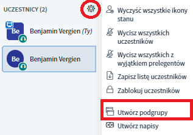
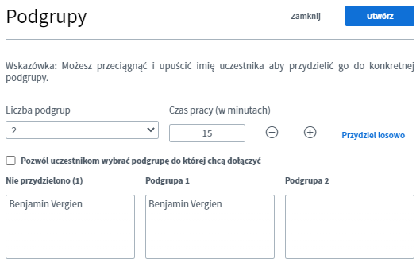
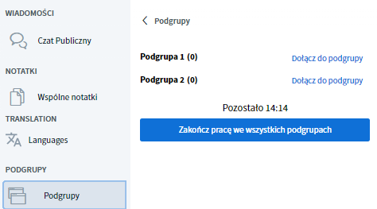

# Breakout-/Gruppenräume

Manchmal ist es sinnvoll, Teilnehmende \(TN\) für kleinere Teamaufgaben, Kennenlernrunden oder interaktive Formate in separate Videokonferenzen zu schicken. In vielen der aktuellen Konferenzlösungen werden diese separaten Videoräume Breakout-Räume genannt. Eine mögliche Herangehensweise wäre, einen [Caféraum](../rooms/#raumtyp) mit mehreren virtuellen Tischen einzurichten und die TN zu bitten, sich auf diese zu verteilen. Der Nachteil davon ist jedoch, dass die TN dafür die laufende Videokonferenz verlassen und sich selbstständig auf die Tische verteilen müssten \(für die Pause jedoch eine tolle Möglichkeit\). BigBlueButton bietet allerdings bereits eine eingebaute Breakout Funktion, welche es als **Gruppenräume** bezeichnet. Sie erlaubt sowohl eine zufällige, als auch eine selbstgewählte Einteilung der Teilnehmenden. Admins und Präsentierende können diese Gruppenräume während einer laufenden Videokonferenz mit wenigen Klicks einrichten.

### Gruppenräume anlegen

Zum Anlegen eines Breakout-Raumes musst Du die Videokonferenz ggf. erst über das Pfeilkreuz oben rechts in der Ecke maximieren, damit Dir alle Optionen angezeigt werden. Neben der Teilnehmerübersicht öffnest du nun das Zahnradmenü und wählst "Gruppenräume erstellen".

In der folgenden Ansicht wählst du die Anzahl der Räume \(bis zu 8\), die Dauer bis die Räume automatisch geschlossen werden, kannst die Teilnehmenden zufällig den Räumen zuordnen oder ihnen erlauben, sich später selbst einen Raum auszusuchen. Du hast zudem die Möglichkeit, mit Drag-and-Drop \(klicken, gedrückt halten und verschieben\) TN zwischen den Räumen hin- herzuschieben. Ein Klick auf "Erstellen" eröffnet die Räume, durch "Schließen" wird der Vorgang abgebrochen.


Das zufällige Zuordnen teilt alle TN gleichmäßig auf die verfügbaren Räume auf. Moderator\*innen werden standardmäßig nicht automatisch zugeteilt, sondern müssen bei Bedarf händisch verschoben werden.


### Gruppenräumen beitreten

Nach dem Erstellen erhalten alle Teilnehmenden eine Nachricht, dass sie einem Raum beitreten können. Je nach Einstellung haben sie an dieser Stelle eine Wahl oder nicht. Es wird allerdings niemand gezwungen einem Raum beitreten, die Nachricht kann über den Button "Schließen" ignoriert werden.

Aber auch nach Schließen des ersten Aufrufes, können die Teilnehmenden den Räumen nachträglich über das Seitenmenü beitreten. Admins oder Präsentierende können jederzeit allen Räumen beitreten, auch wenn sie einem bestimmten Raum zugeordnet wurden.

Sobald ein Teilnehmender auf "Raum betreten" klickt, öffnet sich ein neues Browserfenster mit einer BigBlueButton Videokonferenz. Die Hauptkonferenz bleibt weiterhin im ursprünglichen Fenster geöffnet, wird jedoch stumm geschaltet.


Das Fenster mit der Haupt-Videokonferenz sollte nicht geschlossen werden, da es auch die Tagungsräume von DINA enthält. Falls dieser Fall eintritt, muss DINA erneut geöffnet werden. Gruppenräume hingegen können jederzeit geschlossen werden \(s.u.\).


### Arbeiten in Gruppenräumen

In Gruppenräumen können die meisten der normalen BigBlueButton Funktionen genutzt werden. Der größte Unterschied ist jedoch, dass jede anwesende Person sich selbst zum Präsentierenden machen und damit den Bildschirm teilen kann. Dies ist sehr praktisch, da nicht immer ein Admin in jedem Gruppenraum sein muss.

### Verlassen von Gruppenräumen

Teilnehmende können sich jederzeit entscheiden einen Gruppenraum zu verlassen. Dazu muss einfach nur das entsprechende Browserfenster geschlossen werden.


Ebenso können Teilnehmende ihrem Raum nach dem Schließen des Browserfensters über den Reiter Gruppenräume wieder beitreten.


### Breakout-/Gruppenräume schließen

Grundsätzlich enden Breakout-Räume automatisch nach der eingestellten Zeit. Moderator\*innen können das Schließen der Räume jedoch erzwingen, indem sie den Button "Alle Gruppenräume beenden" im Reiter Gruppenräume betätigen.

### Hinweise


* Die Dauer der Gruppenräume kann nicht nachträglich geändert werden.
* Chat und Notizen der Gruppenräume werden nicht automatisch in den Hauptraum übernommen, ebenso nicht anders herum.
* Gruppenräume können nicht aufgezeichnet werden.
* Alle Teilnehmer\*innen eines Gruppenraumes sind automatisch Moderator\*innen, wobei die erste Person, die beitritt, Präsentator\*in wird \(d.h. ihren Bildschirm teilen kann\). Die Präsentator\*innen Rolle müssen die TN bei Bedarf selbst herumreichen.
* Es ist nicht möglich, Gruppenräume schon zu Beginn der Videokonferenz vorzubereiten, da sie direkt nach dem Erstellen geöffnet werden. Allerdings geht der Prozess sehr schnell und unkompliziert vonstatten und kann durch eine Tech-Unterstützung übernommen werden.


