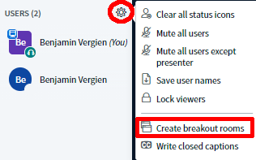
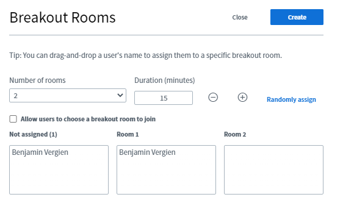
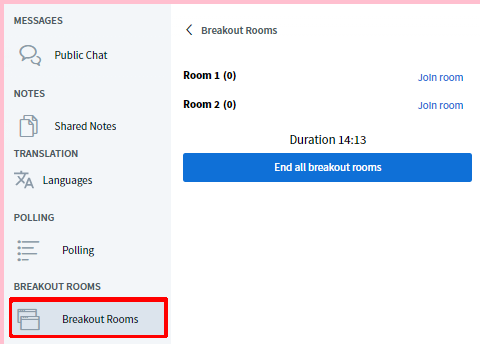

# Breakout/Group Rooms

Sometimes it is useful to send participants to separate video conferences for smaller team tasks, get-to-know-you sessions or interactive formats. In many of the current conferencing solutions, these separate video rooms are called breakout rooms. One possible approach would be to set up a café room with several virtual tables and ask the participants to spread out among them. However, the disadvantage of this is that the participants would have to leave the ongoing video conference and distribute themselves among the tables on their own \(a great option for the break, though\). However, BigBlueButton already offers a built-in breakout function which it refers to as **group rooms**. It allows both random and self-selected grouping of participants. Admins and presenters can set up these group rooms during an ongoing video conference with just a few clicks.

### Creating group rooms

To create a breakout room, you may first have to maximise the video conference by clicking on the arrow cross in the top right corner for all options to be displayed. Next to the participant overview, open the cogwheel menu and select "Create group rooms".

In the following view, you can select the number of rooms \(up to 8\), the duration until the rooms are automatically closed, randomly assign participants to rooms or allow them to choose a room later. You can also drag and drop \(click, hold and move\) participants between the rooms. Clicking on "Create" opens the rooms, "Close" cancels the process.


Random allocation divides all participants equally among the available rooms. Moderators are not automatically assigned by default, they have to be moved manually as needed.


### Joining group rooms

After creating the group rooms, all participants receive a message that they can join a room. Depending on the setting, they may or may not have a choice at this point. However, no one is forced to join a room; the message can be ignored by clicking the "Close" button.

But even after closing the first call, participants can still join the rooms afterwards via the side menu. Admins or presenters can join all rooms at any time, even if they have been assigned to a specific room.

As soon as a participant clicks on "Join room", a new browser window opens with a BigBlueButton video conference. The main conference remains open in the original window, although it is muted.


The window with the main video conference should not be closed as it also contains the DINA conference rooms. If this happens, DINA must be opened again. Group rooms, on the other hand, can be closed at any time \(see below\).


### Working in group rooms

Most of the normal BigBlueButton functions can be used in group rooms. The biggest difference, however, is that each person present can make themselves the presenter and thus share their screen. This is very practical as there is no need for an admin to always be in each group room.

### Leaving group rooms

Participants can decide to leave a group room at any time. All they have to do is close the corresponding browser window.


Also, participants can rejoin their room after closing the browser window via the Group rooms tab.


### Close breakout/group rooms

As a general rule, breakout rooms end automatically after the set time. However, moderators can force the rooms to close by pressing the button "End all group rooms" in the Group rooms tab.

### Additional info


* The duration of the group rooms cannot be changed at a later date.
* Chats and notes from the group rooms are not automatically transferred to the main room or vice-versa.
* Group rooms cannot be recorded.
* All participants in a group room are automatically moderators, with the first person to join becoming a presenter \(i.e. being able to share their screen\). The presenter role must be passed around by the participants themselves, if needed.
* It is not possible to set up group rooms prior to the video conference, as they are opened immediately upon creation. It is a quick and straightforward process, however, which tech support can handle.


