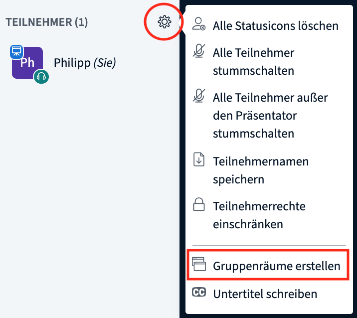

# Αίθουσες επιμέρους συνεδριών/Ομαδικές αίθουσες

Μερικές φορές, θα ήταν χρήσιμο να «στείλετε» τους συμμετέχοντες σε ξεχωριστές τηλεδιασκέψεις, όταν πρόκειται για καθήκοντα μικρότερων ομάδων, για συνεδρίες γνωριμίας ή για διαδραστικές μορφές. Σε κάποιες τρέχουσες μορφές συνεδριάσεων, αυτές οι ξεχωριστές αίθουσες βίντεο ονομάζονται επιμέρους αίθουσες. Μια εφικτή προσέγγιση θα ήταν να δημιουργήσετε μια [αίθουσα café](https://app.gitbook.com/@dina-international/s/manual/v/gre/funktionalitaeten/rooms) με πολλά ψηφιακά τραπέζια και να ζητήσετε από τους συμμετέχοντες να διασκορπιστούν σε αυτά. Ωστόσο, το μειονέκτημα της εν λόγω προσέγγισης είναι ότι οι συμμετέχοντες θα πρέπει να αποχωρήσουν από την τρέχουσα τηλεδιάσκεψη και να διασκορπιστούν μόνοι τους στα τραπέζια \(ιδανική λύση για διάλειμμα\). Παρ’ όλα αυτά, το BigBlueButton προσφέρει ήδη μια επιμέρους ενσωματωμένη λειτουργία, η οποία ονομάζεται **Ομαδικές αίθουσες**. Η εν λόγω λειτουργία δίνει τη δυνατότητα τυχαίας αλλά και αυτοεπιλεχθείσας ομαδοποίησης των συμμετεχόντων. Οι διαχειριστές και οι παρουσιαστές μπορούν να δημιουργήσουν τις εν λόγω ομαδικές αίθουσες κατά τη διάρκεια της τρέχουσας τηλεδιάσκεψης μόνο με μερικά κλικ.

**Δημιουργία ομαδικών αιθουσών**

Για να δημιουργήσετε μια επιμέρους αίθουσα, ίσως χρειαστεί να μεγιστοποιήσετε την τηλεδιάσκεψη κάνοντας κλικ στον σταυρό με τα τέσσερα βέλη στις άκρες του, στην πάνω δεξιά γωνία, έτσι ώστε να εμφανιστούν όλες οι επιλογές. Ανοίξτε το μενού γρανάζι δίπλα στην επισκόπηση των συμμετεχόντων και επιλέξτε «Δημιουργία ομαδικών αιθουσών».

Στην ακόλουθη επισκόπηση, μπορείτε να επιλέξετε τον αριθμό των αιθουσών \(έως 8\), το χρονικό διάστημα με τη λήξη του οποίου θα κλείσουν αυτόματα, να μεταφέρετε τυχαία συμμετέχοντες στις αίθουσες ή αργότερα να τους επιτρέψετε να επιλέξουν μόνοι τους αίθουσα. Επιπλέον, μπορείτε να μεταφέρετε και να αποθέσετε \(κάντε κλικ, κρατήστε και μετακινήστε\) τους συμμετέχοντες μεταξύ των αιθουσών. Κάνοντας κλικ στη «Δημιουργία» ανοίγουν οι αίθουσες, ενώ κάνοντας κλικ στο «Κλείσιμο» ακυρώνεται η διαδικασία.


Η τυχαία κατανομή χωρίζει όλους τους συμμετέχοντες ίσα στις διαθέσιμες αίθουσες. Οι συντονιστές δεν ορίζονται αυτόματα, πρέπει να μετακινηθούν χειροκίνητα.


**Συμμετοχή σε ομαδικές αίθουσες**

Μετά τη δημιουργία των ομαδικών αιθουσών, όλοι οι συμμετέχοντες θα λάβουν ένα μήνυμα ότι μπορούν να συμμετάσχουν σε κάποια αίθουσα. Ανάλογα με τη ρύθμιση, σε αυτό το σημείο ενδέχεται είτε να έχουν είτε να μην έχουν το δικαίωμα επιλογής. Ωστόσο, κανείς δεν υποχρεούται να συμμετάσχει σε μια αίθουσα. Μπορείτε να αγνοήσετε το μήνυμα κάνοντας κλικ στο πλήκτρο «Κλείσιμο».

Ακόμα και αν κλείσουν την πρώτη ειδοποίηση, οι συμμετέχοντες μπορούν να συμμετάσχουν και εκ των υστέρων στις αίθουσες μέσω του πλαϊνού μενού. Οι διαχειριστές ή οι παρουσιαστές μπορούν να συμμετάσχουν σε όλες τις αίθουσες ανά πάσα στιγμή, ακόμη και αν έχουν τοποθετηθεί σε μια συγκεκριμένη αίθουσα.

Μόλις κάποιος συμμετέχων κάνει κλικ στην «Συμμετοχή στην αίθουσα», θα ανοίξει ένα νέο παράθυρο περιήγησης με την τηλεδιάσκεψη BigBlueButton. Το κεντρικό συνέδριο παραμένει ανοιχτό στο αρχικό παράθυρο, αλλά έχει απενεργοποιηθεί ο ήχος του.


Το παράθυρο με την κεντρική τηλεδιάσκεψη δεν θα πρέπει να κλείσει, καθώς περιλαμβάνει όλες τις συνεδριακές αίθουσες της πλατφόρμας DINA. Εάν συμβεί κάτι τέτοιο, θα πρέπει να ανοίξετε ξανά την πλατφόρμα DINA. Από την άλλη πλευρά, μπορείτε να κλείσετε τις ομαδικές αίθουσες ανά πάσα στιγμή \(βλέπε παρακάτω\).


**Εργασίες στις ομαδικές αίθουσες**

Οι περισσότερες από τις τυπικές λειτουργίες του BigBlueButton μπορούν να χρησιμοποιηθούν και στις ομαδικές αίθουσες. Η μεγαλύτερη διαφορά, ωστόσο, είναι ότι κάθε άτομο, που βρίσκεται εκεί, μπορεί να μετατραπεί από μόνος του σε παρουσιαστή και να κάνει κοινή χρήση της οθόνης του. Αυτό είναι πολύ πρακτικό, γιατί δεν χρειάζεται να βρίσκεται πάντα κάποιος διαχειριστής σε κάθε ομαδική αίθουσα.

**Αποχώρηση από τις ομαδικές αίθουσες**

Οι συμμετέχοντες μπορούν να αποφασίσουν ανά πάσα στιγμή να αποχωρήσουν από κάποια ομαδική αίθουσα. Το μόνο που χρειάζεται να κάνουν είναι να κλείσουν το αντίστοιχο παράθυρο περιήγησης.


Επιπλέον, οι συμμετέχοντες μπορούν να εισέλθουν ξανά στην αίθουσα, αφού κλείσουν το παράθυρο περιήγησης, μέσω της καρτέλας Ομαδικές αίθουσες.


**Κλείσιμο επιμέρους αιθουσών / ομαδικών αιθουσών**

Κατά βάση, οι επιμέρους αίθουσες ολοκληρώνονται αυτομάτως μετά τον προκαθορισμένο χρόνο. Ωστόσο, οι συντονιστές μπορούν να κλείσουν τις αίθουσες πιέζοντας το πλήκτρο «Λήξη όλων των ομαδικών αιθουσών» στην καρτέλα Ομαδικές αίθουσες.

### Συμβουλές


* Η διάρκεια των ομαδικών αιθουσών δεν μπορεί να τροποποιηθεί εκ των υστέρων.
* Οι ζωντανές συνομιλίες και οι σημειώσεις των ομαδικών αιθουσών δεν μεταφέρονται αυτομάτως στην κεντρική αίθουσα ή το αντίθετο.
* Οι ομαδικές αίθουσες δεν μπορούν να βιντεοσκοπηθούν.
* Όλοι οι συμμετέχοντες σε μια ομαδική αίθουσα είναι αυτομάτως και συντονιστές, ενώ το πρώτο άτομο που εισέρχεται γίνεται παρουσιαστής \(δηλ. μπορεί να κάνει κοινή χρήση της οθόνης του\). Ο ρόλος του παρουσιαστή θα πρέπει να μεταφέρεται μεταξύ των συμμετεχόντων, εάν χρειαστεί.
* Δεν είναι εφικτή η δημιουργία ομαδικών αιθουσών πριν από την τηλεδιάσκεψη, καθώς ανοίγουν αυτομάτως με τη δημιουργία της. Πρόκειται για μια γρήγορη και απλή διαδικασία, την οποία μπορεί να αναλάβει η τεχνική υποστήριξη.


