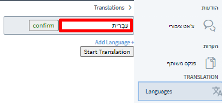
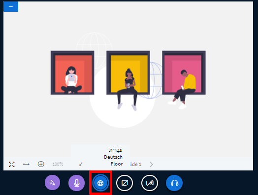
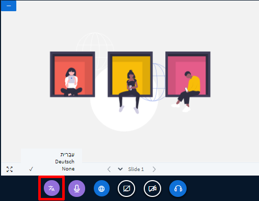

# תרגום בעל-פה או בכתב

פלטפורמת DINA אמורה לקדם חילופי נוער בין-לאומיים, ולכן נועדה לשימוש בריבוי של שפות. אבל לא רק הפלטפורמה עצמה תומכת בריבוי שפות, כי אם גם ה-BigBlueButton \(BBB\) – פתרון ועידת הווידיאו המוטמע בה. אמנם אין עדיין טכנולוגיה שתאפשר תרגום אוטומטי של טקסט בעל-פה, אך באפשרותכם לשלב בקלות מתורגמנים משלכם. להלן נסביר כיצד פועלת הפונקציה וכיצד להפעיל אותה.

**הערה מקדימה:**  
חשוב לזכור שמפגש ב-DINA.international המלווה בתרגום סימולטני דורש הכנות מיוחדות, כמו בחיים האמיתיים.
  
מומלץ למתורגמנים להכיר תחילה את הפונקציות ואת ממשק התוכנה ולבדוק את תפקודם כדי להימנע מתקלות. יהיה מתסכל במיוחד אם משתתפים לא ישמעו את התרגום או אם משהו לא יתפקד כראוי בגלל דפדפן שאינו מתאים. תקלות כאלה ואחרות אפשר למנוע על ידי ניסוי כלים מקדים.

* •	מומלץ ביותר שהמתורגמנים ירכיבו אוזניות כדי למנוע היזונים חוזרים – למעשה, כמעט בלתי אפשרי בלי אוזניות.
* •	חשוב מאוד לבדוק מראש ולוודא הספק גבוה של החיבור לאינטרנט – 20 מ"ב \(10 מ"ב לפחות\). רצוי חיבור חוטי, מאחר שחיבור אלחוטי חשוף יותר להפרעות ולהאטה בתעבורת הנתונים.
* •	כדאי להשתמש במחשב בעל זיכרון של 8 ג'יגה בייט \(4 ג'יגה בייט לפחות\). 
* •	רצוי שהמתורגמנים יעיינו בהגדרות הוועידה בפלטפורמת DINA וינסו את הפונקציות.
* •	לעיתים קרובות, מתורגמנים מעוניינים בקשר עין עם עמיתיהם. הדבר אפשרי באמצעות חדר וידיאו סמוי ונפרד המושתק משני הצדדים. לחלופין, אפשר להפעיל ערוץ זה גם באפליקציות מסרים או בערוצי וידיאו אחרים.

### פונקציית התרגום בעל-פה

כיצד פועל התרגום בעל-פה ב-BBB?

* •	מנחה, או המתורגמן עצמו, מכוון לשפה שמדברים בה, וכן את שפות התרגום.
* •	תיאורטית, כל מנחה יכול לקבל עליו את תפקיד המתורגמן ב-DINA. כל שעליו לעשות לשם כך הוא לבחור את שפת היעד לתרגום.
* •	המשתתפים יבחרו את שפת התרגום שהם מעוניינים לשמוע. לחלופין, הם יכולים לבחור את שפת המקור, בלי תרגום. כשבוחרים בשפה, שומעים את התרגום בשפה הנבחרת וכן את המקור ברקע.
* •	בעת התרגום הסימולטני, עוצמת השמע של שפת המקור תוחלש.

### הפעלת התרגום

בלשונית "שפות" מנחים יכולים להוסיף את כל השפות שידוברו בוועידת הווידיאו. אם יש צורך בתרגום שפה אחת בלבד, לדוגמה במצב שמחצית חברי הקבוצה הם דוברי שתי השפות – די בהוספת שפה אחת. לאחר הוספת השפה לוחצים על כפתור "התחל בתרגום", והכול מוכן.


ככל שנוספות יותר שפות, כך תהיה רשת המתורגמנים מורכבת יותר. כבר כשהרשימה מונה שלוש שפות – יש צורך, תיאורטית לפחות, בשישה מתורגמנים – א ככל שנוספות יותר שפות, כך תהיה רשת המתורגמנים מורכבת יותר. כבר כשהרשימה מונה שלוש שפות – יש צורך, תיאורטית לפחות, בשישה מתורגמנים – א ← ב, ב ← א, א ← ג, ג ← א, ב ← ג, ג ← ב. ב, ב ← א, א ← ג, ג ← א, ב ← ג, ג ← ב.


### למתורגמנים: איזו שפה אני שומע?

כדי להיות מתורגמן במפגשים של DINA.international נדרשת הרשאת מנחה בוועידת וידיאו BBB. אפשר להקצות הרשאות אלה כבר בעת יצירת האירוע או במהלך המפגש:

בסרגל האפשרויות שמתחת לחלונות הווידיאו יופיע עבור כל המנחים וגם עבור המשתתפים הכפתור "שפות זמינות". כפתור זה מאפשר לבחור את השפה שמעוניינים לשמוע. אם בוחרים בשפת המקור, יושמע הקול המקורי בכל השפות. כפתור בחירת שפה יאופשר רק לאחר הפעלה של אופציית התרגום. עד אז, הכפתור ייראה ברקע, כאפשרות שאינה פעילה.


אם בוועידת הווידיאו מיוצגות מעט שפות, אין מניעה שהמתורגמנים ישמעו את הקול המקורי. אך אם הם עצמם זקוקים לתרגום – עליהם לבחור בשפה.


### למתורגמנים: לאיזו שפה יש לתרגם?

כעת על המתורגמנים לבחור את שפת התרגום – השפה שידברו בה. לוחצים על הכפתור "תרגם לשפה" בצד ימין. אם השפה הנשמעת נקבעה קודם לכן, היא אינה ניתנת עוד לבחירה בתפריט זה, וכך גם להפך. 

### למתורגמנים: דיבור

למתורגמנים שמור כפתור מיקרופון שנועד לשימושם בעת התרגום בפועל. בדומה לכפתור "תרגם שפה", גם כפתור המיקרופון סגול. כשהמיקרופון מופעל, ישמעו המשתתפים שבחרו בשפה מסוימת את התרגום הסימולטני בקולו של המתורגמן. רצוי להשאיר את המיקרופון הרגיל מושתק, אלא אם כן מעוניינים לומר דברים שנועדו לאוזניהם של כל הנוכחים במליאה. במצב מושתק יופיע קו אלכסוני על גבי הכפתור. גם את מיקרופון המתורגמן רצוי להשתיק כשאינו בשימוש.

### המאזינים

המאזינים רק צריכים לבחור את השפה שהם מעוניינים לשמוע. בדומה למנחים, גם המאזינים יוכלו לעשות זאת באמצעות לחיצה על הכפתור הגלובוס הכחול.


מאזינים הדוברים את כל השפות המוצעות לבחירה יוכלו לבחור את שפת המקור. בהעדר בחירה, ברירת המחדל תהיה שפת המקור.


