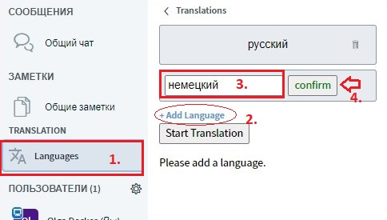
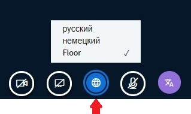
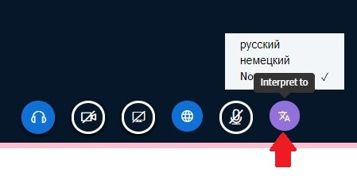

# Перевод

Платформа DINA призвана содействовать международным молодежным обменам и, следовательно, может использоваться на нескольких языках. Однако не только сама платформа поддерживает несколько языков – это также делает интегрированное решение для видеоконференций BigBlueButton \(BBB\). Правда, на сегодняшний день технология недостаточно развита, чтобы обеспечивать автоматический перевод устной речи, но ты можешь совсем просто работать с собственными переводчиками. В следующем разделе мы расскажем, как работает этот компонент и как он активируется.

**Важное примечание:** На конференциях, где будет работать устный перевод, важно иметь в виду, что их на платформе DINA.international \(как и в реальной жизни\) необходимо специально подготовить: Именно в отношении переводчиков мы рекомендуем заранее проверить и ознакомиться с функциями и интерфейсом программного обеспечения, чтобы избежать сбоев. Также нужно быть готовым к большей растерянности участников,  , если они, например, не слышат звука или что-то не ладится, потому что используются не те браузеры или не были опробованы элементы управления…

* Настоятельно рекомендуется, чтобы переводчики во избежание шумов на заднем фоне использовали гарнитуру \(без гарнитуры, собственно, работать невозможно\).
* Не менее настоятельно рекомендуется иметь мощный интернет \(желательно проводной, но не WiFi, мощность не менее 10 Mbit, лучше 20 Mbit, что тоже следует проверить заранее\). Доступ через WiFi может работать, но он чувствителен к помехам, например, если соседи смотрят фильмы.
* Настоятельно рекомендуется использовать мощный компьютер с оперативной памятью не менее 4 GB, но лучше 8 GB.
* Переводчики должны быть знакомы с установками конференций на платформе DINA и протестировать соответствующие функции.
* Переводчики предпочитают иметь зрительный контакт со своими коллегами. Это возможно с помощью \(скрытого, отдельного\) видеопомещения, которое приглушено с обеих сторон. Альтернативно этот канал можно использовать и на других мессенджерах или видеоканалах.

### Принцип функции перевода

Перевод на BBB работает таким образом:

* Модератор \(или сами переводчики\) устанавливает используемые для перевода языки.
* Работать переводчиком на платформе DINA может теоретически любой модератор. Для этого всего лишь необходимо выбрать целевой язык, на который будет осуществляться перевод.
* Участники могут выбрать язык, который они хотят слушать. Они также могут выбрать язык оригинала \(Floor\) без перевода \(в случае выбора языка слышен звук перевода или звук оригинала на выбранном языке\).
* Когда говорит переводчик, звук оригинала приглушается.

### Активировать перевод

Через вкладку «Languages» модераторы могут добавить все языки, используемые на видеоконференции. Если требуется перевод только на один язык \(например, потому что половина группы говорит на обоих языках\), то достаточно выбрать один язык. Затем остается только нажать на кнопку «Start Translation», и все готово.


Чем больше добавляется языков, тем сложнее становится сеть переводчиков. Уже при наличии трех языков теоретически требуется 6 переводчиков \(a➡b, b➡a, a➡c, c ➡ a, b ➡ c, c ➡ b\).


### Для переводчиков: Какой язык я слышу?

Для того, чтобы работать переводчиком, соответствующее лицо должно обладать правами модератора на видеоконференции ВВВ. Оно может наделяться этими правами уже при создании мероприятия или же во время текущего мероприятия.

На панели опций под видеоизображениями все модераторы и участники видят кнопку «Доступные языки» \("Available Languages"\). Здесь можно выбрать необходимый язык. Если выбирается язык оригинала, то тогда воспроизводится звук оригинала со всеми языками. _Выбор языка возможен только после активации функции перевода, сами кнопки видны даже тогда, когда эта функция деактивирована._


Если на видеоконференции представлена лишь пара языков, то переводчикам достаточно звука оригинала. Но если им требуется перевод с языка, которым они не владеют, чтобы переводить на свой рабочий язык, они должны выбрать соответствующий язык перевода.


### Для переводчиков: на какой язык надо переводить?

Переводчики еще должны выбрать, на какой язык они должны переводить, то есть на каком языке они сами будут говорить. Это делается с помощью кнопки «Переводить на» \(Interpret to\) в правом углу. Если до этого уже был выбран прослушиваемый язык, то тогда он в этом меню отсутствует, равно как и наоборот.

### Переводчики: говорить

У переводчиков есть собственная кнопка микрофона, которую они используют только тогда, когда они актуально переводят. Кнопка окрашена, равно как и кнопка «Переводить на» \(Interpret to\), она фиолетового цвета. Если этот микрофон активирован, то тогда голос переводчика слышен только для тех участников, которые выбрали соответствующий язык. Обычный микрофон может использоваться для того, чтобы говорящего могли слышать все участники пленума, в остальном он должен быть выключенным \(выключенный микрофон = зачеркнутый микрофон\). Микрофон переводчика также должен быть выключен, если он не используется.

### Слушатели

Для слушателей все предельно просто: им нужно выбрать только тот язык, который они хотят слушать. Они могут сделать это, как и модераторы, с помощью синей кнопки «Глобус».


Слушатели, понимающие все доступные языки, могут просто выбрать звук оригинала \(Floor\). Если они ничего не выбирают, то тогда настроен звук оригинала.


