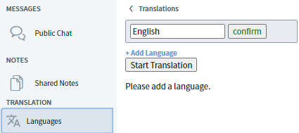
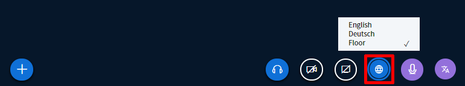
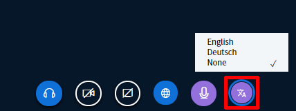

# Interpreting / Translation

DINA is intended to promote international youth exchange and is therefore designed for use in several languages. It is not only the platform itself that supports multiple languages but also the built-in video conferencing solution BigBlueButton \(BBB\). Although the technology is not yet advanced enough to enable automatic interpretation of spoken language, you can easily work with your own interpreters. In the following section you will learn how this feature works and how to activate it.

**Important note before you get started:**  
For an interpreted conference, it seems important to us to point out that such a conference on DINA.international \(as in real life\) requires special preparations: Especially with regard to the interpreters, we recommend checking and getting to know the functions and software interface beforehand in order to avoid disruptions. Also, you can expect more frustration if participants cannot hear the sound or something does not work because the wrong browsers are in use or they have not tried out how to use the system...

* It is strongly recommended that the interpreters wear a headset to avoid feedback \(it is not really possible without one\).
* It is strongly recommended that the internet connection \(preferably via cable and without WLAN\) is powerful \(at least 10 Mbit, better 20 Mbit - this has to be tested beforehand\). Access via WLAN can work - but is susceptible to interference, e.g. from neighbours watching films\).
* We strongly recommend using a powerful computer with at least 4 GB, preferably 8 GB RAM memory.
* The interpreters should have checked out the conference setting on DINA and tested the functions.
* Interpreters often wish to have eye contact with their colleagues. This can be provided by a \(hidden, separate\) video room which is muted on both sides Alternatively, this channel can of course also be used on other messenger services and video channels.

### Principle of the interpreting function

Interpreting on BBB works a s follows:

* A moderator \(or the interpreters themselves\) sets the languages spoken \(or interpreted\).
* Each moderator can theoretically interpret in DINA. All that is needed is to select the target language into which the interpretation should be provided.
* Participants can choose which language they want to listen to. They may also choose the original sound without interpretation \(when a language is selected, the interpreted sound or the original sound in the selected language is heard\).
* When an interpreter speaks, the original sound is turned down.

### Activating interpretation

Moderators can add all spoken languages to the video conference via the Languages tab. If only one language needs to be interpreted \(e.g. because half of the group speaks both languages\), then this is also sufficient. Once this has been done, simply click on the button "Start interpretation" and everything is set.


The more languages are added, the more complex the network of interpreters will become. Even with three languages, you would theoretically need 6 interpreters. \(a➡b, b➡a, a➡c, c ➡ a, b ➡ c, c ➡ b\).


### For interpreters: Which language am I hearing?

In order to act as an interpreter, the person in question needs moderator rights in the BBB video conference. These can be assigned when creating an event or during the ongoing meeting.

In the options bar below the videos, all moderators as well as the participants see the button "available languages". Here you can select which language you want to listen to. If Original is selected, the original sound is played with all languages. _The languages are only available for selection after interpretation has been activated; the buttons are also visible when the function is deactivated._


If only a few languages are spoken in the video conference, there is no reason why the interpreters should not listen to the original sound. But at the latest, if they themselves need interpretation, they should choose the language.


### For interpreters: Which language do you want to interpret into?

Now the interpreters must select the language they want to interpret into, i.e., the language they will speak themselves. This is done via the button "Interpret language" on the far right. If the language listened to has already been selected, it is no longer available in this menu, or vice versa.

### Interpreters: Speaking

Interpreters have their own microphone button which they only use when they are interpreting. This button is purple, just like the "Interpret language" button. When this microphone is activated, only the participants who have selected the corresponding language will hear the interpreter's voice. The normal microphone can be used to be heard by everyone in the plenary and should otherwise always be muted \(mute = crossed out\). The interpreter's microphone should also be muted when not in use.

### Listeners

For listeners it is very easy: they only have to select the language they would like to listen to. This can be done via the blue globe button. The same applies to moderators.


Listeners who understand all available languages can simply select the original sound. If nothing is selected, the original sound is selected by default.


