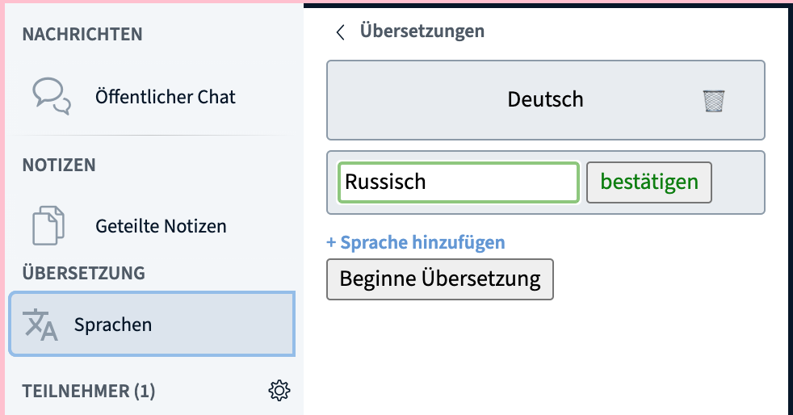
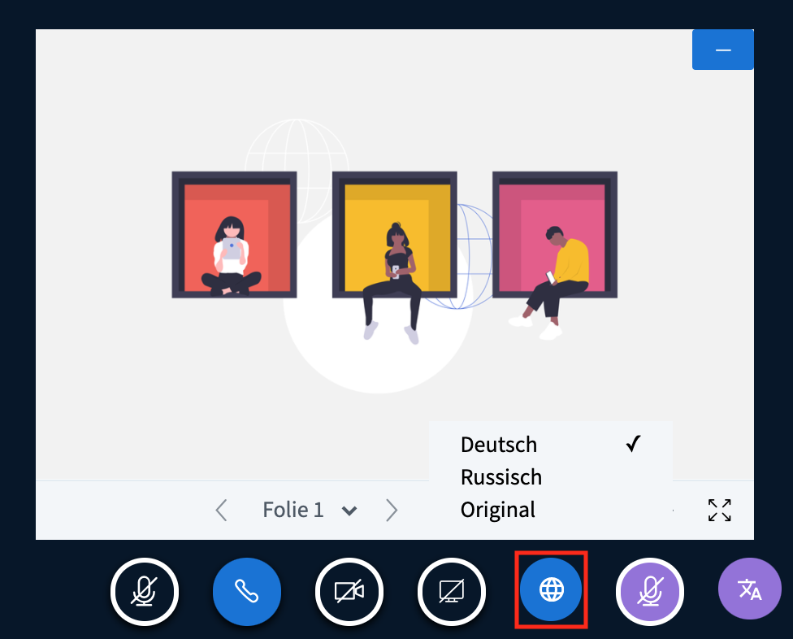
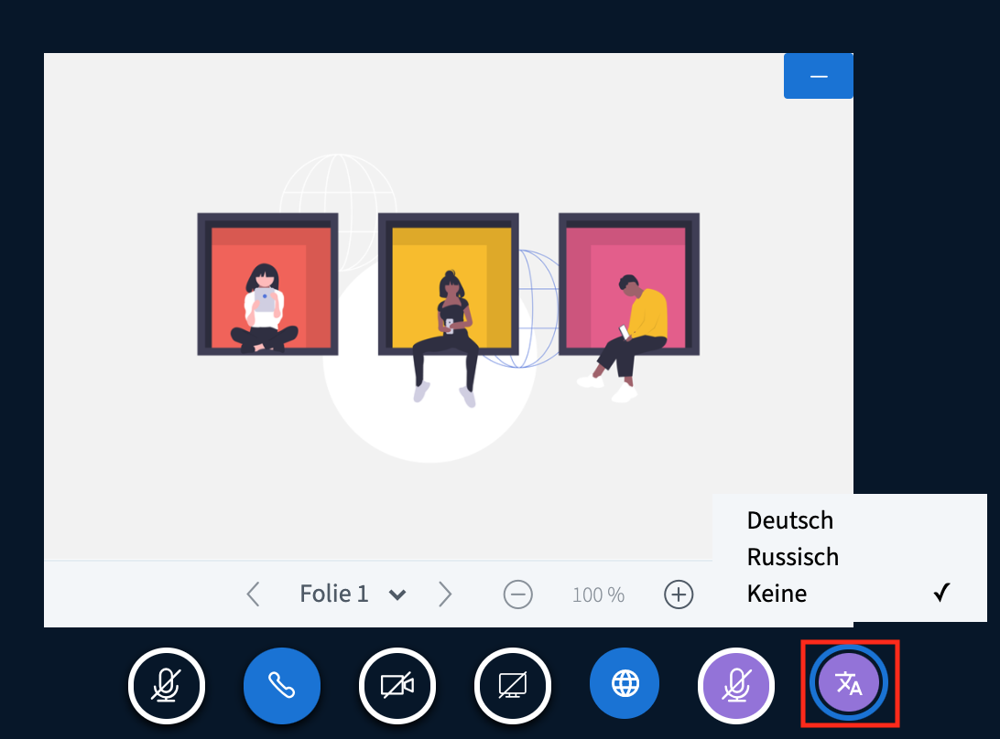

# Dolmetschen / Übersetzen

DINA soll den internationalen Jugendaustausch fördern und ist deshalb für die Nutzung in mehreren Sprachen ausgelegt. Aber nicht nur die Plattform an sich unterstützt mehrere Sprachen, sondern auch die eingebaute Videokonferenzlösung BigBlueButton \(BBB\). Zwar ist die Technologie noch nicht weit genug, um eine automatische Dolmetschung von gesprochener Sprache zu ermöglichen, Du kannst jedoch sehr einfach mit eigenen Dolmetscher\*innen arbeiten. Im folgenden Abschnitt erfährst du, wie dieses Feature funktioniert und wie Du es aktivierst.

**Wichtig vorab:**  
Für eine gedolmetschte Tagung erscheint es uns wichtig darauf hinzuweisen, dass eine solche auf DINA.international \(wie auch im echten Leben\) besonderer Vorbereitungen bedarf:   
Gerade im Hinblick auf die Dolmetschenden empfehlen wir eine vorherige Überprüfung und ein Kennenlernen der Funktionen und Software-Oberfläche, um Störungen zu vermeiden.  
Auch kann man von einer höheren Frustration ausgehen, wenn Teilnehmende z.B. den Ton nicht hören können oder etwas nicht klappt, weil falsche Browser im Einsatz sind oder die Bedienung nicht ausprobiert wurde...

* Es wird dringend empfohlen, dass die Dolmetschenden ein Headset tragen, um Rückkopplungen zu vermeiden \(ohne geht es eigentlich nicht\)
* Es wird dringend empfohlen, dass sowohl die Internetleitung \(möglichst per Kabel und ohne WLAN\) leistungsfähig ist \(mind. 10Mbit, besser 20 MBit - dies ist vorher zu testen\). Ein Zugang per WLAN kann funktionieren- ist aber störanfällig z.B. durch Nachbarn, die Filme anschauen\)
* Es wird dringend empfohlen einen leistungsfähigen Computer zu nutzen mit mind. 4 GB, besser 8GB RAM-Speicher
* Die Dolmetschenden sollten das Konferenzsetting auf DINA besichtigt haben und die Funktionen getestet haben.
* Oft wünschen sich Dolmetschende einen Blickkontakt mit ihreR Kollegin/. Dies ist durch einen \(versteckten, gesonderten\) Videoraum möglich, der beidseitig stumm geschaltet wird  Alternativ ist dieser Kanal naürlich auch auf anderen Messenger-Diensten, VIdeokanälen möglich

### Prinzip der Dolmetschen-Funktion

Das Dolmetschen bei BBB funktioniert so:

* Ein\*e Moderator\*in \(oder die Dolmetschenden selbst\) stellt die gesprochenen \(bzw. die gedolmetschten\) Sprachen ein.
* Jede\*r Moderator\*in kann theoretisch in DINA dolmetschen. Dafür muss nur die zu Ziel-Sprache ausgewählt werden, in die die Dolmetschung erfolgen soll
* Die Teilnehmenden können auswählen, welche Sprache sie hören wollen. Sie können auch den Originalton ohne Dolmetschung wählen \(wenn eine Sprache ausgewählt wird hört man den gedolmetschten Ton oder den Originalton in der ausgewählten Sprache\)
* Wenn ein\*e Dolmetscher\*in spricht, wird der Originalton leiser geschaltet.

### Dolmetschung aktivieren

Moderator\*innen können über den Reiter Sprachen alle gesprochenen Sprachen der Videokonferenz hinzufügen. Falls nur eine Sprache gedolmetscht werden muss \(weil z.B. die Hälfte der Gruppe beide Sprachen spricht\), dann reicht auch diese. Nachdem dies geschehen ist, muss nur noch der Button "Beginne Übersetzung" angewählt werden und alles ist vorbereitet.


Je mehr Sprachen hinzukommen, umso komplexer wird das Netz der Dolmetscher\*innen. Schon bei drei Sprachen braucht es theoretisch 6 Dolmetscher\*innen \(a➡b, b➡a, a➡c, c ➡ a, b ➡ c, c ➡ b\).


### Für Dolmetscher\*innen: Welche Sprache höre ich?

Um als Dolmetscher\*in tätig zu werden, braucht die entsprechende Person Moderator\*innen Rechte in der BBB Videokonferenz. Diese können bereits [bei der Erstellung](../veranstaltungen-erstellen.md#praesentierende-referent-innen-moderator-innen-optional) einer Veranstaltung vergeben werden oder aber auch während des laufenden Meetings. 

In der Optionsleiste unter den Videos sehen alle Moderator\*innen, wie auch die Teilnehmenden, den Button "verfügbare Sprachen". Hier wählt man aus, welche Sprache gehört werden soll. Wird Original angewählt, dann wird der Originalton mit allen Sprachen wiedergegeben. _Die Sprachen stehen erst zur Auswahl, nachdem die Dolmetschung aktiviert wurde._


Falls nur wenige Sprachen in der Videokonferenz vertreten sind, spricht nichts dagegen, dass die Dolmetscher\*innen  den Originalton hören. Aber spätestens, wenn sie selbst auf eine Dolmeschtung angewiesen sind, sollten sie die Sprache wählen.


### Für Dolmetscher\*innen: In welche Sprache soll gedolmetscht werden?

Nun müssen die Dolmetscher\*innen noch auswählen, in welche Sprache sie dolmetschen wollen, also in welcher Sprache sie selbst sprechen werden. Dies läuft über den Button "Sprache übersetzen" ganz rechts. Wurde vorher schon die gehörte Sprache festgelegt, steht sie in diesem Menü dann nicht mehr zur Verfügung, ebenso anders herum. 

### Dolmetscher\*innen: Sprechen

Für Dolmetscher\*innen gibt es einen eigenen Mikrofon-Button, den sie nur verwenden, wenn sie gerade dolmetschen. Dieser ist, genau wie der "Sprache übersetzen" Button, lila eingefärbt. Wenn dieses Mikrofon aktiviert ist, hören nur die Teilnehmenden, welche die entsprechende Sprache ausgewählt haben, die Stimme der Dolmetscher\*in. Das normale Mikrofon kann verwendet werden, um von allen im Plenum gehört zu werden und sollte ansonsten immer stumm geschaltet sein \(stumm = durchgestrichen\). Auch das Dolmetschermikrofon sollte bei nicht-Benutzung stumm geschaltet werden.

### Zuhörer\*innen

Zuhörer\*innen haben es denkbar einfach: Sie müssen nur die Sprache auswählen, die sie gerne hören wollen. Dies geht, genau wie bei Moderator\*innen, über den blauen Welt-Button.


Zuhörer\*innen, die alle verfügbaren Sprachen verstehen, können einfach den Originalton wählen. Wird nichts ausgewählt, dann ist der Originalton voreingestellt.


