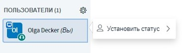
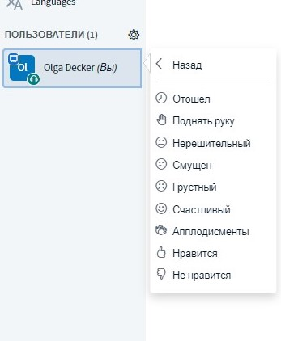
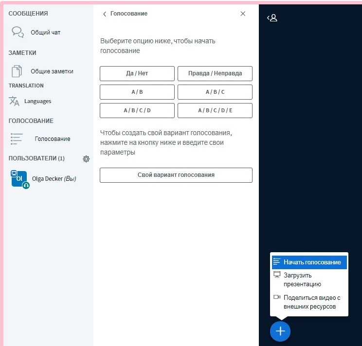
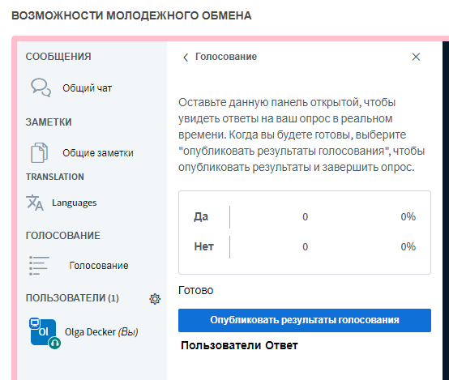

# Интерактив

Успех видеоконференции зависит от взаимодействия всех участников. Поэтому, как и в случае очных мероприятий, важно обеспечивать возможности для выражения и коммуникации. BigBlueButton предлагает ряд инструментов, которые при правильном использовании могут способствовать интерактивному обмену.

### Чат

BigBlueButton предлагает два вида чата: публичный и индивидуальный.

Публичный чат доступен уже в начале видеоконференции и может просматриваться и использоваться всеми участниками. Его можно использовать для того, чтобы задавать общие вопросы или направлять информацию всем участникам.

Индивидуальный чат открывается только после клика на одного из участников в списке участников и выбора опции **«Начать приватный чат»**. Индивидуальные чаты могут читаться двумя участвующими сторонами; их можно использовать для быстрого согласования, например, между модераторами.


Публичный чат можно скачать в виде текстового файла через трехстрочное меню в правом верхнем углу окна чата.


### Символы статуса

Символы статуса могут использоваться для выражения различных эмоций в невербальной форме или при общении с другими участниками видеоконференции. Статус изменяется кликом сначала на собственное имя на вкладке «Участники», а затем кликом на кнопку «Установить статус». Изображение заменяется соответствующим статусом, который виден всем.


Другие участники и модераторы не информируются об изменении статуса акустическим сигналом. Например, если кто-то поднимает руку, то на это сначала должен отреагировать один из модераторов.


### Общие заметки

Как публичный чат, так и общие заметки могут просматриваться и редактироваться всеми участниками. Отличие состоит в том, что отдельные заметки не могут соотноситься с конкретными лицами; для заметок используется простой HTML-редактор. С его помощью заметки можно лучше структурировать и стилистически модифицировать. Общие заметки хороши для совместного протокола или для фиксирования соображений и идей.


Как и в публичном чате, общие заметки можно скачивать в различных форматах \(HTML, Text, PDF, Word, ODF\) с помощью функции «Download».


### Опросы

Для простых голосований или тестов BigBlueButton имеет функцию опроса. Однако он позволяет задавать всегда только один вопрос одновременно \(single-choice\). BigBlueButton содержит ряд подготовленных опросов, кроме того, возможен и опрос с пятью самостоятельно выбранными ответами. После публикации опрос завершается, и все участники могут просмотреть его результаты.


Только актуальный презентующий может создавать опросы. Однако модераторы, актуально не являющиеся презентующими, могут себе сами присвоить этот статус, кликнув на символ плюс. Презентация актуально презентующего лица, однако, этим заканчивается.


