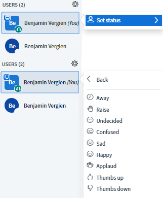
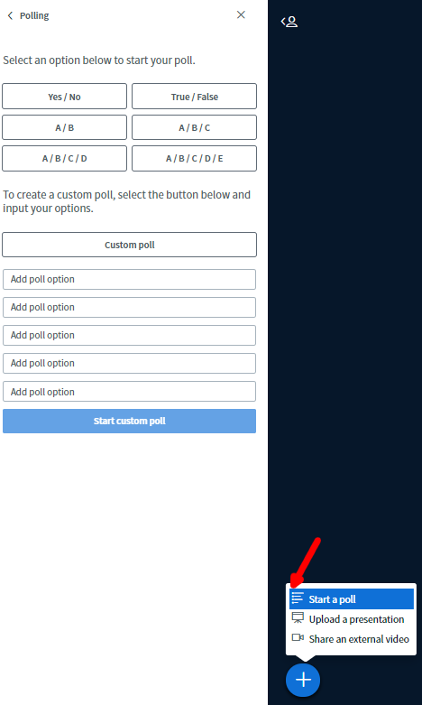
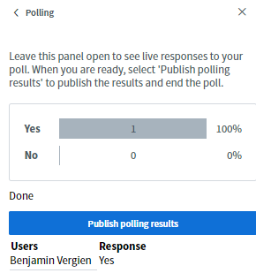

# Interaction

A video conference depends on the interaction of all participants. Just as in a face-to-face meeting, it is therefore important that there are opportunities for expression and communication. BigBlueButton offers a number of tools that, if used correctly, can contribute to an interactive exchange.

### Chat

There are two types of chat in BigBlueButton, the public chat and the private chat.

The public chat is available at the beginning of the video conference and can be seen and used by all participants. It is particularly useful for asking general questions or sending information to all participants.

The private chat opens only after clicking on a participant in the participant list and selecting the option **Start private chat**. The private chats can only be read by the two parties involved and are particularly suitable for quick consultations, e.g., between moderators.


The public chat can be downloaded as a text file via the 3-point menu in the upper right corner of the chat window.


### Status Symbols

Status symbols can be used to express different emotions non-verbally or to communicate with the other persons in the video conference. The status is changed by clicking on one's own name in the Participant tab and then on Set status. The picture is then replaced by the corresponding status visible to everyone.


Other participants and moderators are not informed of the change of status by an acoustic signal. Hence, if someone raises their hand, it must be noticed by a moderator.


### Shared notes

Just like the public chat, the shared notes can be seen and edited by all participants. The difference being that the contributions cannot be assigned to specific persons and that a simple HTML editor is available. This makes it easier to organise the notes and change their style. The shared notes are well suited for joint minutes or for capturing thoughts and ideas.


Just like the public chat, the shared notes can be downloaded in various formats \(HTML, text, PDF, Word, ODF\) via the download icon.


### Surveys

For simple polls or quizzes, BigBlueButton provides a poll function. However, only one \(single-choice\) question can be asked at a time. There are already some pre-defined polls to choose from, but a user-defined poll with up to 5 self-selected answers can also be created. After publishing, the survey ends and all participants can view the results.


Only the current presenter can create surveys. However, presenters who are not currently presenters can simply add themselves by clicking on the plus symbol. However, this will end the presentation of the current presenter.


