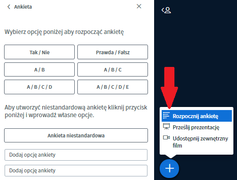
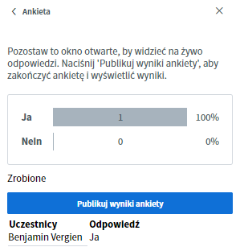

# Interaktion

Eine Videokonferenz lebt von der Interaktion aller Teilnehmenden. Deshalb ist es wichtig, genau wie bei einem Treffen in Präsenz, dass es Möglichkeiten des Ausdrucks und der Kommunikation gibt. BigBlueButton bietet dafür einige Tools, die, richtig eingesetzt, zu einem interaktiven Austausch beitragen können.

### Chat

Es gibt zwei Arten des Chats bei BigBlueButton, den öffentlichen und den privaten Chat. 

Der öffentliche Chat steht bereits zum Anfang der Videokonferenz zur Verfügung und kann von allen Teilnehmenden gesehen und genutzt werden. Er eignet sich vor allem dazu allgemeine Fragen zu stellen oder Informationen an alle Teilnehmenden zu senden.

Der private Chat öffnet sich erst nach dem Klick auf einen Teilnehmenden in der Teilnehmerliste und dem Anwählen der Option **privaten Chat starten.** Die privaten Chats können nur von den beiden beteiligten Parteien gelesen werden und eignen sich insbesondere für schnelle Absprachen z.B. unter Moderator\*innen.


Der öffentliche Chat lässt sich über das 3-Punkt-Menü in der rechten oberen Ecke des Chatfensters als Text-Datei herunterladen.


### Status-Symbole

Über Status-Symbole lassen sich verschiedene Emotionen non-verbal zum Ausdruck bringen oder auch mit den anderen Personen in der Videokonferenz kommunizieren. Der Status wird gewechselt, indem man auf den eigenen Namen im Reiter Teilnehmer klickt und dort auf Status setzen. Das Bildchen wird dann für alle sichtbar durch den entsprechenden Status ersetzt. 


Andere Teilnehmende und Moderator\*innen werden nicht durch ein akustisches Signal über die Änderung des Status informiert. Hebt jemand beispielsweise die Hand, muss dies erst von eine\*r Moderator\*in wahrgenommen werden.


### Geteilte Notizen

Die geteilten Notizen können wie der öffentliche Chat von allen Teilnehmenden gesehen und bearbeitet werden. Der Unterschied besteht darin, dass die Beiträge nicht bestimmten Personen zugeordnet werden können und ein simpler HTML-Editor zur Verfügung steht. Dadurch können die Notizen besser geordnet und stilistisch verändert werden. Die geteilten Notizen eignen sich gut für ein gemeinsames Protokoll oder für das Festhalten von Gedanken und Ideen.


Wie der öffentliche Chat können die geteilten Notizen über das Download-Symbol in verschiedenen Formaten \(HTML, Text, PDF, Word, ODF\) heruntergeladen werden.


### Umfragen

Für einfache Abstimmungen oder simple Quizze stellt BigBlueButton eine Umfrage-Funktion zur Verfügung. Allerdings kann hier immer nur eine \(Single-Choice\) Frage gleichzeitig gestellt werden. Es stehen bereits einige vordefinierte Umfragen zur Auswahl, eine benutzerdefinierte Umfrage mit bis zu 5 selbst gewählten Antworten ist jedoch auch möglich. Nach dem Veröffentlichen endet die Umfrage und alle Teilnehmenden können die Ergebnisse einsehen.


Immer nur der aktuelle Präsentator kann Umfragen erstellen. Moderator\*innen, die aktuell nicht Präsentator sind, können sich jedoch einfach selbst dazu machen, wenn sie auf das Plus-Symbol klicken. Dies beendet jedoch die Präsentation der aktuell präsentierenden Person.


