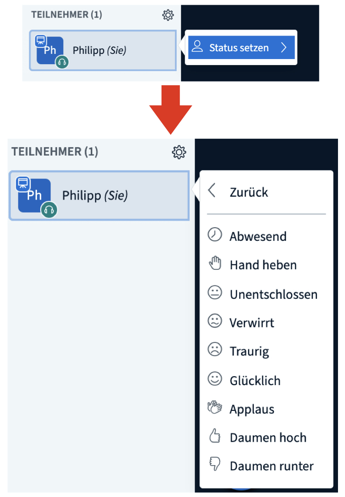
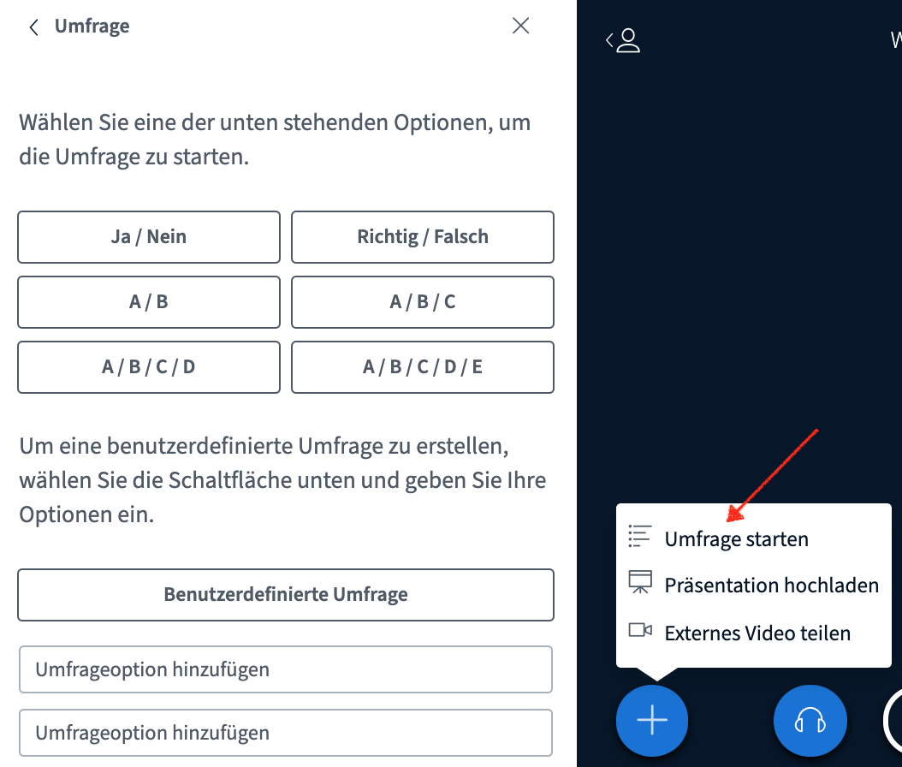
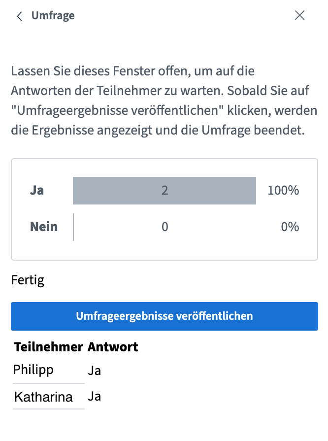

# Interakce

Základem každé videokonference je interakce účastníků. Proto je stejně jako při osobním setkání důležité, aby měli dostatek příležitostí pro vyjádření svých názorů. BigBlueButton nabízí řadu nástrojů, které mohou při správném použití interaktivní komunikaci podpořit.

### Chat

Na BigBlueButton existují dva typy chatu – veřejný \(skupinový\) a soukromý chat.

Veřejný chat je k dispozici od začátku videokonference, je viditelný pro všechny a všichni se do něj mohou zapojit. Je vhodný zejména pro obecné otázky nebo pro rozesílání informací všem účastníkům.

Soukromý chat se otevře, když v seznamu účastníků kliknete na konkrétní osobu a zvolíte možnost **Zahájit soukromý chat**. Soukromé zprávy jsou viditelné jen pro dané dvě osoby, proto se hodí například pro rychlou domluvu mezi moderátory.


Obsah veřejného chatu lze stáhnout jako textový soubor. Tuto možnost naleznete, když kliknete na tři tečky v pravém horním rohu chatového okna.


### Stavové symboly

Stavové symboly lze použít k neverbálnímu vyjádření emocí nebo ke komunikaci s ostatními účastníky videokonference. Stav změníte kliknutím na své vlastní jméno na záložce „Účastníci“ a následně na „Stav“. Místo obrázku se pak všem zobrazí zvolený stavový symbol.


Na změnu stavu ostatní účastníky ani moderátora neupozorní žádný zvukový signál. Pokud se tedy někdo touto cestou hlásí, moderátor si toho musí všimnout vizuálně.


### Sdílené poznámky

Sdílené poznámky vidí a mohou upravovat všichni účastníci, stejně jako tomu je u veřejného chatu. Rozdíl je v tom, že u jednotlivých poznámek není uveden jejich autor a že je zde k dispozici jednoduchý html editor. Díky tomu lze poznámky lépe třídit a formátovat. Sdílené poznámky se hodí zejména pro společný zápis nebo zaznamenávání myšlenek a nápadů.


Stejně jako veřejný chat si poznámky můžete kliknutím na symbol stahování uložit, a to v různých formátech: HTML, prostý text, PDF, Word nebo ODF.


### Ankety

Pro účely hlasování a jednoduchých kvízů nabízí BigBlueButton funkci ankety, ve které můžete vždy položit pouze jednu otázku, na kterou účastníci vyberou jednu z možných odpovědí. K dispozici je několik předdefinovaných anket, můžete si ale vytvořit i vlastní s maximálně 5 odpověďmi, které si sami naformulujete. Po zveřejnění anketa končí a výsledky se zobrazí všem účastníkům.


Ankety může vytvářet vždy jen aktuální přednášející. Moderátoři, kteří právě nejsou přednášejícími, si tuto roli mohou přiřadit kliknutím na symbol plus. Tím ji ale odeberou aktuálnímu přednášejícímu.


